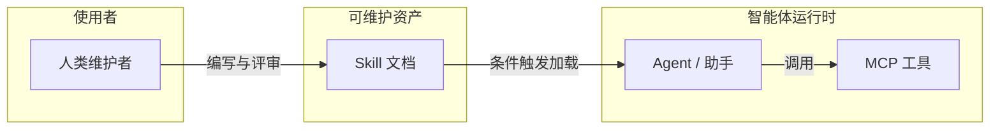

# Agent Skill 概述

在 AI 编程助手、自动化代理与各类「会调用工具的模型」普及之后，**Skill（技能）** 正在成为把「偶尔能写对」变成「稳定按团队方式交付」的关键一层：它不是替模型学更多参数，而是把**领域流程、约束、检查清单与可复用写法**外置成模型可读、人类可维护的说明资产。

本小节整理 Skill 的定位、与周边能力的关系，以及如何在本站后续文档中按需深入。

## Skill 解决什么问题

- **一致性**：同一类任务（例如写迁移、配 CI、做安全自查）每次都走同一套步骤与口径。
- **上下文效率**：把长篇经验压缩成「按需加载」的片段，减少在对话里重复交代背景。
- **协作边界**：Skill 由人编写与评审，可版本化，适合作为团队或个人的「操作规范 + 提示词」混合体。

## Skill 不是什么

- 不是替代 **MCP** 或业务 API：Skill 描述「何时、如何用」；连接外部系统仍常依赖 MCP、脚本与权限模型。
- 不是替代 **Agent 编排**：多步任务、状态机、人机确认仍由编排层或产品流程承担；Skill 更像其中一步的「作业指导书」。
- 不是「写得越长越好」：冗长 Skill 反而降低遵从率；好的 Skill 强调触发条件、输入输出契约与可验证的完成标准。

## 与 MCP、Agent 的关系（简图）

## 常见形态

- **单文件 Skill**：例如 `SKILL.md`，含元数据、适用场景、分步流程与示例。
- **目录型 Skill**：主文件 + `references/` 等渐进展开，避免一次塞满上下文。
- **平台绑定**：不同客户端（桌面助手、IDE 插件、CLI）对路径、元字段与加载策略可能略有差异，但「可发现、可版本、可审计」的原则相通。

## 在本站如何阅读

| 文档 | 说明 |
| --- | --- |
| [Skill 推荐与选型](./recommendations) | 按场景的入门组合与维护建议，可持续增补 |
| [Claude Code 推荐实践：从能用到好用](./claude-code-best-practices) | 围绕上下文、任务切分、验证闭环与团队协作的实践指南 |
| （后续）实践与模板 | 将按主题补充：编写规范、评审清单、与 CI 的结合等 |

若你刚接触「用 AI 写代码」，建议先通读本页，再按需打开推荐清单，避免一次性安装过多 Skill 导致噪音大于收益。
