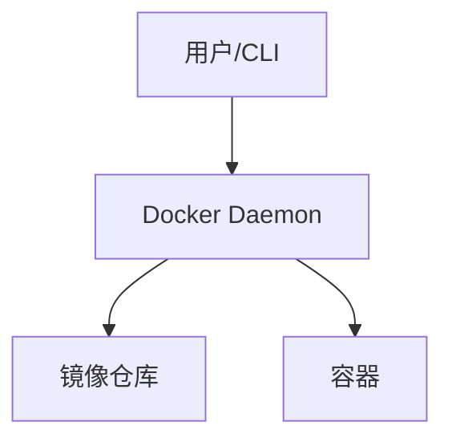

# Docker 全面介绍

## 1. 什么是 Docker

Docker 是一个开源的容器化平台，用于开发、交付和运行应用。容器是一种轻量级、可移植、自给自足的软件包，包含运行应用所需的全部环境（代码、运行时、库、配置等）。Docker 让“在我电脑能跑”的应用可以无缝迁移到任何环境。

## 2. Docker 的核心概念

- **镜像（Image）**：只读模板，包含应用和环境。类似于虚拟机快照。
- **容器（Container）**：镜像的运行实例。轻量、快速、可移植。
- **仓库（Registry）**：存储和分发镜像的服务（如 Docker Hub、阿里云镜像仓库）。
- **Docker 引擎（Engine）**：Docker 的核心服务，负责构建、运行和管理容器。

## 3. Docker 架构

- **Docker 客户端**：用户操作入口（docker 命令行）。
- **Docker 守护进程（daemon）**：后台服务，负责管理容器和镜像。
- **镜像仓库**：集中存储和分发镜像。
- **容器运行时**：如 runc，负责容器的实际运行。



## 4. Docker 安装与配置

- 支持 Linux、macOS、Windows。
- 推荐使用 Docker Desktop（桌面版）或官方安装脚本。
- 安装后可用 `docker version`、`docker info` 检查环境。

## 5. 常用 Docker 命令

### 镜像相关
```bash
# 搜索镜像
docker search nginx
# 拉取镜像
docker pull nginx:latest
# 查看本地镜像
docker images
# 删除镜像
docker rmi nginx:latest
```

### 容器相关
```bash
# 运行容器
docker run -d --name web -p 8080:80 nginx
# 查看运行中的容器
docker ps
# 查看所有容器（包括已停止）
docker ps -a
# 停止/启动/重启容器
docker stop web
docker start web
docker restart web
# 进入容器
docker exec -it web /bin/bash
# 删除容器
docker rm web
```

### 构建镜像
```bash
# 编写 Dockerfile
# 构建镜像
docker build -t myapp:1.0 .
# 查看构建历史
docker history myapp:1.0
```

### 日志与监控

```bash
docker logs web
docker stats
```

### 镜像打包

```bash
#保存镜像
docker save -o myapp.tar myapp:1.0

#导入镜像
docker load -i myapp.tar

# 保存已运行后的容器

docker commit <容器ID或名称> 新镜像名称:标签

docker commit linux-arm linux-arm64:v1

#导出容器为 tar 文件：
docker export <容器ID或名称> > container.tar

docker export linux-armi > container.tar


#导入 tar 文件为新镜像：
cat container.tar | docker import - 新镜像名称:标签


```

## 6. Docker 网络

- **bridge**（默认桥接网络）：容器间通信，常用于单机。
- **host**：容器与主机共用网络。
- **none**：无网络。
- **自定义网络**：支持容器服务发现和隔离。

```bash
docker network ls
docker network create mynet
docker run --network=mynet ...
```

## 7. 数据管理

- **数据卷（Volume）**：持久化和共享数据的推荐方式。
- **绑定挂载（Bind Mount）**：将主机目录挂载到容器。

```bash
# 创建数据卷
docker volume create mydata
# 挂载数据卷
docker run -v mydata:/data ...
# 绑定主机目录
docker run -v /host/path:/container/path ...
```

## 8. Dockerfile 基础

- 用于定义自定义镜像的构建过程。
- 常用指令：FROM、RUN、COPY、ADD、CMD、ENTRYPOINT、EXPOSE、ENV、WORKDIR 等。

```dockerfile
FROM python:3.10
WORKDIR /app
COPY . .
RUN pip install -r requirements.txt
CMD ["python", "main.py"]
```

## 9. Docker Compose 简介

- 用于定义和管理多容器应用。
- 使用 `docker-compose.yml` 文件描述服务、网络、卷等。

```yaml
version: '3'
services:
  web:
    image: nginx
    ports:
      - "8080:80"
  db:
    image: mysql
    environment:
      MYSQL_ROOT_PASSWORD: example
```

## 10. 最佳实践与常见问题

- 镜像尽量小，分层合理，清理无用文件。
- 使用官方基础镜像，定期更新。
- 合理使用 .dockerignore 文件。
- 日志、数据持久化用卷。
- 安全：不在容器内运行 root，及时打补丁。
- 常见问题排查：端口映射、权限、网络、存储等。

## 11. 参考资料

- [Docker 官方文档](https://docs.docker.com/)
- [Docker Hub](https://hub.docker.com/)
- [Awesome Docker](https://github.com/veggiemonk/awesome-docker)

## 问题排查

启动容器后看不到进程

``` bash
# 1. 查看所有容器
docker ps -a 

# 2. 查看日东日志
docker log <container_id>/<container_name>

```