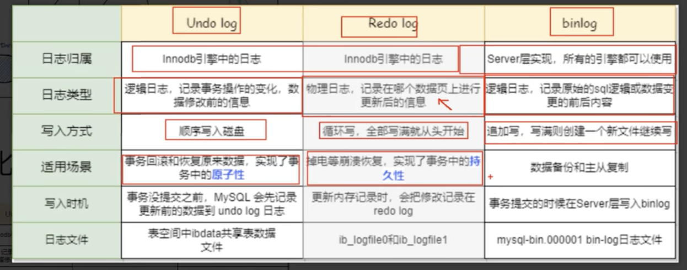

```
select column,count(1) from `test` group by column order by 2 desc
```
查看列数据分布比例，来判断查询是否可以走索引，通常扫描返回列超过5%进行全表扫描，不走索引

```
SQL> select owner,
  2         column_name,
  3         num_rows,
  4         Cardinality,
  5         selectivity,
  6         'Need index' as notice
  7    from (select b.owner,
  8                 a.column_name,
  9                 b.num_rows,
 10                 a.num_distinct Cardinality,
 11                 round(a.num_distinct / b.num_rows * 100, 2) selectivity
 12            from dba_tab_col_statistics a, dba_tables b
 13           where a.owner = b.owner
 14             and a.table_name = b.table_name
 15             and a.owner = 'SCOTT'
 16             and a.table_name = 'TEST')
 17   where selectivity >= 20
 18     and column_name not in (select column_name
 19                               from dba_ind_columns
 20                              where table_owner = 'SCOTT'
 21                                and table_name = 'TEST')
 22     and column_name in
 23         (select c.name
 24            from sys.col_usage$ u, sys.obj$ o, sys.col$ c, sys.user$ r
 25           where o.obj# = u.obj#
 26             and c.obj# = u.obj#
 27             and c.col# = u.intcol#
 28             and r.name = 'SCOTT'
 29             and o.name = 'TEST');

OWNER      COLUMN_NAME     NUM_ROWS CARDINALITY SELECTIVITY NOTICE
---------- ------------- ---------- ----------- ----------- ----------
SCOTT      OBJECT_ID          72462       72462         100 Need index
```

