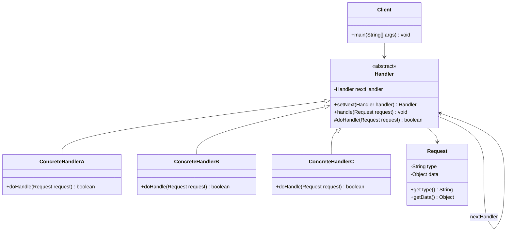

# 责任链模式 (Chain of Responsibility Pattern)

## 概述

责任链模式是一种行为型设计模式，它允许你将请求沿着处理者链进行发送。收到请求后，每个处理者均可对请求进行处理，或将其传递给链上的下个处理者。

### 核心思想

责任链模式的核心思想是**解耦请求发送者和接收者**，通过建立一条处理链来：

- **避免请求发送者与接收者耦合**：发送者无需知道具体哪个对象会处理请求
- **动态组织和分配责任**：可以在运行时动态地添加或删除处理者
- **支持多级处理**：请求可以被多个处理者依次处理
- **提供处理的灵活性**：每个处理者可以决定是否处理请求或传递给下一个处理者

## 使用场景

### 🎯 适用情况

1. **多个对象可以处理同一请求**：但具体由哪个对象处理在运行时确定
2. **不明确指定接收者**：希望向多个对象中的一个提交请求
3. **动态指定处理者集合**：可处理请求的对象集合应被动态指定
4. **审批流程**：如请假审批、费用报销等需要多级审批的场景
5. **异常处理**：不同类型的异常需要不同的处理方式
6. **过滤器链**：如Web请求过滤、数据验证等

### 🚫 不适用情况

1. **性能要求极高**：责任链可能增加处理延迟
2. **处理逻辑简单固定**：不需要动态组织处理者
3. **必须有明确的处理者**：不允许请求未被处理的情况

## UML 类图



## 核心组件

### 1. 抽象处理者 (Handler)
定义处理请求的接口，包含指向下一个处理者的引用。

### 2. 具体处理者 (ConcreteHandler)
实现处理请求的具体逻辑，决定是否处理请求或传递给下一个处理者。

### 3. 客户端 (Client)
创建责任链并向链的第一个处理者发送请求。

## 代码示例

### 示例1：请假审批系统

```java
// 请假请求
class LeaveRequest {
    private String employeeName;
    private int days;
    private String reason;
    
    public LeaveRequest(String employeeName, int days, String reason) {
        this.employeeName = employeeName;
        this.days = days;
        this.reason = reason;
    }
    
    // getters
    public String getEmployeeName() { return employeeName; }
    public int getDays() { return days; }
    public String getReason() { return reason; }
}

// 抽象审批者
abstract class Approver {
    protected Approver nextApprover;
    protected String name;
    
    public Approver(String name) {
        this.name = name;
    }
    
    public Approver setNext(Approver nextApprover) {
        this.nextApprover = nextApprover;
        return nextApprover;
    }
    
    public final void processRequest(LeaveRequest request) {
        if (canHandle(request)) {
            handleRequest(request);
        } else if (nextApprover != null) {
            System.out.println(name + " 无权限处理，转交给上级");
            nextApprover.processRequest(request);
        } else {
            System.out.println("请求无法处理：超出所有审批者权限范围");
        }
    }
    
    protected abstract boolean canHandle(LeaveRequest request);
    protected abstract void handleRequest(LeaveRequest request);
}

// 组长 - 可审批1天以内请假
class TeamLeader extends Approver {
    public TeamLeader(String name) {
        super(name);
    }
    
    @Override
    protected boolean canHandle(LeaveRequest request) {
        return request.getDays() <= 1;
    }
    
    @Override
    protected void handleRequest(LeaveRequest request) {
        System.out.println(String.format(
            "组长 %s 批准了 %s 的 %d 天请假申请：%s",
            name, request.getEmployeeName(), request.getDays(), request.getReason()
        ));
    }
}

// 部门经理 - 可审批3天以内请假
class DepartmentManager extends Approver {
    public DepartmentManager(String name) {
        super(name);
    }
    
    @Override
    protected boolean canHandle(LeaveRequest request) {
        return request.getDays() <= 3;
    }
    
    @Override
    protected void handleRequest(LeaveRequest request) {
        System.out.println(String.format(
            "部门经理 %s 批准了 %s 的 %d 天请假申请：%s",
            name, request.getEmployeeName(), request.getDays(), request.getReason()
        ));
    }
}

// 总经理 - 可审批7天以内请假
class GeneralManager extends Approver {
    public GeneralManager(String name) {
        super(name);
    }
    
    @Override
    protected boolean canHandle(LeaveRequest request) {
        return request.getDays() <= 7;
    }
    
    @Override
    protected void handleRequest(LeaveRequest request) {
        System.out.println(String.format(
            "总经理 %s 批准了 %s 的 %d 天请假申请：%s",
            name, request.getEmployeeName(), request.getDays(), request.getReason()
        ));
    }
}

// 使用示例
public class LeaveApprovalDemo {
    public static void main(String[] args) {
        // 构建责任链
        Approver teamLeader = new TeamLeader("张三");
        Approver deptManager = new DepartmentManager("李四");
        Approver generalManager = new GeneralManager("王五");
        
        teamLeader.setNext(deptManager).setNext(generalManager);
        
        // 测试不同的请假申请
        LeaveRequest request1 = new LeaveRequest("小明", 1, "感冒发烧");
        LeaveRequest request2 = new LeaveRequest("小红", 3, "家中有事");
        LeaveRequest request3 = new LeaveRequest("小刚", 7, "年假旅游");
        LeaveRequest request4 = new LeaveRequest("小美", 15, "产假");
        
        System.out.println("=== 处理1天请假 ===");
        teamLeader.processRequest(request1);
        
        System.out.println("\n=== 处理3天请假 ===");
        teamLeader.processRequest(request2);
        
        System.out.println("\n=== 处理7天请假 ===");
        teamLeader.processRequest(request3);
        
        System.out.println("\n=== 处理15天请假 ===");
        teamLeader.processRequest(request4);
    }
}
```

### 示例2：Web请求过滤器链

```java
// HTTP请求对象
class HttpRequest {
    private String url;
    private String method;
    private Map<String, String> headers;
    private String body;
    private Map<String, Object> attributes;
    
    public HttpRequest(String url, String method) {
        this.url = url;
        this.method = method;
        this.headers = new HashMap<>();
        this.attributes = new HashMap<>();
    }
    
    // getters and setters
    public String getUrl() { return url; }
    public String getMethod() { return method; }
    public Map<String, String> getHeaders() { return headers; }
    public String getBody() { return body; }
    public void setBody(String body) { this.body = body; }
    public Map<String, Object> getAttributes() { return attributes; }
    
    public void setAttribute(String key, Object value) {
        attributes.put(key, value);
    }
    
    public Object getAttribute(String key) {
        return attributes.get(key);
    }
}

// HTTP响应对象
class HttpResponse {
    private int statusCode = 200;
    private Map<String, String> headers = new HashMap<>();
    private String body;
    
    public int getStatusCode() { return statusCode; }
    public void setStatusCode(int statusCode) { this.statusCode = statusCode; }
    public Map<String, String> getHeaders() { return headers; }
    public String getBody() { return body; }
    public void setBody(String body) { this.body = body; }
}

// 过滤器接口
interface Filter {
    void doFilter(HttpRequest request, HttpResponse response, FilterChain chain);
}

// 过滤器链
class FilterChain {
    private List<Filter> filters = new ArrayList<>();
    private int currentIndex = 0;
    
    public void addFilter(Filter filter) {
        filters.add(filter);
    }
    
    public void doFilter(HttpRequest request, HttpResponse response) {
        if (currentIndex < filters.size()) {
            Filter filter = filters.get(currentIndex++);
            filter.doFilter(request, response, this);
        } else {
            // 所有过滤器都执行完毕，执行实际的业务逻辑
            handleRequest(request, response);
        }
    }
    
    private void handleRequest(HttpRequest request, HttpResponse response) {
        response.setBody("Hello, " + request.getAttribute("username") + "!");
        System.out.println("执行业务逻辑：" + response.getBody());
    }
}

// 认证过滤器
class AuthenticationFilter implements Filter {
    @Override
    public void doFilter(HttpRequest request, HttpResponse response, FilterChain chain) {
        System.out.println("认证过滤器：检查用户身份");
        
        String authHeader = request.getHeaders().get("Authorization");
        if (authHeader == null || !authHeader.startsWith("Bearer ")) {
            response.setStatusCode(401);
            response.setBody("Unauthorized: Missing or invalid token");
            return; // 中断过滤器链
        }
        
        // 模拟从token中解析用户信息
        String token = authHeader.substring(7);
        String username = parseUsernameFromToken(token);
        request.setAttribute("username", username);
        
        System.out.println("认证成功，用户：" + username);
        chain.doFilter(request, response); // 继续执行下一个过滤器
    }
    
    private String parseUsernameFromToken(String token) {
        // 简化的token解析逻辑
        return "user_" + token.hashCode() % 1000;
    }
}

// 权限过滤器
class AuthorizationFilter implements Filter {
    @Override
    public void doFilter(HttpRequest request, HttpResponse response, FilterChain chain) {
        System.out.println("权限过滤器：检查用户权限");
        
        String username = (String) request.getAttribute("username");
        String url = request.getUrl();
        
        if (url.startsWith("/admin/") && !username.contains("admin")) {
            response.setStatusCode(403);
            response.setBody("Forbidden: Insufficient permissions");
            return; // 中断过滤器链
        }
        
        System.out.println("权限检查通过");
        chain.doFilter(request, response); // 继续执行下一个过滤器
    }
}

// 日志过滤器
class LoggingFilter implements Filter {
    @Override
    public void doFilter(HttpRequest request, HttpResponse response, FilterChain chain) {
        long startTime = System.currentTimeMillis();
        System.out.println(String.format(
            "请求开始：%s %s", request.getMethod(), request.getUrl()
        ));
        
        chain.doFilter(request, response); // 继续执行下一个过滤器
        
        long endTime = System.currentTimeMillis();
        System.out.println(String.format(
            "请求结束：状态码=%d，耗时=%dms", 
            response.getStatusCode(), endTime - startTime
        ));
    }
}

// 使用示例
public class FilterChainDemo {
    public static void main(String[] args) {
        // 创建过滤器链
        FilterChain filterChain = new FilterChain();
        filterChain.addFilter(new LoggingFilter());
        filterChain.addFilter(new AuthenticationFilter());
        filterChain.addFilter(new AuthorizationFilter());
        
        // 测试正常请求
        System.out.println("=== 测试正常请求 ===");
        HttpRequest request1 = new HttpRequest("/api/user/profile", "GET");
        request1.getHeaders().put("Authorization", "Bearer valid_token_123");
        HttpResponse response1 = new HttpResponse();
        filterChain.doFilter(request1, response1);
        
        System.out.println("\n=== 测试未认证请求 ===");
        HttpRequest request2 = new HttpRequest("/api/user/profile", "GET");
        HttpResponse response2 = new HttpResponse();
        filterChain.doFilter(request2, response2);
        
        System.out.println("\n=== 测试权限不足请求 ===");
        HttpRequest request3 = new HttpRequest("/admin/users", "GET");
        request3.getHeaders().put("Authorization", "Bearer user_token_456");
        HttpResponse response3 = new HttpResponse();
        filterChain.doFilter(request3, response3);
    }
}
```

## 优缺点分析

### ✅ 优点

1. **降低耦合度**
   - 请求发送者和接收者解耦
   - 发送者无需知道具体的处理者

2. **增强灵活性**
   - 可以动态地添加或删除处理者
   - 可以改变链内的成员或调整顺序

3. **符合开闭原则**
   - 增加新的处理者无需修改现有代码
   - 每个处理者职责单一

4. **支持多级处理**
   - 请求可以被多个处理者依次处理
   - 每个处理者可以对请求进行部分处理

### ❌ 缺点

1. **性能问题**
   - 请求可能需要遍历整个链
   - 链过长时会影响性能

2. **不保证被接收**
   - 如果链配置不当，请求可能不被任何处理者处理
   - 需要在链的末尾提供默认处理

3. **调试困难**
   - 运行时才能确定处理路径
   - 链的结构可能比较复杂

4. **系统复杂性**
   - 增加了系统的复杂度
   - 需要仔细设计链的结构

## 与其他模式的对比

### 🆚 责任链模式 vs 装饰器模式

| 特性 | 责任链模式 | 装饰器模式 |
|------|------------|------------|
| **目的** | 传递请求直到找到合适的处理者 | 动态添加对象功能 |
| **处理方式** | 通常只有一个处理者处理请求 | 所有装饰器都会处理请求 |
| **结构** | 链式结构，可以中断 | 嵌套结构，层层包装 |
| **使用场景** | 审批流程、异常处理 | 功能增强、UI组件 |

### 🆚 责任链模式 vs 命令模式

| 特性 | 责任链模式 | 命令模式 |
|------|------------|----------|
| **关注点** | 请求的传递和处理 | 请求的封装和执行 |
| **处理者** | 多个处理者形成链 | 单个接收者执行命令 |
| **解耦程度** | 发送者与处理者解耦 | 调用者与接收者解耦 |
| **扩展性** | 易于添加新的处理者 | 易于添加新的命令 |

### 🆚 责任链模式 vs 观察者模式

| 特性 | 责任链模式 | 观察者模式 |
|------|------------|------------|
| **通信方式** | 一对一（找到处理者就停止） | 一对多（通知所有观察者） |
| **处理顺序** | 有序处理 | 无序通知 |
| **中断机制** | 可以中断传递 | 不能中断通知 |
| **使用场景** | 请求处理、过滤 | 事件通知、状态同步 |

## 实际应用场景

### 1. Spring Security 过滤器链

```java
// Spring Security 中的过滤器链实现
public class SecurityFilterChain {
    private List<Filter> filters;
    
    public void doFilter(ServletRequest request, ServletResponse response) {
        // 创建过滤器链并执行
        new VirtualFilterChain(filters).doFilter(request, response);
    }
    
    private static class VirtualFilterChain implements FilterChain {
        private final List<Filter> filters;
        private int currentPosition = 0;
        
        public VirtualFilterChain(List<Filter> filters) {
            this.filters = filters;
        }
        
        @Override
        public void doFilter(ServletRequest request, ServletResponse response) {
            if (currentPosition == filters.size()) {
                return; // 所有过滤器执行完毕
            }
            
            Filter nextFilter = filters.get(currentPosition++);
            nextFilter.doFilter(request, response, this);
        }
    }
}
```

### 2. Servlet 过滤器

```java
// Servlet 规范中的过滤器实现
public class CustomFilter implements Filter {
    @Override
    public void doFilter(ServletRequest request, ServletResponse response, 
                        FilterChain chain) throws IOException, ServletException {
        // 前置处理
        System.out.println("请求前处理");
        
        // 继续执行链中的下一个过滤器
        chain.doFilter(request, response);
        
        // 后置处理
        System.out.println("请求后处理");
    }
}
```

### 3. Netty 的 ChannelPipeline

```java
// Netty 中的处理器链
public class NettyHandlerChain {
    public void setupPipeline(ChannelPipeline pipeline) {
        // 添加处理器到管道
        pipeline.addLast("decoder", new HttpRequestDecoder());
        pipeline.addLast("encoder", new HttpResponseEncoder());
        pipeline.addLast("aggregator", new HttpObjectAggregator(1048576));
        pipeline.addLast("handler", new CustomHttpHandler());
    }
}

class CustomHttpHandler extends SimpleChannelInboundHandler<FullHttpRequest> {
    @Override
    protected void channelRead0(ChannelHandlerContext ctx, FullHttpRequest request) {
        // 处理HTTP请求
        // 如果需要，可以传递给下一个处理器
        ctx.fireChannelRead(request);
    }
}
```

### 4. 异常处理链

```java
// 异常处理责任链
abstract class ExceptionHandler {
    protected ExceptionHandler nextHandler;
    
    public ExceptionHandler setNext(ExceptionHandler nextHandler) {
        this.nextHandler = nextHandler;
        return nextHandler;
    }
    
    public final void handleException(Exception exception) {
        if (canHandle(exception)) {
            doHandle(exception);
        } else if (nextHandler != null) {
            nextHandler.handleException(exception);
        } else {
            // 默认处理
            System.err.println("未处理的异常：" + exception.getMessage());
            exception.printStackTrace();
        }
    }
    
    protected abstract boolean canHandle(Exception exception);
    protected abstract void doHandle(Exception exception);
}

class DatabaseExceptionHandler extends ExceptionHandler {
    @Override
    protected boolean canHandle(Exception exception) {
        return exception instanceof SQLException;
    }
    
    @Override
    protected void doHandle(Exception exception) {
        System.out.println("数据库异常处理：" + exception.getMessage());
        // 记录日志、发送告警等
    }
}

class NetworkExceptionHandler extends ExceptionHandler {
    @Override
    protected boolean canHandle(Exception exception) {
        return exception instanceof IOException;
    }
    
    @Override
    protected void doHandle(Exception exception) {
        System.out.println("网络异常处理：" + exception.getMessage());
        // 重试机制、降级处理等
    }
}
```

## 模式变种和扩展

### 1. 纯责任链 vs 不纯责任链

```java
// 纯责任链：每个请求只被一个处理者处理
class PureChainHandler extends Handler {
    @Override
    public void handleRequest(Request request) {
        if (canHandle(request)) {
            doHandle(request);
            // 处理完毕，不再传递
        } else if (nextHandler != null) {
            nextHandler.handleRequest(request);
        }
    }
}

// 不纯责任链：请求可以被多个处理者处理
class ImpureChainHandler extends Handler {
    @Override
    public void handleRequest(Request request) {
        if (canHandle(request)) {
            doHandle(request);
        }
        
        // 无论是否处理，都传递给下一个处理者
        if (nextHandler != null) {
            nextHandler.handleRequest(request);
        }
    }
}
```

### 2. 带优先级的责任链

```java
class PriorityHandler extends Handler implements Comparable<PriorityHandler> {
    private int priority;
    
    public PriorityHandler(int priority) {
        this.priority = priority;
    }
    
    @Override
    public int compareTo(PriorityHandler other) {
        return Integer.compare(this.priority, other.priority);
    }
}

class PriorityChain {
    private List<PriorityHandler> handlers = new ArrayList<>();
    
    public void addHandler(PriorityHandler handler) {
        handlers.add(handler);
        Collections.sort(handlers); // 按优先级排序
    }
    
    public void handleRequest(Request request) {
        for (PriorityHandler handler : handlers) {
            if (handler.canHandle(request)) {
                handler.doHandle(request);
                break; // 找到处理者就停止
            }
        }
    }
}
```

### 3. 并行责任链

```java
class ParallelChain {
    private List<Handler> handlers = new ArrayList<>();
    private ExecutorService executor = Executors.newFixedThreadPool(10);
    
    public void addHandler(Handler handler) {
        handlers.add(handler);
    }
    
    public CompletableFuture<Void> handleRequestAsync(Request request) {
        List<CompletableFuture<Void>> futures = handlers.stream()
            .map(handler -> CompletableFuture.runAsync(() -> {
                if (handler.canHandle(request)) {
                    handler.doHandle(request);
                }
            }, executor))
            .collect(Collectors.toList());
        
        return CompletableFuture.allOf(futures.toArray(new CompletableFuture[0]));
    }
}
```

## 最佳实践

### 1. 责任链设计原则

```java
// 1. 单一职责原则：每个处理者只负责一种类型的请求
class SingleResponsibilityHandler extends Handler {
    private final RequestType supportedType;
    
    public SingleResponsibilityHandler(RequestType supportedType) {
        this.supportedType = supportedType;
    }
    
    @Override
    protected boolean canHandle(Request request) {
        return request.getType() == supportedType;
    }
}

// 2. 开闭原则：易于扩展新的处理者
class ExtensibleChain {
    private Handler firstHandler;
    
    public void addHandler(Handler newHandler) {
        if (firstHandler == null) {
            firstHandler = newHandler;
        } else {
            Handler current = firstHandler;
            while (current.getNext() != null) {
                current = current.getNext();
            }
            current.setNext(newHandler);
        }
    }
}
```

### 2. 性能优化策略

```java
// 1. 缓存处理者映射
class CachedChain {
    private Map<RequestType, Handler> handlerCache = new ConcurrentHashMap<>();
    private Handler firstHandler;
    
    public void handleRequest(Request request) {
        Handler handler = handlerCache.get(request.getType());
        if (handler != null) {
            handler.doHandle(request);
            return;
        }
        
        // 遍历链找到合适的处理者并缓存
        Handler current = firstHandler;
        while (current != null) {
            if (current.canHandle(request)) {
                handlerCache.put(request.getType(), current);
                current.doHandle(request);
                return;
            }
            current = current.getNext();
        }
    }
}

// 2. 短路优化
class ShortCircuitChain {
    public void handleRequest(Request request) {
        Handler current = firstHandler;
        while (current != null) {
            if (current.canHandle(request)) {
                current.doHandle(request);
                break; // 短路，避免继续遍历
            }
            current = current.getNext();
        }
    }
}
```

### 3. 监控和调试

```java
class MonitoredChain {
    private static final Logger logger = LoggerFactory.getLogger(MonitoredChain.class);
    
    public void handleRequest(Request request) {
        long startTime = System.currentTimeMillis();
        String requestId = UUID.randomUUID().toString();
        
        logger.info("开始处理请求 [{}]: {}", requestId, request);
        
        Handler current = firstHandler;
        int handlerCount = 0;
        
        while (current != null) {
            handlerCount++;
            logger.debug("请求 [{}] 传递到处理者 {}", requestId, current.getClass().getSimpleName());
            
            if (current.canHandle(request)) {
                logger.info("请求 [{}] 被处理者 {} 处理", requestId, current.getClass().getSimpleName());
                current.doHandle(request);
                break;
            }
            
            current = current.getNext();
        }
        
        long duration = System.currentTimeMillis() - startTime;
        logger.info("请求 [{}] 处理完成，耗时: {}ms，遍历处理者数量: {}", 
                   requestId, duration, handlerCount);
    }
}
```

### 4. 异常处理策略

```java
class RobustChain {
    public void handleRequest(Request request) {
        Handler current = firstHandler;
        List<Exception> exceptions = new ArrayList<>();
        
        while (current != null) {
            try {
                if (current.canHandle(request)) {
                    current.doHandle(request);
                    return; // 成功处理，退出
                }
            } catch (Exception e) {
                logger.warn("处理者 {} 处理请求时发生异常", 
                           current.getClass().getSimpleName(), e);
                exceptions.add(e);
                // 继续尝试下一个处理者
            }
            
            current = current.getNext();
        }
        
        // 如果所有处理者都失败了
        if (!exceptions.isEmpty()) {
            throw new ChainProcessingException("所有处理者都无法处理请求", exceptions);
        }
    }
}
```

## 总结

责任链模式是一种强大的行为型设计模式，它通过建立处理者链来实现请求的动态处理。该模式的核心价值在于：

### 🎯 核心价值

1. **解耦合**：发送者与接收者完全解耦，提高系统灵活性
2. **动态性**：可以在运行时动态组织和调整处理链
3. **可扩展性**：易于添加新的处理者，符合开闭原则
4. **职责分离**：每个处理者专注于特定类型的请求处理

### 📋 使用建议

1. **合理设计链长度**：避免链过长影响性能
2. **提供默认处理**：确保请求总能得到处理
3. **考虑缓存优化**：对于频繁的请求类型进行缓存
4. **添加监控机制**：便于调试和性能分析
5. **异常处理策略**：确保链的健壮性

### 🚀 实际应用

责任链模式在现代软件开发中应用广泛：

- **Web框架**：如Servlet过滤器、Spring Security过滤器链
- **网络编程**：如Netty的ChannelPipeline
- **业务流程**：如审批流程、异常处理
- **中间件**：如消息处理、请求路由
- **框架设计**：如拦截器链、插件系统

责任链模式体现了"传递责任"的设计思想，是构建灵活、可扩展系统的重要工具。通过合理运用责任链模式，我们可以创建出既灵活又高效的请求处理系统，提高代码的可维护性和可扩展性。