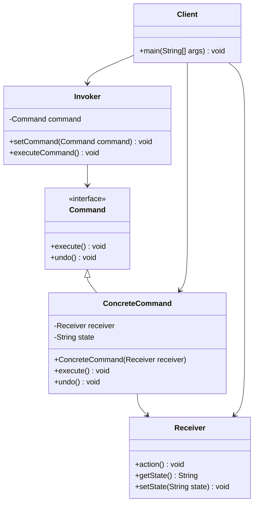

# 命令模式 (Command Pattern)

## 概述

命令模式是一种行为型设计模式，它将请求封装成对象，从而使你可以用不同的请求对客户进行参数化，对请求排队或记录请求日志，以及支持可撤销的操作。

### 核心思想

命令模式的核心思想是**将请求封装成对象**，通过这种封装来：

- **解耦调用者和接收者**：调用者无需知道接收者的具体实现
- **支持请求的参数化**：可以用不同的命令对象来参数化客户
- **支持请求排队**：命令对象可以被存储、排队和延迟执行
- **支持撤销操作**：命令对象可以实现撤销功能
- **支持日志记录**：可以记录命令的执行历史
- **支持宏命令**：可以组合多个命令形成复合命令

## 使用场景

### 🎯 适用情况

1. **需要将请求调用者和请求接收者解耦**：调用者不需要知道接收者的接口
2. **需要在不同时间指定、排列和执行请求**：命令可以被存储和延迟执行
3. **需要支持撤销操作**：命令对象可以存储状态并实现撤销
4. **需要支持日志记录**：可以记录命令执行的历史
5. **需要支持事务操作**：可以将一组命令作为事务执行
6. **GUI按钮和菜单项**：每个按钮对应一个命令对象
7. **宏录制和回放**：录制用户操作并支持回放
8. **多级撤销/重做**：支持复杂的撤销重做操作

### 🚫 不适用情况

1. **简单的方法调用**：如果只是简单的方法调用，使用命令模式会增加复杂性
2. **性能要求极高**：命令对象的创建和管理会带来一定的性能开销
3. **不需要解耦的场景**：如果调用者和接收者紧密相关，没必要使用命令模式

## UML 类图



## 核心组件

### 1. 命令接口 (Command)
定义执行操作的接口，通常包含execute()方法。

### 2. 具体命令 (ConcreteCommand)
实现命令接口，定义接收者和动作之间的绑定关系。

### 3. 接收者 (Receiver)
知道如何实施与执行一个请求相关的操作。

### 4. 调用者 (Invoker)
要求命令执行请求，通常包含一个命令对象。

### 5. 客户端 (Client)
创建具体命令对象并设置其接收者。

## 代码示例

### 示例1：智能家居控制系统

```java
// 命令接口
interface Command {
    void execute();
    void undo();
    String getDescription();
}

// 接收者：电灯
class Light {
    private String location;
    private boolean isOn = false;
    private int brightness = 0; // 0-100
    
    public Light(String location) {
        this.location = location;
    }
    
    public void on() {
        isOn = true;
        brightness = 100;
        System.out.println(location + "的灯已打开，亮度：" + brightness + "%");
    }
    
    public void off() {
        isOn = false;
        brightness = 0;
        System.out.println(location + "的灯已关闭");
    }
    
    public void dim(int level) {
        if (isOn) {
            brightness = Math.max(0, Math.min(100, level));
            System.out.println(location + "的灯亮度调节到：" + brightness + "%");
        } else {
            System.out.println(location + "的灯未开启，无法调节亮度");
        }
    }
    
    public boolean isOn() { return isOn; }
    public int getBrightness() { return brightness; }
    public String getLocation() { return location; }
}

// 接收者：音响
class Stereo {
    private String location;
    private boolean isOn = false;
    private int volume = 0;
    private String cd;
    
    public Stereo(String location) {
        this.location = location;
    }
    
    public void on() {
        isOn = true;
        System.out.println(location + "的音响已打开");
    }
    
    public void off() {
        isOn = false;
        volume = 0;
        cd = null;
        System.out.println(location + "的音响已关闭");
    }
    
    public void setCd(String cd) {
        this.cd = cd;
        System.out.println(location + "的音响正在播放CD：" + cd);
    }
    
    public void setVolume(int volume) {
        if (isOn) {
            this.volume = Math.max(0, Math.min(100, volume));
            System.out.println(location + "的音响音量调节到：" + this.volume);
        }
    }
    
    public boolean isOn() { return isOn; }
    public int getVolume() { return volume; }
    public String getCd() { return cd; }
}

// 具体命令：开灯命令
class LightOnCommand implements Command {
    private Light light;
    
    public LightOnCommand(Light light) {
        this.light = light;
    }
    
    @Override
    public void execute() {
        light.on();
    }
    
    @Override
    public void undo() {
        light.off();
    }
    
    @Override
    public String getDescription() {
        return "打开" + light.getLocation() + "的灯";
    }
}

// 具体命令：关灯命令
class LightOffCommand implements Command {
    private Light light;
    
    public LightOffCommand(Light light) {
        this.light = light;
    }
    
    @Override
    public void execute() {
        light.off();
    }
    
    @Override
    public void undo() {
        light.on();
    }
    
    @Override
    public String getDescription() {
        return "关闭" + light.getLocation() + "的灯";
    }
}

// 具体命令：调光命令
class LightDimCommand implements Command {
    private Light light;
    private int level;
    private int previousBrightness;
    
    public LightDimCommand(Light light, int level) {
        this.light = light;
        this.level = level;
    }
    
    @Override
    public void execute() {
        previousBrightness = light.getBrightness();
        light.dim(level);
    }
    
    @Override
    public void undo() {
        light.dim(previousBrightness);
    }
    
    @Override
    public String getDescription() {
        return "调节" + light.getLocation() + "的灯亮度到" + level + "%";
    }
}

// 具体命令：音响开启命令
class StereoOnWithCDCommand implements Command {
    private Stereo stereo;
    private String cd;
    private int volume;
    
    public StereoOnWithCDCommand(Stereo stereo, String cd, int volume) {
        this.stereo = stereo;
        this.cd = cd;
        this.volume = volume;
    }
    
    @Override
    public void execute() {
        stereo.on();
        stereo.setCd(cd);
        stereo.setVolume(volume);
    }
    
    @Override
    public void undo() {
        stereo.off();
    }
    
    @Override
    public String getDescription() {
        return "打开音响并播放CD：" + cd + "，音量：" + volume;
    }
}

// 空命令对象（空对象模式）
class NoCommand implements Command {
    @Override
    public void execute() {
        // 什么都不做
    }
    
    @Override
    public void undo() {
        // 什么都不做
    }
    
    @Override
    public String getDescription() {
        return "无命令";
    }
}

// 宏命令：组合多个命令
class MacroCommand implements Command {
    private Command[] commands;
    
    public MacroCommand(Command[] commands) {
        this.commands = commands;
    }
    
    @Override
    public void execute() {
        for (Command command : commands) {
            command.execute();
        }
    }
    
    @Override
    public void undo() {
        // 逆序撤销
        for (int i = commands.length - 1; i >= 0; i--) {
            commands[i].undo();
        }
    }
    
    @Override
    public String getDescription() {
        StringBuilder sb = new StringBuilder("宏命令：[");
        for (int i = 0; i < commands.length; i++) {
            sb.append(commands[i].getDescription());
            if (i < commands.length - 1) {
                sb.append(", ");
            }
        }
        sb.append("]");
        return sb.toString();
    }
}

// 调用者：遥控器
class RemoteControl {
    private Command[] onCommands;
    private Command[] offCommands;
    private Command undoCommand;
    private static final int SLOT_COUNT = 7;
    
    public RemoteControl() {
        onCommands = new Command[SLOT_COUNT];
        offCommands = new Command[SLOT_COUNT];
        
        Command noCommand = new NoCommand();
        for (int i = 0; i < SLOT_COUNT; i++) {
            onCommands[i] = noCommand;
            offCommands[i] = noCommand;
        }
        undoCommand = noCommand;
    }
    
    public void setCommand(int slot, Command onCommand, Command offCommand) {
        if (slot >= 0 && slot < SLOT_COUNT) {
            onCommands[slot] = onCommand;
            offCommands[slot] = offCommand;
        }
    }
    
    public void onButtonPressed(int slot) {
        if (slot >= 0 && slot < SLOT_COUNT) {
            onCommands[slot].execute();
            undoCommand = onCommands[slot];
        }
    }
    
    public void offButtonPressed(int slot) {
        if (slot >= 0 && slot < SLOT_COUNT) {
            offCommands[slot].execute();
            undoCommand = offCommands[slot];
        }
    }
    
    public void undoButtonPressed() {
        undoCommand.undo();
    }
    
    public String toString() {
        StringBuilder sb = new StringBuilder();
        sb.append("\n------ 遥控器 ------\n");
        for (int i = 0; i < onCommands.length; i++) {
            sb.append(String.format("[插槽 %d] %s | %s\n", 
                i, onCommands[i].getDescription(), offCommands[i].getDescription()));
        }
        sb.append("[撤销] " + undoCommand.getDescription() + "\n");
        return sb.toString();
    }
}

// 使用示例
public class SmartHomeDemo {
    public static void main(String[] args) {
        // 创建遥控器
        RemoteControl remote = new RemoteControl();
        
        // 创建设备
        Light livingRoomLight = new Light("客厅");
        Light kitchenLight = new Light("厨房");
        Stereo stereo = new Stereo("客厅");
        
        // 创建命令
        LightOnCommand livingRoomLightOn = new LightOnCommand(livingRoomLight);
        LightOffCommand livingRoomLightOff = new LightOffCommand(livingRoomLight);
        LightOnCommand kitchenLightOn = new LightOnCommand(kitchenLight);
        LightOffCommand kitchenLightOff = new LightOffCommand(kitchenLight);
        
        StereoOnWithCDCommand stereoOnWithCD = new StereoOnWithCDCommand(stereo, "轻音乐合集", 30);
        Command stereoOff = new Command() {
            @Override
            public void execute() { stereo.off(); }
            @Override
            public void undo() { stereoOnWithCD.execute(); }
            @Override
            public String getDescription() { return "关闭音响"; }
        };
        
        // 设置命令到遥控器
        remote.setCommand(0, livingRoomLightOn, livingRoomLightOff);
        remote.setCommand(1, kitchenLightOn, kitchenLightOff);
        remote.setCommand(2, stereoOnWithCD, stereoOff);
        
        // 创建宏命令：派对模式
        Command[] partyOn = {livingRoomLightOn, stereoOnWithCD};
        Command[] partyOff = {livingRoomLightOff, stereoOff};
        MacroCommand partyOnMacro = new MacroCommand(partyOn);
        MacroCommand partyOffMacro = new MacroCommand(partyOff);
        remote.setCommand(3, partyOnMacro, partyOffMacro);
        
        System.out.println(remote);
        
        // 测试命令执行
        System.out.println("=== 测试单个命令 ===");
        remote.onButtonPressed(0);  // 打开客厅灯
        remote.offButtonPressed(0); // 关闭客厅灯
        remote.undoButtonPressed(); // 撤销（重新打开客厅灯）
        
        System.out.println("\n=== 测试宏命令 ===");
        remote.onButtonPressed(3);  // 派对模式开启
        remote.undoButtonPressed(); // 撤销派对模式
        
        System.out.println("\n=== 测试调光命令 ===");
        LightDimCommand dimCommand = new LightDimCommand(livingRoomLight, 50);
        dimCommand.execute();
        dimCommand.undo();
    }
}
```

### 示例2：文本编辑器的撤销/重做功能

```java
// 文档类
class Document {
    private StringBuilder content;
    
    public Document() {
        this.content = new StringBuilder();
    }
    
    public void write(String text) {
        content.append(text);
    }
    
    public void delete(int length) {
        if (length > 0 && length <= content.length()) {
            content.delete(content.length() - length, content.length());
        }
    }
    
    public void insert(int position, String text) {
        if (position >= 0 && position <= content.length()) {
            content.insert(position, text);
        }
    }
    
    public void replace(int start, int end, String text) {
        if (start >= 0 && end <= content.length() && start <= end) {
            content.replace(start, end, text);
        }
    }
    
    public String getContent() {
        return content.toString();
    }
    
    public int getLength() {
        return content.length();
    }
}

// 编辑命令接口
interface EditCommand {
    void execute();
    void undo();
    String getDescription();
}

// 写入命令
class WriteCommand implements EditCommand {
    private Document document;
    private String text;
    
    public WriteCommand(Document document, String text) {
        this.document = document;
        this.text = text;
    }
    
    @Override
    public void execute() {
        document.write(text);
    }
    
    @Override
    public void undo() {
        document.delete(text.length());
    }
    
    @Override
    public String getDescription() {
        return "写入: \"" + text + "\"";
    }
}

// 删除命令
class DeleteCommand implements EditCommand {
    private Document document;
    private int length;
    private String deletedText;
    
    public DeleteCommand(Document document, int length) {
        this.document = document;
        this.length = length;
    }
    
    @Override
    public void execute() {
        String content = document.getContent();
        int start = Math.max(0, content.length() - length);
        deletedText = content.substring(start);
        document.delete(length);
    }
    
    @Override
    public void undo() {
        if (deletedText != null) {
            document.write(deletedText);
        }
    }
    
    @Override
    public String getDescription() {
        return "删除 " + length + " 个字符";
    }
}

// 插入命令
class InsertCommand implements EditCommand {
    private Document document;
    private int position;
    private String text;
    
    public InsertCommand(Document document, int position, String text) {
        this.document = document;
        this.position = position;
        this.text = text;
    }
    
    @Override
    public void execute() {
        document.insert(position, text);
    }
    
    @Override
    public void undo() {
        document.delete(text.length());
    }
    
    @Override
    public String getDescription() {
        return "在位置 " + position + " 插入: \"" + text + "\"";
    }
}

// 替换命令
class ReplaceCommand implements EditCommand {
    private Document document;
    private int start;
    private int end;
    private String newText;
    private String originalText;
    
    public ReplaceCommand(Document document, int start, int end, String newText) {
        this.document = document;
        this.start = start;
        this.end = end;
        this.newText = newText;
    }
    
    @Override
    public void execute() {
        originalText = document.getContent().substring(start, end);
        document.replace(start, end, newText);
    }
    
    @Override
    public void undo() {
        if (originalText != null) {
            int newEnd = start + newText.length();
            document.replace(start, newEnd, originalText);
        }
    }
    
    @Override
    public String getDescription() {
        return "替换位置 " + start + "-" + end + " 为: \"" + newText + "\"";
    }
}

// 编辑器类（调用者）
class TextEditor {
    private Document document;
    private Stack<EditCommand> undoStack;
    private Stack<EditCommand> redoStack;
    private static final int MAX_HISTORY = 100;
    
    public TextEditor() {
        this.document = new Document();
        this.undoStack = new Stack<>();
        this.redoStack = new Stack<>();
    }
    
    public void executeCommand(EditCommand command) {
        command.execute();
        
        // 添加到撤销栈
        undoStack.push(command);
        
        // 限制历史记录大小
        if (undoStack.size() > MAX_HISTORY) {
            undoStack.remove(0);
        }
        
        // 清空重做栈
        redoStack.clear();
        
        System.out.println("执行: " + command.getDescription());
        System.out.println("当前内容: \"" + document.getContent() + "\"");
    }
    
    public void undo() {
        if (!undoStack.isEmpty()) {
            EditCommand command = undoStack.pop();
            command.undo();
            redoStack.push(command);
            
            System.out.println("撤销: " + command.getDescription());
            System.out.println("当前内容: \"" + document.getContent() + "\"");
        } else {
            System.out.println("没有可撤销的操作");
        }
    }
    
    public void redo() {
        if (!redoStack.isEmpty()) {
            EditCommand command = redoStack.pop();
            command.execute();
            undoStack.push(command);
            
            System.out.println("重做: " + command.getDescription());
            System.out.println("当前内容: \"" + document.getContent() + "\"");
        } else {
            System.out.println("没有可重做的操作");
        }
    }
    
    public String getContent() {
        return document.getContent();
    }
    
    public void showHistory() {
        System.out.println("\n=== 操作历史 ===");
        System.out.println("撤销栈 (" + undoStack.size() + " 项):");
        for (int i = undoStack.size() - 1; i >= 0; i--) {
            System.out.println("  " + (undoStack.size() - i) + ". " + undoStack.get(i).getDescription());
        }
        
        System.out.println("重做栈 (" + redoStack.size() + " 项):");
        for (int i = redoStack.size() - 1; i >= 0; i--) {
            System.out.println("  " + (redoStack.size() - i) + ". " + redoStack.get(i).getDescription());
        }
        System.out.println();
    }
}

// 使用示例
public class TextEditorDemo {
    public static void main(String[] args) {
        TextEditor editor = new TextEditor();
        
        System.out.println("=== 文本编辑器演示 ===");
        
        // 执行一系列编辑操作
        editor.executeCommand(new WriteCommand(editor.document, "Hello"));
        editor.executeCommand(new WriteCommand(editor.document, " World"));
        editor.executeCommand(new InsertCommand(editor.document, 5, ","));
        editor.executeCommand(new ReplaceCommand(editor.document, 0, 5, "Hi"));
        
        editor.showHistory();
        
        // 测试撤销操作
        System.out.println("=== 撤销操作 ===");
        editor.undo(); // 撤销替换
        editor.undo(); // 撤销插入
        
        editor.showHistory();
        
        // 测试重做操作
        System.out.println("=== 重做操作 ===");
        editor.redo(); // 重做插入
        
        editor.showHistory();
        
        // 执行新操作（会清空重做栈）
        System.out.println("=== 执行新操作 ===");
        editor.executeCommand(new WriteCommand(editor.document, "!"));
        
        editor.showHistory();
    }
}
```

## 优缺点分析

### ✅ 优点

1. **解耦调用者和接收者**
   - 调用者无需知道接收者的具体实现
   - 降低了系统的耦合度

2. **支持撤销操作**
   - 命令对象可以存储执行前的状态
   - 容易实现多级撤销/重做功能

3. **支持宏命令**
   - 可以组合多个命令形成复合命令
   - 支持批量操作

4. **支持日志和事务**
   - 可以记录命令的执行历史
   - 支持事务性操作

5. **易于扩展**
   - 增加新命令不会影响现有代码
   - 符合开闭原则

6. **支持队列和延迟执行**
   - 命令可以被存储、排队和延迟执行
   - 支持异步操作

### ❌ 缺点

1. **增加系统复杂性**
   - 每个命令都需要一个类来实现
   - 类的数量会快速增长

2. **内存开销**
   - 需要存储命令对象和相关状态
   - 支持撤销时内存消耗更大

3. **性能开销**
   - 命令对象的创建和管理有一定开销
   - 不适合性能要求极高的场景

## 与其他模式的对比

### 🆚 命令模式 vs 策略模式

| 特性 | 命令模式 | 策略模式 |
|------|----------|----------|
| **目的** | 封装请求为对象 | 封装算法族 |
| **关注点** | 请求的发送和接收 | 算法的选择和切换 |
| **状态保存** | 可以保存执行状态 | 通常不保存状态 |
| **撤销支持** | 天然支持撤销操作 | 不支持撤销 |
| **使用场景** | GUI操作、宏录制 | 算法选择、计算策略 |

### 🆚 命令模式 vs 备忘录模式

| 特性 | 命令模式 | 备忘录模式 |
|------|----------|------------|
| **撤销机制** | 通过逆向操作实现 | 通过状态恢复实现 |
| **内存消耗** | 相对较小 | 可能很大（存储完整状态） |
| **适用场景** | 操作可逆的情况 | 操作不可逆的情况 |
| **实现复杂度** | 需要实现逆向操作 | 需要实现状态保存/恢复 |

### 🆚 命令模式 vs 观察者模式

| 特性 | 命令模式 | 观察者模式 |
|------|----------|------------|
| **通信方式** | 一对一（调用者到接收者） | 一对多（主题到观察者） |
| **解耦程度** | 调用者与接收者解耦 | 主题与观察者解耦 |
| **执行时机** | 可以延迟执行 | 立即通知 |
| **使用场景** | 操作封装、撤销重做 | 事件通知、状态同步 |

## 实际应用场景

### 1. GUI 框架中的事件处理

```java
// Swing 中的 Action 接口就是命令模式的应用
public class SwingCommandExample {
    public static void main(String[] args) {
        JFrame frame = new JFrame("命令模式示例");
        
        // 创建命令
        Action saveAction = new AbstractAction("保存") {
            @Override
            public void actionPerformed(ActionEvent e) {
                System.out.println("执行保存操作");
            }
        };
        
        Action openAction = new AbstractAction("打开") {
            @Override
            public void actionPerformed(ActionEvent e) {
                System.out.println("执行打开操作");
            }
        };
        
        // 同一个命令可以绑定到多个UI组件
        JButton saveButton = new JButton(saveAction);
        JMenuItem saveMenuItem = new JMenuItem(saveAction);
        
        // 设置快捷键
        saveAction.putValue(Action.ACCELERATOR_KEY, 
            KeyStroke.getKeyStroke(KeyEvent.VK_S, InputEvent.CTRL_DOWN_MASK));
    }
}
```

### 2. 数据库事务操作

```java
// 数据库操作命令
interface DatabaseCommand {
    void execute() throws SQLException;
    void rollback() throws SQLException;
}

class InsertCommand implements DatabaseCommand {
    private Connection connection;
    private String sql;
    private Object[] parameters;
    private Long generatedId;
    
    public InsertCommand(Connection connection, String sql, Object[] parameters) {
        this.connection = connection;
        this.sql = sql;
        this.parameters = parameters;
    }
    
    @Override
    public void execute() throws SQLException {
        try (PreparedStatement stmt = connection.prepareStatement(sql, Statement.RETURN_GENERATED_KEYS)) {
            for (int i = 0; i < parameters.length; i++) {
                stmt.setObject(i + 1, parameters[i]);
            }
            stmt.executeUpdate();
            
            // 保存生成的ID用于回滚
            try (ResultSet rs = stmt.getGeneratedKeys()) {
                if (rs.next()) {
                    generatedId = rs.getLong(1);
                }
            }
        }
    }
    
    @Override
    public void rollback() throws SQLException {
        if (generatedId != null) {
            String deleteSql = "DELETE FROM table_name WHERE id = ?";
            try (PreparedStatement stmt = connection.prepareStatement(deleteSql)) {
                stmt.setLong(1, generatedId);
                stmt.executeUpdate();
            }
        }
    }
}

// 事务管理器
class TransactionManager {
    private List<DatabaseCommand> commands = new ArrayList<>();
    private Connection connection;
    
    public TransactionManager(Connection connection) {
        this.connection = connection;
    }
    
    public void addCommand(DatabaseCommand command) {
        commands.add(command);
    }
    
    public void executeTransaction() throws SQLException {
        connection.setAutoCommit(false);
        
        try {
            for (DatabaseCommand command : commands) {
                command.execute();
            }
            connection.commit();
        } catch (SQLException e) {
            connection.rollback();
            throw e;
        } finally {
            connection.setAutoCommit(true);
        }
    }
}
```

### 3. 任务调度系统

```java
// 任务命令接口
interface Task {
    void execute();
    String getTaskId();
    int getPriority();
    long getScheduledTime();
}

// 具体任务实现
class EmailTask implements Task {
    private String taskId;
    private String recipient;
    private String subject;
    private String content;
    private int priority;
    private long scheduledTime;
    
    public EmailTask(String taskId, String recipient, String subject, 
                    String content, int priority, long scheduledTime) {
        this.taskId = taskId;
        this.recipient = recipient;
        this.subject = subject;
        this.content = content;
        this.priority = priority;
        this.scheduledTime = scheduledTime;
    }
    
    @Override
    public void execute() {
        System.out.println(String.format(
            "发送邮件到 %s，主题：%s，内容：%s", 
            recipient, subject, content
        ));
        // 实际的邮件发送逻辑
    }
    
    @Override
    public String getTaskId() { return taskId; }
    
    @Override
    public int getPriority() { return priority; }
    
    @Override
    public long getScheduledTime() { return scheduledTime; }
}

// 任务调度器
class TaskScheduler {
    private PriorityQueue<Task> taskQueue;
    private ScheduledExecutorService executor;
    
    public TaskScheduler() {
        // 按优先级和调度时间排序
        this.taskQueue = new PriorityQueue<>((t1, t2) -> {
            int priorityCompare = Integer.compare(t2.getPriority(), t1.getPriority());
            if (priorityCompare != 0) {
                return priorityCompare;
            }
            return Long.compare(t1.getScheduledTime(), t2.getScheduledTime());
        });
        
        this.executor = Executors.newScheduledThreadPool(10);
    }
    
    public void scheduleTask(Task task) {
        long delay = task.getScheduledTime() - System.currentTimeMillis();
        if (delay <= 0) {
            // 立即执行
            executor.execute(task::execute);
        } else {
            // 延迟执行
            executor.schedule(task::execute, delay, TimeUnit.MILLISECONDS);
        }
    }
    
    public void shutdown() {
        executor.shutdown();
    }
}
```

### 4. 游戏中的技能系统

```java
// 游戏角色
class GameCharacter {
    private String name;
    private int health;
    private int mana;
    private int x, y; // 位置
    
    public GameCharacter(String name, int health, int mana, int x, int y) {
        this.name = name;
        this.health = health;
        this.mana = mana;
        this.x = x;
        this.y = y;
    }
    
    // getters and setters
    public String getName() { return name; }
    public int getHealth() { return health; }
    public void setHealth(int health) { this.health = Math.max(0, health); }
    public int getMana() { return mana; }
    public void setMana(int mana) { this.mana = Math.max(0, mana); }
    public int getX() { return x; }
    public void setX(int x) { this.x = x; }
    public int getY() { return y; }
    public void setY(int y) { this.y = y; }
    
    public void takeDamage(int damage) {
        setHealth(health - damage);
        System.out.println(name + " 受到 " + damage + " 点伤害，剩余生命值：" + health);
    }
    
    public void heal(int amount) {
        setHealth(health + amount);
        System.out.println(name + " 恢复 " + amount + " 点生命值，当前生命值：" + health);
    }
    
    public void moveTo(int newX, int newY) {
        this.x = newX;
        this.y = newY;
        System.out.println(name + " 移动到位置 (" + x + ", " + y + ")");
    }
}

// 技能命令接口
interface SkillCommand {
    boolean canExecute(GameCharacter caster, GameCharacter target);
    void execute(GameCharacter caster, GameCharacter target);
    void undo(GameCharacter caster, GameCharacter target);
    String getSkillName();
    int getManaCost();
    int getCooldown();
}

// 攻击技能
class AttackSkill implements SkillCommand {
    private int damage;
    private int manaCost;
    private int lastDamageDealt;
    
    public AttackSkill(int damage, int manaCost) {
        this.damage = damage;
        this.manaCost = manaCost;
    }
    
    @Override
    public boolean canExecute(GameCharacter caster, GameCharacter target) {
        return caster.getMana() >= manaCost && target.getHealth() > 0;
    }
    
    @Override
    public void execute(GameCharacter caster, GameCharacter target) {
        caster.setMana(caster.getMana() - manaCost);
        lastDamageDealt = damage;
        target.takeDamage(damage);
        System.out.println(caster.getName() + " 对 " + target.getName() + " 使用了攻击技能");
    }
    
    @Override
    public void undo(GameCharacter caster, GameCharacter target) {
        caster.setMana(caster.getMana() + manaCost);
        target.heal(lastDamageDealt);
        System.out.println("撤销攻击技能");
    }
    
    @Override
    public String getSkillName() { return "攻击"; }
    
    @Override
    public int getManaCost() { return manaCost; }
    
    @Override
    public int getCooldown() { return 1000; } // 1秒冷却
}

// 治疗技能
class HealSkill implements SkillCommand {
    private int healAmount;
    private int manaCost;
    private int lastHealAmount;
    
    public HealSkill(int healAmount, int manaCost) {
        this.healAmount = healAmount;
        this.manaCost = manaCost;
    }
    
    @Override
    public boolean canExecute(GameCharacter caster, GameCharacter target) {
        return caster.getMana() >= manaCost;
    }
    
    @Override
    public void execute(GameCharacter caster, GameCharacter target) {
        caster.setMana(caster.getMana() - manaCost);
        int oldHealth = target.getHealth();
        target.heal(healAmount);
        lastHealAmount = target.getHealth() - oldHealth;
        System.out.println(caster.getName() + " 对 " + target.getName() + " 使用了治疗技能");
    }
    
    @Override
    public void undo(GameCharacter caster, GameCharacter target) {
        caster.setMana(caster.getMana() + manaCost);
        target.setHealth(target.getHealth() - lastHealAmount);
        System.out.println("撤销治疗技能");
    }
    
    @Override
    public String getSkillName() { return "治疗"; }
    
    @Override
    public int getManaCost() { return manaCost; }
    
    @Override
    public int getCooldown() { return 2000; } // 2秒冷却
}

// 技能管理器
class SkillManager {
    private Map<String, SkillCommand> skills;
    private Map<String, Long> cooldowns;
    private Stack<SkillExecution> executionHistory;
    
    public SkillManager() {
        this.skills = new HashMap<>();
        this.cooldowns = new HashMap<>();
        this.executionHistory = new Stack<>();
    }
    
    public void registerSkill(String skillId, SkillCommand skill) {
        skills.put(skillId, skill);
    }
    
    public boolean useSkill(String skillId, GameCharacter caster, GameCharacter target) {
        SkillCommand skill = skills.get(skillId);
        if (skill == null) {
            System.out.println("技能不存在：" + skillId);
            return false;
        }
        
        // 检查冷却时间
        Long lastUseTime = cooldowns.get(skillId);
        long currentTime = System.currentTimeMillis();
        if (lastUseTime != null && currentTime - lastUseTime < skill.getCooldown()) {
            System.out.println("技能冷却中：" + skill.getSkillName());
            return false;
        }
        
        // 检查是否可以执行
        if (!skill.canExecute(caster, target)) {
            System.out.println("无法使用技能：" + skill.getSkillName());
            return false;
        }
        
        // 执行技能
        skill.execute(caster, target);
        cooldowns.put(skillId, currentTime);
        executionHistory.push(new SkillExecution(skill, caster, target));
        
        return true;
    }
    
    public void undoLastSkill() {
        if (!executionHistory.isEmpty()) {
            SkillExecution execution = executionHistory.pop();
            execution.skill.undo(execution.caster, execution.target);
        } else {
            System.out.println("没有可撤销的技能");
        }
    }
    
    private static class SkillExecution {
        final SkillCommand skill;
        final GameCharacter caster;
        final GameCharacter target;
        
        SkillExecution(SkillCommand skill, GameCharacter caster, GameCharacter target) {
            this.skill = skill;
            this.caster = caster;
            this.target = target;
        }
    }
}

// 使用示例
public class GameSkillDemo {
    public static void main(String[] args) {
        // 创建角色
        GameCharacter warrior = new GameCharacter("战士", 100, 50, 0, 0);
        GameCharacter mage = new GameCharacter("法师", 80, 100, 5, 5);
        
        // 创建技能管理器
        SkillManager skillManager = new SkillManager();
        skillManager.registerSkill("attack", new AttackSkill(20, 10));
        skillManager.registerSkill("heal", new HealSkill(30, 15));
        
        System.out.println("=== 游戏技能演示 ===");
        
        // 战士攻击法师
        skillManager.useSkill("attack", warrior, mage);
        
        // 法师治疗自己
        skillManager.useSkill("heal", mage, mage);
        
        // 撤销最后一个技能
        skillManager.undoLastSkill();
        
        // 再次攻击
        skillManager.useSkill("attack", warrior, mage);
    }
}
```

## 模式变种和扩展

### 1. 异步命令模式

```java
// 异步命令接口
interface AsyncCommand {
    CompletableFuture<Void> executeAsync();
    CompletableFuture<Void> undoAsync();
    String getDescription();
}

// 异步文件操作命令
class AsyncFileWriteCommand implements AsyncCommand {
    private String filePath;
    private String content;
    private String originalContent;
    
    public AsyncFileWriteCommand(String filePath, String content) {
        this.filePath = filePath;
        this.content = content;
    }
    
    @Override
    public CompletableFuture<Void> executeAsync() {
        return CompletableFuture.runAsync(() -> {
            try {
                // 保存原始内容用于撤销
                if (Files.exists(Paths.get(filePath))) {
                    originalContent = Files.readString(Paths.get(filePath));
                }
                
                // 异步写入文件
                Files.writeString(Paths.get(filePath), content);
                System.out.println("异步写入文件完成：" + filePath);
            } catch (IOException e) {
                throw new RuntimeException(e);
            }
        });
    }
    
    @Override
    public CompletableFuture<Void> undoAsync() {
        return CompletableFuture.runAsync(() -> {
            try {
                if (originalContent != null) {
                    Files.writeString(Paths.get(filePath), originalContent);
                } else {
                    Files.deleteIfExists(Paths.get(filePath));
                }
                System.out.println("异步撤销文件操作完成：" + filePath);
            } catch (IOException e) {
                throw new RuntimeException(e);
            }
        });
    }
    
    @Override
    public String getDescription() {
        return "异步写入文件：" + filePath;
    }
}

// 异步命令执行器
class AsyncCommandExecutor {
    private Stack<AsyncCommand> executedCommands = new Stack<>();
    
    public CompletableFuture<Void> executeAsync(AsyncCommand command) {
        return command.executeAsync().thenRun(() -> {
            executedCommands.push(command);
            System.out.println("命令执行完成：" + command.getDescription());
        });
    }
    
    public CompletableFuture<Void> undoLastAsync() {
        if (executedCommands.isEmpty()) {
            return CompletableFuture.completedFuture(null);
        }
        
        AsyncCommand command = executedCommands.pop();
        return command.undoAsync().thenRun(() -> {
            System.out.println("命令撤销完成：" + command.getDescription());
        });
    }
}
```

### 2. 带优先级的命令队列

```java
// 优先级命令接口
interface PriorityCommand extends Command, Comparable<PriorityCommand> {
    int getPriority();
    long getTimestamp();
    
    @Override
    default int compareTo(PriorityCommand other) {
        // 优先级高的先执行，优先级相同时按时间戳排序
        int priorityCompare = Integer.compare(other.getPriority(), this.getPriority());
        if (priorityCompare != 0) {
            return priorityCompare;
        }
        return Long.compare(this.getTimestamp(), other.getTimestamp());
    }
}

// 具体优先级命令
class PriorityTaskCommand implements PriorityCommand {
    private String taskName;
    private Runnable task;
    private int priority;
    private long timestamp;
    
    public PriorityTaskCommand(String taskName, Runnable task, int priority) {
        this.taskName = taskName;
        this.task = task;
        this.priority = priority;
        this.timestamp = System.currentTimeMillis();
    }
    
    @Override
    public void execute() {
        System.out.println("执行优先级任务：" + taskName + "（优先级：" + priority + "）");
        task.run();
    }
    
    @Override
    public void undo() {
        System.out.println("撤销任务：" + taskName);
    }
    
    @Override
    public String getDescription() {
        return taskName;
    }
    
    @Override
    public int getPriority() {
        return priority;
    }
    
    @Override
    public long getTimestamp() {
        return timestamp;
    }
}

// 优先级命令队列
class PriorityCommandQueue {
    private PriorityQueue<PriorityCommand> commandQueue;
    private ExecutorService executor;
    
    public PriorityCommandQueue() {
        this.commandQueue = new PriorityQueue<>();
        this.executor = Executors.newSingleThreadExecutor();
    }
    
    public void addCommand(PriorityCommand command) {
        commandQueue.offer(command);
        System.out.println("添加命令到队列：" + command.getDescription() + 
                          "（优先级：" + command.getPriority() + "）");
    }
    
    public void processCommands() {
        while (!commandQueue.isEmpty()) {
            PriorityCommand command = commandQueue.poll();
            executor.submit(() -> {
                try {
                    command.execute();
                } catch (Exception e) {
                    System.err.println("命令执行失败：" + command.getDescription());
                    e.printStackTrace();
                }
            });
        }
    }
    
    public void shutdown() {
        executor.shutdown();
    }
}
```

### 3. 命令模式与观察者模式结合

```java
// 命令执行事件
class CommandExecutionEvent {
    private Command command;
    private boolean success;
    private long executionTime;
    private Exception exception;
    
    public CommandExecutionEvent(Command command, boolean success, 
                               long executionTime, Exception exception) {
        this.command = command;
        this.success = success;
        this.executionTime = executionTime;
        this.exception = exception;
    }
    
    // getters
    public Command getCommand() { return command; }
    public boolean isSuccess() { return success; }
    public long getExecutionTime() { return executionTime; }
    public Exception getException() { return exception; }
}

// 命令执行监听器
interface CommandExecutionListener {
    void onCommandExecuted(CommandExecutionEvent event);
}

// 可观察的命令执行器
class ObservableCommandExecutor {
    private List<CommandExecutionListener> listeners = new ArrayList<>();
    
    public void addListener(CommandExecutionListener listener) {
        listeners.add(listener);
    }
    
    public void removeListener(CommandExecutionListener listener) {
        listeners.remove(listener);
    }
    
    public void execute(Command command) {
        long startTime = System.currentTimeMillis();
        boolean success = false;
        Exception exception = null;
        
        try {
            command.execute();
            success = true;
        } catch (Exception e) {
            exception = e;
            success = false;
        } finally {
            long executionTime = System.currentTimeMillis() - startTime;
            CommandExecutionEvent event = new CommandExecutionEvent(
                command, success, executionTime, exception
            );
            notifyListeners(event);
        }
    }
    
    private void notifyListeners(CommandExecutionEvent event) {
        for (CommandExecutionListener listener : listeners) {
            try {
                listener.onCommandExecuted(event);
            } catch (Exception e) {
                System.err.println("监听器执行失败：" + e.getMessage());
            }
        }
    }
}

// 日志监听器
class LoggingCommandListener implements CommandExecutionListener {
    @Override
    public void onCommandExecuted(CommandExecutionEvent event) {
        if (event.isSuccess()) {
            System.out.println(String.format(
                "[LOG] 命令执行成功：%s，耗时：%dms",
                event.getCommand().getDescription(),
                event.getExecutionTime()
            ));
        } else {
            System.err.println(String.format(
                "[LOG] 命令执行失败：%s，错误：%s",
                event.getCommand().getDescription(),
                event.getException().getMessage()
            ));
        }
    }
}

// 性能监控监听器
class PerformanceMonitorListener implements CommandExecutionListener {
    private Map<String, List<Long>> executionTimes = new HashMap<>();
    
    @Override
    public void onCommandExecuted(CommandExecutionEvent event) {
        String commandType = event.getCommand().getClass().getSimpleName();
        executionTimes.computeIfAbsent(commandType, k -> new ArrayList<>())
                     .add(event.getExecutionTime());
        
        // 每10次执行输出一次统计信息
        List<Long> times = executionTimes.get(commandType);
        if (times.size() % 10 == 0) {
            double avgTime = times.stream().mapToLong(Long::longValue).average().orElse(0.0);
            System.out.println(String.format(
                "[PERF] %s 平均执行时间：%.2fms（基于%d次执行）",
                commandType, avgTime, times.size()
            ));
        }
    }
}
```

## 最佳实践

### 1. 命令接口设计原则

```java
// 良好的命令接口设计
interface RobustCommand {
    // 基本操作
    void execute() throws CommandException;
    void undo() throws CommandException;
    
    // 元数据
    String getDescription();
    String getCommandId();
    long getTimestamp();
    
    // 状态检查
    boolean canExecute();
    boolean canUndo();
    boolean isExecuted();
    
    // 资源管理
    void cleanup();
}

// 命令异常
class CommandException extends Exception {
    public CommandException(String message) {
        super(message);
    }
    
    public CommandException(String message, Throwable cause) {
        super(message, cause);
    }
}

// 抽象命令基类
abstract class AbstractCommand implements RobustCommand {
    protected String commandId;
    protected long timestamp;
    protected boolean executed = false;
    
    public AbstractCommand() {
        this.commandId = UUID.randomUUID().toString();
        this.timestamp = System.currentTimeMillis();
    }
    
    @Override
    public final void execute() throws CommandException {
        if (!canExecute()) {
            throw new CommandException("命令无法执行：" + getDescription());
        }
        
        try {
            doExecute();
            executed = true;
        } catch (Exception e) {
            throw new CommandException("命令执行失败：" + getDescription(), e);
        }
    }
    
    @Override
    public final void undo() throws CommandException {
        if (!canUndo()) {
            throw new CommandException("命令无法撤销：" + getDescription());
        }
        
        try {
            doUndo();
            executed = false;
        } catch (Exception e) {
            throw new CommandException("命令撤销失败：" + getDescription(), e);
        }
    }
    
    protected abstract void doExecute() throws Exception;
    protected abstract void doUndo() throws Exception;
    
    @Override
    public boolean isExecuted() {
        return executed;
    }
    
    @Override
    public String getCommandId() {
        return commandId;
    }
    
    @Override
    public long getTimestamp() {
        return timestamp;
    }
    
    @Override
    public void cleanup() {
        // 默认实现，子类可以重写
    }
}
```

### 2. 命令执行器的设计

```java
// 健壮的命令执行器
class RobustCommandExecutor {
    private Stack<RobustCommand> undoStack;
    private Stack<RobustCommand> redoStack;
    private List<CommandExecutionListener> listeners;
    private ExecutorService executorService;
    private int maxHistorySize;
    
    public RobustCommandExecutor(int maxHistorySize) {
        this.undoStack = new Stack<>();
        this.redoStack = new Stack<>();
        this.listeners = new ArrayList<>();
        this.executorService = Executors.newSingleThreadExecutor();
        this.maxHistorySize = maxHistorySize;
    }
    
    public CompletableFuture<Boolean> executeAsync(RobustCommand command) {
        return CompletableFuture.supplyAsync(() -> {
            try {
                command.execute();
                
                // 添加到撤销栈
                undoStack.push(command);
                
                // 限制历史记录大小
                if (undoStack.size() > maxHistorySize) {
                    RobustCommand oldCommand = undoStack.remove(0);
                    oldCommand.cleanup();
                }
                
                // 清空重做栈
                redoStack.forEach(RobustCommand::cleanup);
                redoStack.clear();
                
                notifyListeners(new CommandExecutionEvent(command, true, 0, null));
                return true;
                
            } catch (CommandException e) {
                notifyListeners(new CommandExecutionEvent(command, false, 0, e));
                return false;
            }
        }, executorService);
    }
    
    public CompletableFuture<Boolean> undoAsync() {
        return CompletableFuture.supplyAsync(() -> {
            if (undoStack.isEmpty()) {
                return false;
            }
            
            RobustCommand command = undoStack.pop();
            try {
                command.undo();
                redoStack.push(command);
                return true;
            } catch (CommandException e) {
                // 撤销失败，重新放回撤销栈
                undoStack.push(command);
                notifyListeners(new CommandExecutionEvent(command, false, 0, e));
                return false;
            }
        }, executorService);
    }
    
    public CompletableFuture<Boolean> redoAsync() {
        return CompletableFuture.supplyAsync(() -> {
            if (redoStack.isEmpty()) {
                return false;
            }
            
            RobustCommand command = redoStack.pop();
            try {
                command.execute();
                undoStack.push(command);
                return true;
            } catch (CommandException e) {
                // 重做失败，重新放回重做栈
                redoStack.push(command);
                notifyListeners(new CommandExecutionEvent(command, false, 0, e));
                return false;
            }
        }, executorService);
    }
    
    private void notifyListeners(CommandExecutionEvent event) {
        for (CommandExecutionListener listener : listeners) {
            try {
                listener.onCommandExecuted(event);
            } catch (Exception e) {
                System.err.println("监听器执行失败：" + e.getMessage());
            }
        }
    }
    
    public void shutdown() {
        executorService.shutdown();
        undoStack.forEach(RobustCommand::cleanup);
        redoStack.forEach(RobustCommand::cleanup);
    }
}
```

### 3. 性能优化策略

```java
// 命令池化
class CommandPool<T extends RobustCommand> {
    private Queue<T> pool;
    private Supplier<T> commandFactory;
    private int maxPoolSize;
    
    public CommandPool(Supplier<T> commandFactory, int maxPoolSize) {
        this.pool = new ConcurrentLinkedQueue<>();
        this.commandFactory = commandFactory;
        this.maxPoolSize = maxPoolSize;
    }
    
    public T acquire() {
        T command = pool.poll();
        return command != null ? command : commandFactory.get();
    }
    
    public void release(T command) {
        if (pool.size() < maxPoolSize) {
            // 重置命令状态
            command.cleanup();
            pool.offer(command);
        }
    }
}

// 批量命令执行
class BatchCommandExecutor {
    private List<RobustCommand> batch;
    private int batchSize;
    
    public BatchCommandExecutor(int batchSize) {
        this.batch = new ArrayList<>();
        this.batchSize = batchSize;
    }
    
    public void addCommand(RobustCommand command) {
        batch.add(command);
        if (batch.size() >= batchSize) {
            executeBatch();
        }
    }
    
    public void executeBatch() {
        if (batch.isEmpty()) {
            return;
        }
        
        List<RobustCommand> currentBatch = new ArrayList<>(batch);
        batch.clear();
        
        // 并行执行批量命令
        currentBatch.parallelStream().forEach(command -> {
            try {
                command.execute();
            } catch (CommandException e) {
                System.err.println("批量命令执行失败：" + command.getDescription());
            }
        });
    }
    
    public void flush() {
        executeBatch();
    }
}
```

### 4. 监控和调试

```java
// 命令执行统计
class CommandStatistics {
    private Map<String, AtomicLong> executionCounts;
    private Map<String, AtomicLong> totalExecutionTime;
    private Map<String, AtomicLong> failureCounts;
    
    public CommandStatistics() {
        this.executionCounts = new ConcurrentHashMap<>();
        this.totalExecutionTime = new ConcurrentHashMap<>();
        this.failureCounts = new ConcurrentHashMap<>();
    }
    
    public void recordExecution(String commandType, long executionTime, boolean success) {
        executionCounts.computeIfAbsent(commandType, k -> new AtomicLong(0)).incrementAndGet();
        totalExecutionTime.computeIfAbsent(commandType, k -> new AtomicLong(0)).addAndGet(executionTime);
        
        if (!success) {
            failureCounts.computeIfAbsent(commandType, k -> new AtomicLong(0)).incrementAndGet();
        }
    }
    
    public void printStatistics() {
        System.out.println("\n=== 命令执行统计 ===");
        for (String commandType : executionCounts.keySet()) {
            long execCount = executionCounts.get(commandType).get();
            long totalTime = totalExecutionTime.get(commandType).get();
            long failures = failureCounts.getOrDefault(commandType, new AtomicLong(0)).get();
            
            double avgTime = execCount > 0 ? (double) totalTime / execCount : 0;
            double successRate = execCount > 0 ? (double) (execCount - failures) / execCount * 100 : 0;
            
            System.out.println(String.format(
                "%s: 执行次数=%d, 平均耗时=%.2fms, 成功率=%.1f%%",
                commandType, execCount, avgTime, successRate
            ));
        }
    }
}

// 命令调试器
class CommandDebugger implements CommandExecutionListener {
    private boolean debugEnabled = false;
    private Set<String> debugCommands = new HashSet<>();
    
    public void enableDebug(String... commandTypes) {
        debugEnabled = true;
        debugCommands.addAll(Arrays.asList(commandTypes));
    }
    
    public void disableDebug() {
        debugEnabled = false;
        debugCommands.clear();
    }
    
    @Override
    public void onCommandExecuted(CommandExecutionEvent event) {
        if (!debugEnabled) {
            return;
        }
        
        String commandType = event.getCommand().getClass().getSimpleName();
        if (debugCommands.isEmpty() || debugCommands.contains(commandType)) {
            System.out.println(String.format(
                "[DEBUG] %s - %s: %s (耗时: %dms)",
                commandType,
                event.getCommand().getDescription(),
                event.isSuccess() ? "成功" : "失败",
                event.getExecutionTime()
            ));
            
            if (!event.isSuccess() && event.getException() != null) {
                event.getException().printStackTrace();
            }
        }
    }
}
```

## 总结

命令模式是一种强大的行为型设计模式，它通过将请求封装成对象来实现调用者与接收者的解耦。这种模式在现代软件开发中有着广泛的应用，特别是在需要支持撤销操作、日志记录、事务处理和异步执行的场景中。

### 🎯 核心价值

1. **解耦性**：调用者无需了解接收者的具体实现
2. **可扩展性**：易于添加新的命令类型
3. **可撤销性**：天然支持撤销和重做操作
4. **可组合性**：支持宏命令和批量操作
5. **可监控性**：便于添加日志、统计和调试功能

### 💡 使用建议

1. **适度使用**：不要为简单的方法调用使用命令模式
2. **合理设计**：命令接口应该简洁明确，避免过度复杂
3. **资源管理**：注意命令对象的生命周期和内存使用
4. **异常处理**：确保命令执行和撤销的异常安全性
5. **性能考虑**：在高频场景中考虑使用对象池等优化技术

### 🚀 实际应用

命令模式在以下领域有重要应用：

- **GUI框架**：按钮点击、菜单选择等用户操作
- **文本编辑器**：撤销/重做功能的实现
- **游戏开发**：技能系统、操作回放
- **数据库系统**：事务处理、操作日志
- **任务调度**：作业队列、批处理系统
- **微服务架构**：命令查询职责分离（CQRS）

通过合理运用命令模式，我们可以构建出更加灵活、可维护和可扩展的软件系统。