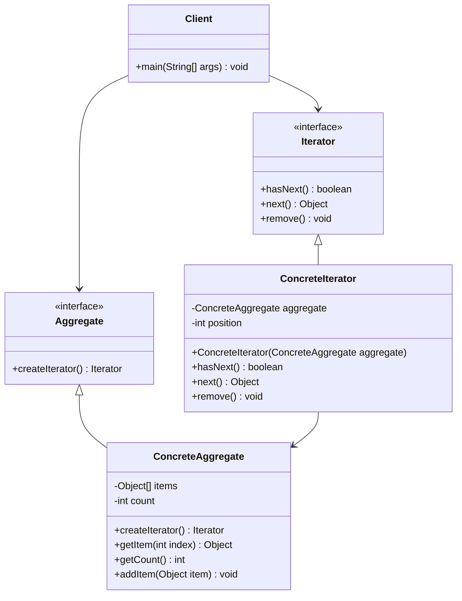

# 迭代器模式 (Iterator Pattern)

## 概述

迭代器模式是一种行为型设计模式，它提供一种方法来顺序访问聚合对象中的各个元素，而不需要暴露该对象的内部表示。迭代器模式将遍历算法从聚合对象中分离出来，使得可以独立地改变遍历算法而不影响聚合对象的结构。

### 核心思想

迭代器模式的核心思想是**将遍历行为从聚合对象中分离出来**，通过这种分离来：

- **统一访问接口**：为不同的聚合结构提供统一的遍历接口
- **隐藏内部结构**：客户端无需了解聚合对象的内部实现
- **支持多种遍历**：同一个聚合对象可以有多种遍历方式
- **简化聚合接口**：聚合对象的接口更加简洁
- **支持并发遍历**：可以同时进行多个遍历操作

## 使用场景

### 🎯 适用情况

1. **需要访问聚合对象的内容而无需暴露其内部表示**：保护聚合对象的封装性
2. **需要支持对聚合对象的多种遍历**：如正向、反向、按条件过滤等
3. **需要为不同的聚合结构提供统一的遍历接口**：如数组、链表、树等
4. **需要支持并发遍历**：多个客户端同时遍历同一个聚合对象
5. **集合框架的实现**：如Java的Collection框架
6. **数据库结果集的遍历**：如JDBC的ResultSet
7. **文件系统的遍历**：如目录树的遍历
8. **图形界面的组件遍历**：如GUI组件树的遍历

### 🚫 不适用情况

1. **简单的数组访问**：如果只是简单的索引访问，使用迭代器会增加复杂性
2. **性能要求极高**：迭代器的间接访问会带来一定的性能开销
3. **聚合对象结构简单且固定**：如果结构不会变化且访问模式单一

## UML 类图



## 核心组件

### 1. 迭代器接口 (Iterator)
定义访问和遍历元素的接口，通常包含hasNext()、next()等方法。

### 2. 具体迭代器 (ConcreteIterator)
实现迭代器接口，负责具体的遍历算法，维护遍历的当前位置。

### 3. 聚合接口 (Aggregate)
定义创建迭代器对象的接口。

### 4. 具体聚合 (ConcreteAggregate)
实现聚合接口，返回一个适当的具体迭代器实例。

## 代码示例

### 示例1：自定义集合的迭代器实现

```java
// 迭代器接口
interface Iterator<T> {
    boolean hasNext();
    T next();
    void remove();
    default void reset() {
        throw new UnsupportedOperationException("Reset not supported");
    }
}

// 聚合接口
interface Iterable<T> {
    Iterator<T> createIterator();
    Iterator<T> createReverseIterator();
    int size();
    boolean isEmpty();
}

// 自定义动态数组
class DynamicArray<T> implements Iterable<T> {
    private Object[] elements;
    private int size;
    private static final int DEFAULT_CAPACITY = 10;
    
    public DynamicArray() {
        this.elements = new Object[DEFAULT_CAPACITY];
        this.size = 0;
    }
    
    public DynamicArray(int initialCapacity) {
        this.elements = new Object[initialCapacity];
        this.size = 0;
    }
    
    public void add(T element) {
        ensureCapacity();
        elements[size++] = element;
    }
    
    public void add(int index, T element) {
        if (index < 0 || index > size) {
            throw new IndexOutOfBoundsException("Index: " + index + ", Size: " + size);
        }
        
        ensureCapacity();
        
        // 移动元素
        System.arraycopy(elements, index, elements, index + 1, size - index);
        elements[index] = element;
        size++;
    }
    
    @SuppressWarnings("unchecked")
    public T get(int index) {
        if (index < 0 || index >= size) {
            throw new IndexOutOfBoundsException("Index: " + index + ", Size: " + size);
        }
        return (T) elements[index];
    }
    
    public T remove(int index) {
        if (index < 0 || index >= size) {
            throw new IndexOutOfBoundsException("Index: " + index + ", Size: " + size);
        }
        
        @SuppressWarnings("unchecked")
        T removedElement = (T) elements[index];
        
        // 移动元素
        int numMoved = size - index - 1;
        if (numMoved > 0) {
            System.arraycopy(elements, index + 1, elements, index, numMoved);
        }
        
        elements[--size] = null; // 清除引用
        return removedElement;
    }
    
    private void ensureCapacity() {
        if (size >= elements.length) {
            int newCapacity = elements.length * 2;
            elements = Arrays.copyOf(elements, newCapacity);
        }
    }
    
    @Override
    public int size() {
        return size;
    }
    
    @Override
    public boolean isEmpty() {
        return size == 0;
    }
    
    @Override
    public Iterator<T> createIterator() {
        return new ForwardIterator();
    }
    
    @Override
    public Iterator<T> createReverseIterator() {
        return new ReverseIterator();
    }
    
    // 正向迭代器
    private class ForwardIterator implements Iterator<T> {
        private int currentIndex = 0;
        private int lastReturnedIndex = -1;
        private boolean canRemove = false;
        
        @Override
        public boolean hasNext() {
            return currentIndex < size;
        }
        
        @Override
        @SuppressWarnings("unchecked")
        public T next() {
            if (!hasNext()) {
                throw new NoSuchElementException("No more elements");
            }
            
            lastReturnedIndex = currentIndex;
            canRemove = true;
            return (T) elements[currentIndex++];
        }
        
        @Override
        public void remove() {
            if (!canRemove) {
                throw new IllegalStateException("remove() can only be called once per call to next()");
            }
            
            DynamicArray.this.remove(lastReturnedIndex);
            currentIndex = lastReturnedIndex;
            lastReturnedIndex = -1;
            canRemove = false;
        }
        
        @Override
        public void reset() {
            currentIndex = 0;
            lastReturnedIndex = -1;
            canRemove = false;
        }
    }
    
    // 反向迭代器
    private class ReverseIterator implements Iterator<T> {
        private int currentIndex;
        private int lastReturnedIndex = -1;
        private boolean canRemove = false;
        
        public ReverseIterator() {
            this.currentIndex = size - 1;
        }
        
        @Override
        public boolean hasNext() {
            return currentIndex >= 0;
        }
        
        @Override
        @SuppressWarnings("unchecked")
        public T next() {
            if (!hasNext()) {
                throw new NoSuchElementException("No more elements");
            }
            
            lastReturnedIndex = currentIndex;
            canRemove = true;
            return (T) elements[currentIndex--];
        }
        
        @Override
        public void remove() {
            if (!canRemove) {
                throw new IllegalStateException("remove() can only be called once per call to next()");
            }
            
            DynamicArray.this.remove(lastReturnedIndex);
            // 反向迭代时，删除元素后不需要调整currentIndex
            lastReturnedIndex = -1;
            canRemove = false;
        }
        
        @Override
        public void reset() {
            currentIndex = size - 1;
            lastReturnedIndex = -1;
            canRemove = false;
        }
    }
    
    @Override
    public String toString() {
        StringBuilder sb = new StringBuilder("[");
        Iterator<T> it = createIterator();
        while (it.hasNext()) {
            sb.append(it.next());
            if (it.hasNext()) {
                sb.append(", ");
            }
        }
        sb.append("]");
        return sb.toString();
    }
}

// 使用示例
public class DynamicArrayDemo {
    public static void main(String[] args) {
        DynamicArray<String> array = new DynamicArray<>();
        
        // 添加元素
        array.add("Apple");
        array.add("Banana");
        array.add("Cherry");
        array.add("Date");
        array.add("Elderberry");
        
        System.out.println("原始数组: " + array);
        
        // 正向遍历
        System.out.println("\n=== 正向遍历 ===");
        Iterator<String> forwardIt = array.createIterator();
        while (forwardIt.hasNext()) {
            String element = forwardIt.next();
            System.out.println("元素: " + element);
            
            // 删除包含"a"的元素
            if (element.toLowerCase().contains("a")) {
                forwardIt.remove();
                System.out.println("  -> 删除了: " + element);
            }
        }
        
        System.out.println("删除后的数组: " + array);
        
        // 反向遍历
        System.out.println("\n=== 反向遍历 ===");
        Iterator<String> reverseIt = array.createReverseIterator();
        while (reverseIt.hasNext()) {
            System.out.println("元素: " + reverseIt.next());
        }
        
        // 重置迭代器
        System.out.println("\n=== 重置后再次遍历 ===");
        forwardIt.reset();
        while (forwardIt.hasNext()) {
            System.out.println("元素: " + forwardIt.next());
        }
    }
}
```

### 示例2：树结构的多种遍历迭代器

```java
// 树节点
class TreeNode<T> {
    private T data;
    private List<TreeNode<T>> children;
    private TreeNode<T> parent;
    
    public TreeNode(T data) {
        this.data = data;
        this.children = new ArrayList<>();
        this.parent = null;
    }
    
    public void addChild(TreeNode<T> child) {
        children.add(child);
        child.parent = this;
    }
    
    public void removeChild(TreeNode<T> child) {
        children.remove(child);
        child.parent = null;
    }
    
    // getters
    public T getData() { return data; }
    public List<TreeNode<T>> getChildren() { return new ArrayList<>(children); }
    public TreeNode<T> getParent() { return parent; }
    public boolean isLeaf() { return children.isEmpty(); }
    public boolean isRoot() { return parent == null; }
    
    @Override
    public String toString() {
        return data.toString();
    }
}

// 树遍历类型枚举
enum TreeTraversalType {
    DEPTH_FIRST_PREORDER,   // 深度优先前序
    DEPTH_FIRST_POSTORDER,  // 深度优先后序
    BREADTH_FIRST           // 广度优先
}

// 树结构
class Tree<T> implements Iterable<T> {
    private TreeNode<T> root;
    
    public Tree(TreeNode<T> root) {
        this.root = root;
    }
    
    public TreeNode<T> getRoot() {
        return root;
    }
    
    @Override
    public Iterator<T> createIterator() {
        return createIterator(TreeTraversalType.DEPTH_FIRST_PREORDER);
    }
    
    @Override
    public Iterator<T> createReverseIterator() {
        return createIterator(TreeTraversalType.DEPTH_FIRST_POSTORDER);
    }
    
    public Iterator<T> createIterator(TreeTraversalType traversalType) {
        switch (traversalType) {
            case DEPTH_FIRST_PREORDER:
                return new DepthFirstPreorderIterator();
            case DEPTH_FIRST_POSTORDER:
                return new DepthFirstPostorderIterator();
            case BREADTH_FIRST:
                return new BreadthFirstIterator();
            default:
                throw new IllegalArgumentException("Unsupported traversal type: " + traversalType);
        }
    }
    
    @Override
    public int size() {
        return countNodes(root);
    }
    
    @Override
    public boolean isEmpty() {
        return root == null;
    }
    
    private int countNodes(TreeNode<T> node) {
        if (node == null) return 0;
        
        int count = 1;
        for (TreeNode<T> child : node.getChildren()) {
            count += countNodes(child);
        }
        return count;
    }
    
    // 深度优先前序遍历迭代器
    private class DepthFirstPreorderIterator implements Iterator<T> {
        private Stack<TreeNode<T>> stack;
        private TreeNode<T> lastReturned;
        
        public DepthFirstPreorderIterator() {
            stack = new Stack<>();
            if (root != null) {
                stack.push(root);
            }
        }
        
        @Override
        public boolean hasNext() {
            return !stack.isEmpty();
        }
        
        @Override
        public T next() {
            if (!hasNext()) {
                throw new NoSuchElementException();
            }
            
            TreeNode<T> current = stack.pop();
            lastReturned = current;
            
            // 将子节点逆序压入栈（这样弹出时就是正序）
            List<TreeNode<T>> children = current.getChildren();
            for (int i = children.size() - 1; i >= 0; i--) {
                stack.push(children.get(i));
            }
            
            return current.getData();
        }
        
        @Override
        public void remove() {
            if (lastReturned == null) {
                throw new IllegalStateException();
            }
            
            if (lastReturned.getParent() != null) {
                lastReturned.getParent().removeChild(lastReturned);
            }
            lastReturned = null;
        }
    }
    
    // 深度优先后序遍历迭代器
    private class DepthFirstPostorderIterator implements Iterator<T> {
        private Stack<TreeNode<T>> stack;
        private Set<TreeNode<T>> visited;
        private TreeNode<T> lastReturned;
        
        public DepthFirstPostorderIterator() {
            stack = new Stack<>();
            visited = new HashSet<>();
            if (root != null) {
                stack.push(root);
            }
        }
        
        @Override
        public boolean hasNext() {
            return !stack.isEmpty();
        }
        
        @Override
        public T next() {
            if (!hasNext()) {
                throw new NoSuchElementException();
            }
            
            TreeNode<T> current;
            
            while (!stack.isEmpty()) {
                current = stack.peek();
                
                if (current.isLeaf() || visited.contains(current)) {
                    // 叶子节点或已访问过子节点的节点
                    stack.pop();
                    visited.add(current);
                    lastReturned = current;
                    return current.getData();
                } else {
                    // 将子节点逆序压入栈
                    List<TreeNode<T>> children = current.getChildren();
                    for (int i = children.size() - 1; i >= 0; i--) {
                        stack.push(children.get(i));
                    }
                    visited.add(current);
                }
            }
            
            throw new NoSuchElementException();
        }
        
        @Override
        public void remove() {
            if (lastReturned == null) {
                throw new IllegalStateException();
            }
            
            if (lastReturned.getParent() != null) {
                lastReturned.getParent().removeChild(lastReturned);
            }
            lastReturned = null;
        }
    }
    
    // 广度优先遍历迭代器
    private class BreadthFirstIterator implements Iterator<T> {
        private Queue<TreeNode<T>> queue;
        private TreeNode<T> lastReturned;
        
        public BreadthFirstIterator() {
            queue = new LinkedList<>();
            if (root != null) {
                queue.offer(root);
            }
        }
        
        @Override
        public boolean hasNext() {
            return !queue.isEmpty();
        }
        
        @Override
        public T next() {
            if (!hasNext()) {
                throw new NoSuchElementException();
            }
            
            TreeNode<T> current = queue.poll();
            lastReturned = current;
            
            // 将子节点加入队列
            for (TreeNode<T> child : current.getChildren()) {
                queue.offer(child);
            }
            
            return current.getData();
        }
        
        @Override
        public void remove() {
            if (lastReturned == null) {
                throw new IllegalStateException();
            }
            
            if (lastReturned.getParent() != null) {
                lastReturned.getParent().removeChild(lastReturned);
            }
            lastReturned = null;
        }
    }
}

// 使用示例
public class TreeIteratorDemo {
    public static void main(String[] args) {
        // 构建树结构
        //       A
        //      /|\  
        //     B C D
        //    /| |\  
        //   E F G H
        
        TreeNode<String> root = new TreeNode<>("A");
        TreeNode<String> nodeB = new TreeNode<>("B");
        TreeNode<String> nodeC = new TreeNode<>("C");
        TreeNode<String> nodeD = new TreeNode<>("D");
        TreeNode<String> nodeE = new TreeNode<>("E");
        TreeNode<String> nodeF = new TreeNode<>("F");
        TreeNode<String> nodeG = new TreeNode<>("G");
        TreeNode<String> nodeH = new TreeNode<>("H");
        
        root.addChild(nodeB);
        root.addChild(nodeC);
        root.addChild(nodeD);
        
        nodeB.addChild(nodeE);
        nodeB.addChild(nodeF);
        nodeC.addChild(nodeG);
        nodeC.addChild(nodeH);
        
        Tree<String> tree = new Tree<>(root);
        
        System.out.println("树的大小: " + tree.size());
        
        // 深度优先前序遍历
        System.out.println("\n=== 深度优先前序遍历 ===");
        Iterator<String> preorderIt = tree.createIterator(TreeTraversalType.DEPTH_FIRST_PREORDER);
        while (preorderIt.hasNext()) {
            System.out.print(preorderIt.next() + " ");
        }
        
        // 深度优先后序遍历
        System.out.println("\n\n=== 深度优先后序遍历 ===");
        Iterator<String> postorderIt = tree.createIterator(TreeTraversalType.DEPTH_FIRST_POSTORDER);
        while (postorderIt.hasNext()) {
            System.out.print(postorderIt.next() + " ");
        }
        
        // 广度优先遍历
        System.out.println("\n\n=== 广度优先遍历 ===");
        Iterator<String> breadthFirstIt = tree.createIterator(TreeTraversalType.BREADTH_FIRST);
        while (breadthFirstIt.hasNext()) {
            System.out.print(breadthFirstIt.next() + " ");
        }
        
        System.out.println();
    }
}
```

## 优缺点分析

### ✅ 优点

1. **分离关注点**：将遍历算法从聚合对象中分离，使得两者可以独立变化
2. **统一接口**：为不同的聚合结构提供统一的遍历接口
3. **支持多种遍历**：同一个聚合对象可以有多种遍历方式
4. **简化聚合接口**：聚合对象的接口更加简洁，职责更加单一
5. **支持并发遍历**：可以同时进行多个遍历操作
6. **延迟计算**：可以实现惰性求值，只在需要时计算下一个元素
7. **内存效率**：对于大型数据集，可以避免一次性加载所有数据
8. **类型安全**：通过泛型提供编译时类型检查

### ❌ 缺点

1. **增加复杂性**：对于简单的聚合对象，使用迭代器可能过于复杂
2. **性能开销**：迭代器的间接访问会带来一定的性能开销
3. **内存占用**：每个迭代器都需要维护状态信息
4. **并发安全问题**：在多线程环境下需要额外考虑线程安全
5. **实现复杂**：对于复杂的数据结构，迭代器的实现可能很复杂

## 与其他模式的对比

### 🔄 迭代器模式 vs 访问者模式

| 特性 | 迭代器模式 | 访问者模式 |
|------|------------|------------|
| **目的** | 顺序访问聚合对象的元素 | 在不修改类的前提下定义新操作 |
| **关注点** | 遍历算法 | 操作算法 |
| **元素类型** | 通常同质 | 可以异质 |
| **操作复杂度** | 简单的访问操作 | 复杂的操作逻辑 |
| **扩展性** | 易于添加新的遍历方式 | 易于添加新的操作 |

### 🏭 迭代器模式 vs 工厂模式

| 特性 | 迭代器模式 | 工厂模式 |
|------|------------|----------|
| **目的** | 提供遍历接口 | 创建对象 |
| **生命周期** | 遍历过程中存在 | 创建完成后可能不再需要 |
| **状态管理** | 维护遍历状态 | 通常无状态 |
| **使用频率** | 频繁使用 | 按需使用 |

### 🎯 迭代器模式 vs 策略模式

| 特性 | 迭代器模式 | 策略模式 |
|------|------------|----------|
| **目的** | 遍历聚合对象 | 选择算法 |
| **算法类型** | 遍历算法 | 业务算法 |
| **状态依赖** | 依赖遍历状态 | 通常无状态 |
| **接口设计** | 固定的遍历接口 | 灵活的策略接口 |

## 实际应用场景

### 1. Java集合框架

```java
// Java集合框架中的迭代器使用
public class JavaIteratorExample {
    public static void main(String[] args) {
        List<String> list = Arrays.asList("Apple", "Banana", "Cherry");
        
        // 使用迭代器遍历
        Iterator<String> iterator = list.iterator();
        while (iterator.hasNext()) {
            String item = iterator.next();
            System.out.println(item);
            
            // 安全删除
            if ("Banana".equals(item)) {
                iterator.remove();
            }
        }
        
        // 使用增强for循环（内部使用迭代器）
        for (String item : list) {
            System.out.println(item);
        }
        
        // 使用Stream API（内部使用迭代器）
        list.stream()
            .filter(item -> item.startsWith("A"))
            .forEach(System.out::println);
    }
}
```

### 2. 数据库结果集遍历

```java
// 数据库结果集迭代器
class DatabaseResultIterator implements Iterator<Map<String, Object>> {
    private ResultSet resultSet;
    private ResultSetMetaData metaData;
    private boolean hasNextCached;
    private boolean hasNextValue;
    
    public DatabaseResultIterator(ResultSet resultSet) throws SQLException {
        this.resultSet = resultSet;
        this.metaData = resultSet.getMetaData();
        this.hasNextCached = false;
    }
    
    @Override
    public boolean hasNext() {
        if (!hasNextCached) {
            try {
                hasNextValue = resultSet.next();
                hasNextCached = true;
            } catch (SQLException e) {
                throw new RuntimeException("Error checking for next result", e);
            }
        }
        return hasNextValue;
    }
    
    @Override
    public Map<String, Object> next() {
        if (!hasNext()) {
            throw new NoSuchElementException("No more results");
        }
        
        try {
            Map<String, Object> row = new HashMap<>();
            int columnCount = metaData.getColumnCount();
            
            for (int i = 1; i <= columnCount; i++) {
                String columnName = metaData.getColumnName(i);
                Object value = resultSet.getObject(i);
                row.put(columnName, value);
            }
            
            hasNextCached = false; // 重置缓存
            return row;
        } catch (SQLException e) {
            throw new RuntimeException("Error reading result set", e);
        }
    }
    
    @Override
    public void remove() {
        throw new UnsupportedOperationException("Remove not supported for database results");
    }
}

// 数据库查询结果包装器
class QueryResult implements Iterable<Map<String, Object>>, AutoCloseable {
    private ResultSet resultSet;
    private Statement statement;
    private Connection connection;
    
    public QueryResult(Connection connection, String sql) throws SQLException {
        this.connection = connection;
        this.statement = connection.createStatement();
        this.resultSet = statement.executeQuery(sql);
    }
    
    @Override
    public Iterator<Map<String, Object>> iterator() {
        try {
            return new DatabaseResultIterator(resultSet);
        } catch (SQLException e) {
            throw new RuntimeException("Error creating iterator", e);
        }
    }
    
    @Override
    public void close() throws SQLException {
        if (resultSet != null) resultSet.close();
        if (statement != null) statement.close();
        // 注意：通常不在这里关闭connection，由调用者管理
    }
}
```

### 3. 文件系统遍历

```java
// 文件系统迭代器
class FileSystemIterator implements Iterator<Path> {
    private Stack<Iterator<Path>> iteratorStack;
    private Path nextPath;
    private boolean recursive;
    private Predicate<Path> filter;
    
    public FileSystemIterator(Path rootPath, boolean recursive, Predicate<Path> filter) {
        this.iteratorStack = new Stack<>();
        this.recursive = recursive;
        this.filter = filter != null ? filter : path -> true;
        
        try {
            if (Files.isDirectory(rootPath)) {
                iteratorStack.push(Files.list(rootPath).iterator());
            } else if (this.filter.test(rootPath)) {
                // 如果是文件且通过过滤器，创建单元素迭代器
                iteratorStack.push(Collections.singletonList(rootPath).iterator());
            }
        } catch (IOException e) {
            throw new RuntimeException("Error accessing path: " + rootPath, e);
        }
        
        advance();
    }
    
    private void advance() {
        nextPath = null;
        
        while (!iteratorStack.isEmpty() && nextPath == null) {
            Iterator<Path> currentIterator = iteratorStack.peek();
            
            if (currentIterator.hasNext()) {
                Path candidate = currentIterator.next();
                
                try {
                    if (Files.isDirectory(candidate) && recursive) {
                        // 如果是目录且需要递归，将其子目录迭代器压入栈
                        iteratorStack.push(Files.list(candidate).iterator());
                    }
                    
                    if (filter.test(candidate)) {
                        nextPath = candidate;
                    }
                } catch (IOException e) {
                    System.err.println("Error accessing: " + candidate + ", " + e.getMessage());
                    // 继续处理下一个文件
                }
            } else {
                // 当前迭代器已完成，弹出栈
                iteratorStack.pop();
            }
        }
    }
    
    @Override
    public boolean hasNext() {
        return nextPath != null;
    }
    
    @Override
    public Path next() {
        if (nextPath == null) {
            throw new NoSuchElementException("No more files");
        }
        
        Path result = nextPath;
        advance();
        return result;
    }
}

// 文件系统遍历器
class FileSystemTraverser implements Iterable<Path> {
    private Path rootPath;
    private boolean recursive;
    private Predicate<Path> filter;
    
    public FileSystemTraverser(Path rootPath) {
        this(rootPath, false, null);
    }
    
    public FileSystemTraverser(Path rootPath, boolean recursive) {
        this(rootPath, recursive, null);
    }
    
    public FileSystemTraverser(Path rootPath, boolean recursive, Predicate<Path> filter) {
        this.rootPath = rootPath;
        this.recursive = recursive;
        this.filter = filter;
    }
    
    @Override
    public Iterator<Path> iterator() {
        return new FileSystemIterator(rootPath, recursive, filter);
    }
    
    // 便利方法
    public static FileSystemTraverser files(Path rootPath) {
        return new FileSystemTraverser(rootPath, true, Files::isRegularFile);
    }
    
    public static FileSystemTraverser directories(Path rootPath) {
        return new FileSystemTraverser(rootPath, true, Files::isDirectory);
    }
    
    public static FileSystemTraverser withExtension(Path rootPath, String extension) {
        return new FileSystemTraverser(rootPath, true, 
            path -> Files.isRegularFile(path) && 
                   path.toString().toLowerCase().endsWith(extension.toLowerCase()));
    }
}

// 使用示例
public class FileSystemIteratorDemo {
    public static void main(String[] args) {
        Path currentDir = Paths.get(".");
        
        // 遍历所有Java文件
        System.out.println("=== Java文件 ===");
        for (Path path : FileSystemTraverser.withExtension(currentDir, ".java")) {
            System.out.println(path);
        }
        
        // 遍历所有目录
        System.out.println("\n=== 目录 ===");
        for (Path path : FileSystemTraverser.directories(currentDir)) {
            System.out.println(path);
        }
        
        // 自定义过滤器：大于1KB的文件
        System.out.println("\n=== 大于1KB的文件 ===");
        FileSystemTraverser largeFiles = new FileSystemTraverser(currentDir, true, 
            path -> {
                try {
                    return Files.isRegularFile(path) && Files.size(path) > 1024;
                } catch (IOException e) {
                    return false;
                }
            });
        
        for (Path path : largeFiles) {
            try {
                long size = Files.size(path);
                System.out.println(path + " (" + size + " bytes)");
            } catch (IOException e) {
                System.out.println(path + " (size unknown)");
            }
        }
    }
}
```

## 模式变种和扩展

### 1. 外部迭代器 vs 内部迭代器

```java
// 外部迭代器（客户端控制遍历）
class ExternalIterator<T> implements Iterator<T> {
    private List<T> items;
    private int position;
    
    public ExternalIterator(List<T> items) {
        this.items = items;
        this.position = 0;
    }
    
    @Override
    public boolean hasNext() {
        return position < items.size();
    }
    
    @Override
    public T next() {
        if (!hasNext()) {
            throw new NoSuchElementException();
        }
        return items.get(position++);
    }
}

// 内部迭代器（集合控制遍历）
class InternalIterator<T> {
    private List<T> items;
    
    public InternalIterator(List<T> items) {
        this.items = items;
    }
    
    public void forEach(Consumer<T> action) {
        for (T item : items) {
            action.accept(item);
        }
    }
    
    public void forEachWithIndex(BiConsumer<Integer, T> action) {
        for (int i = 0; i < items.size(); i++) {
            action.accept(i, items.get(i));
        }
    }
    
    public <R> List<R> map(Function<T, R> mapper) {
        List<R> result = new ArrayList<>();
        for (T item : items) {
            result.add(mapper.apply(item));
        }
        return result;
    }
    
    public List<T> filter(Predicate<T> predicate) {
        List<T> result = new ArrayList<>();
        for (T item : items) {
            if (predicate.test(item)) {
                result.add(item);
            }
        }
        return result;
    }
}
```

### 2. 惰性迭代器

```java
// 惰性迭代器：只在需要时计算下一个元素
class LazyIterator<T> implements Iterator<T> {
    private Supplier<T> supplier;
    private Predicate<T> hasNextCondition;
    private T nextElement;
    private boolean nextComputed;
    
    public LazyIterator(Supplier<T> supplier, Predicate<T> hasNextCondition) {
        this.supplier = supplier;
        this.hasNextCondition = hasNextCondition;
        this.nextComputed = false;
    }
    
    @Override
    public boolean hasNext() {
        if (!nextComputed) {
            nextElement = supplier.get();
            nextComputed = true;
        }
        return hasNextCondition.test(nextElement);
    }
    
    @Override
    public T next() {
        if (!hasNext()) {
            throw new NoSuchElementException();
        }
        
        T result = nextElement;
        nextComputed = false;
        return result;
    }
}

// 斐波那契数列的惰性迭代器
class FibonacciIterator implements Iterator<Long> {
    private long current = 0;
    private long next = 1;
    private final long maxValue;
    
    public FibonacciIterator(long maxValue) {
        this.maxValue = maxValue;
    }
    
    @Override
    public boolean hasNext() {
        return current <= maxValue;
    }
    
    @Override
    public Long next() {
        if (!hasNext()) {
            throw new NoSuchElementException();
        }
        
        long result = current;
        long temp = current + next;
        current = next;
        next = temp;
        return result;
    }
}

// 使用示例
public class LazyIteratorDemo {
    public static void main(String[] args) {
        // 斐波那契数列
        System.out.println("=== 斐波那契数列（小于100） ===");
        Iterator<Long> fibIterator = new FibonacciIterator(100);
        while (fibIterator.hasNext()) {
            System.out.print(fibIterator.next() + " ");
        }
        System.out.println();
        
        // 随机数迭代器
        System.out.println("\n=== 随机数（10个） ===");
        Random random = new Random();
        LazyIterator<Integer> randomIterator = new LazyIterator<>(
            () -> random.nextInt(100),
            value -> true // 总是有下一个
        );
        
        for (int i = 0; i < 10 && randomIterator.hasNext(); i++) {
            System.out.print(randomIterator.next() + " ");
        }
        System.out.println();
    }
}
```

### 3. 组合迭代器

```java
// 组合迭代器：将多个迭代器组合成一个
class CompositeIterator<T> implements Iterator<T> {
    private List<Iterator<T>> iterators;
    private int currentIteratorIndex;
    
    @SafeVarargs
    public CompositeIterator(Iterator<T>... iterators) {
        this.iterators = Arrays.asList(iterators);
        this.currentIteratorIndex = 0;
    }
    
    public CompositeIterator(List<Iterator<T>> iterators) {
        this.iterators = new ArrayList<>(iterators);
        this.currentIteratorIndex = 0;
    }
    
    @Override
    public boolean hasNext() {
        while (currentIteratorIndex < iterators.size()) {
            if (iterators.get(currentIteratorIndex).hasNext()) {
                return true;
            }
            currentIteratorIndex++;
        }
        return false;
    }
    
    @Override
    public T next() {
        if (!hasNext()) {
            throw new NoSuchElementException();
        }
        return iterators.get(currentIteratorIndex).next();
    }
    
    @Override
    public void remove() {
        if (currentIteratorIndex >= iterators.size()) {
            throw new IllegalStateException();
        }
        iterators.get(currentIteratorIndex).remove();
    }
}

// 过滤迭代器：只返回满足条件的元素
class FilterIterator<T> implements Iterator<T> {
    private Iterator<T> sourceIterator;
    private Predicate<T> predicate;
    private T nextElement;
    private boolean hasNextElement;
    
    public FilterIterator(Iterator<T> sourceIterator, Predicate<T> predicate) {
        this.sourceIterator = sourceIterator;
        this.predicate = predicate;
        advance();
    }
    
    private void advance() {
        hasNextElement = false;
        while (sourceIterator.hasNext()) {
            T element = sourceIterator.next();
            if (predicate.test(element)) {
                nextElement = element;
                hasNextElement = true;
                break;
            }
        }
    }
    
    @Override
    public boolean hasNext() {
        return hasNextElement;
    }
    
    @Override
    public T next() {
        if (!hasNext()) {
            throw new NoSuchElementException();
        }
        
        T result = nextElement;
        advance();
        return result;
    }
}

// 转换迭代器：将元素转换为另一种类型
class TransformIterator<T, R> implements Iterator<R> {
    private Iterator<T> sourceIterator;
    private Function<T, R> transformer;
    
    public TransformIterator(Iterator<T> sourceIterator, Function<T, R> transformer) {
        this.sourceIterator = sourceIterator;
        this.transformer = transformer;
    }
    
    @Override
    public boolean hasNext() {
        return sourceIterator.hasNext();
    }
    
    @Override
    public R next() {
        return transformer.apply(sourceIterator.next());
    }
}
```

## 最佳实践

### 1. 迭代器设计原则

```java
// 健壮的迭代器实现
public abstract class RobustIterator<T> implements Iterator<T> {
    protected boolean canRemove = false;
    protected T lastReturned = null;
    
    @Override
    public final T next() {
        if (!hasNext()) {
            throw new NoSuchElementException("No more elements");
        }
        
        T element = doNext();
        lastReturned = element;
        canRemove = true;
        return element;
    }
    
    @Override
    public final void remove() {
        if (!canRemove) {
            throw new IllegalStateException(
                "remove() can only be called once per call to next()");
        }
        
        doRemove(lastReturned);
        lastReturned = null;
        canRemove = false;
    }
    
    // 子类需要实现的方法
    protected abstract T doNext();
    protected abstract void doRemove(T element);
    
    // 可选的重置方法
    public void reset() {
        canRemove = false;
        lastReturned = null;
        doReset();
    }
    
    protected void doReset() {
        // 默认实现：不支持重置
        throw new UnsupportedOperationException("Reset not supported");
    }
}
```

### 2. 线程安全的迭代器

```java
// 线程安全的迭代器实现
class ThreadSafeIterator<T> implements Iterator<T> {
    private final List<T> snapshot;
    private int position;
    private final Object lock = new Object();
    
    public ThreadSafeIterator(List<T> source) {
        // 创建快照以避免并发修改
        synchronized (source) {
            this.snapshot = new ArrayList<>(source);
        }
        this.position = 0;
    }
    
    @Override
    public boolean hasNext() {
        synchronized (lock) {
            return position < snapshot.size();
        }
    }
    
    @Override
    public T next() {
        synchronized (lock) {
            if (!hasNext()) {
                throw new NoSuchElementException();
            }
            return snapshot.get(position++);
        }
    }
    
    @Override
    public void remove() {
        throw new UnsupportedOperationException(
            "Remove not supported in thread-safe iterator");
    }
}

// 写时复制的线程安全集合
class CopyOnWriteList<T> implements Iterable<T> {
    private volatile List<T> list;
    private final Object lock = new Object();
    
    public CopyOnWriteList() {
        this.list = new ArrayList<>();
    }
    
    public void add(T element) {
        synchronized (lock) {
            List<T> newList = new ArrayList<>(list);
            newList.add(element);
            list = newList;
        }
    }
    
    public boolean remove(T element) {
        synchronized (lock) {
            List<T> newList = new ArrayList<>(list);
            boolean removed = newList.remove(element);
            if (removed) {
                list = newList;
            }
            return removed;
        }
    }
    
    @Override
    public Iterator<T> iterator() {
        // 返回当前快照的迭代器，天然线程安全
        return list.iterator();
    }
    
    public int size() {
        return list.size();
    }
}
```

### 3. 性能优化策略

```java
// 缓存迭代器：减少重复计算
class CachedIterator<T> implements Iterator<T> {
    private Iterator<T> sourceIterator;
    private List<T> cache;
    private int cacheIndex;
    private boolean fullyLoaded;
    
    public CachedIterator(Iterator<T> sourceIterator) {
        this.sourceIterator = sourceIterator;
        this.cache = new ArrayList<>();
        this.cacheIndex = 0;
        this.fullyLoaded = false;
    }
    
    @Override
    public boolean hasNext() {
        if (cacheIndex < cache.size()) {
            return true;
        }
        
        if (!fullyLoaded && sourceIterator.hasNext()) {
            return true;
        }
        
        return false;
    }
    
    @Override
    public T next() {
        if (cacheIndex < cache.size()) {
            return cache.get(cacheIndex++);
        }
        
        if (!fullyLoaded && sourceIterator.hasNext()) {
            T element = sourceIterator.next();
            cache.add(element);
            cacheIndex++;
            return element;
        }
        
        throw new NoSuchElementException();
    }
    
    // 重置到开始位置
    public void reset() {
        cacheIndex = 0;
    }
    
    // 预加载所有元素
    public void preload() {
        while (!fullyLoaded && sourceIterator.hasNext()) {
            cache.add(sourceIterator.next());
        }
        fullyLoaded = true;
    }
}

// 批量迭代器：批量处理元素以提高性能
class BatchIterator<T> implements Iterator<List<T>> {
    private Iterator<T> sourceIterator;
    private int batchSize;
    
    public BatchIterator(Iterator<T> sourceIterator, int batchSize) {
        this.sourceIterator = sourceIterator;
        this.batchSize = batchSize;
    }
    
    @Override
    public boolean hasNext() {
        return sourceIterator.hasNext();
    }
    
    @Override
    public List<T> next() {
        if (!hasNext()) {
            throw new NoSuchElementException();
        }
        
        List<T> batch = new ArrayList<>(batchSize);
        for (int i = 0; i < batchSize && sourceIterator.hasNext(); i++) {
            batch.add(sourceIterator.next());
        }
        
        return batch;
    }
}
```

### 4. 监控和调试

```java
// 监控迭代器：统计遍历信息
class MonitoringIterator<T> implements Iterator<T> {
    private Iterator<T> sourceIterator;
    private long elementCount;
    private long startTime;
    private String name;
    
    public MonitoringIterator(Iterator<T> sourceIterator, String name) {
        this.sourceIterator = sourceIterator;
        this.name = name;
        this.elementCount = 0;
        this.startTime = System.currentTimeMillis();
    }
    
    @Override
    public boolean hasNext() {
        boolean hasNext = sourceIterator.hasNext();
        if (!hasNext) {
            logStatistics();
        }
        return hasNext;
    }
    
    @Override
    public T next() {
        T element = sourceIterator.next();
        elementCount++;
        
        if (elementCount % 1000 == 0) {
            logProgress();
        }
        
        return element;
    }
    
    @Override
    public void remove() {
        sourceIterator.remove();
    }
    
    private void logProgress() {
        long elapsed = System.currentTimeMillis() - startTime;
        double rate = elementCount / (elapsed / 1000.0);
        System.out.printf("[%s] 已处理 %d 个元素，速率: %.2f 元素/秒%n", 
                         name, elementCount, rate);
    }
    
    private void logStatistics() {
        long elapsed = System.currentTimeMillis() - startTime;
        double rate = elementCount / (elapsed / 1000.0);
        System.out.printf("[%s] 遍历完成：总计 %d 个元素，耗时 %d ms，平均速率: %.2f 元素/秒%n", 
                         name, elementCount, elapsed, rate);
    }
}
```

## 总结

迭代器模式是一种非常实用的设计模式，它通过将遍历算法从聚合对象中分离出来，提供了统一的访问接口，使得客户端可以透明地访问不同类型的聚合对象。

### 🎯 核心价值

1. **统一访问**：为不同的数据结构提供统一的遍历接口
2. **封装保护**：隐藏聚合对象的内部结构
3. **职责分离**：将遍历逻辑从聚合对象中分离
4. **灵活扩展**：支持多种遍历方式和并发遍历

### 💡 使用建议

1. **合理选择**：对于简单的数组访问，直接使用索引可能更高效
2. **线程安全**：在多线程环境下要考虑线程安全问题
3. **性能优化**：对于大数据集，考虑使用惰性加载和批量处理
4. **异常处理**：正确处理并发修改异常和边界条件
5. **资源管理**：及时释放迭代器占用的资源

### 🚀 实际应用

迭代器模式在现代软件开发中无处不在：

- **Java集合框架**：ArrayList、LinkedList、HashMap等都实现了Iterator接口
- **数据库访问**：JDBC的ResultSet提供了类似迭代器的接口
- **文件处理**：文件系统遍历、日志文件读取等
- **流处理**：Java 8的Stream API内部大量使用迭代器
- **Web框架**：分页查询、数据流处理等

通过合理使用迭代器模式，我们可以编写出更加灵活、可维护和高效的代码。
```