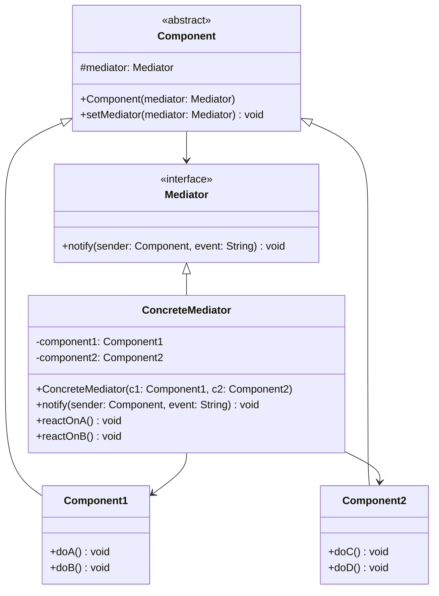

# 中介者模式 (Mediator Pattern)

## 概述

中介者模式是一种行为型设计模式，它定义了一个中介对象来封装一系列对象之间的交互。中介者使各对象不需要显式地相互引用，从而使其耦合松散，而且可以独立地改变它们之间的交互。

### 核心思想

中介者模式的核心思想是**通过中介者对象来协调多个对象之间的交互**，通过这种方式来：

- **减少对象间的直接依赖**：对象不直接引用其他对象，而是通过中介者进行通信
- **集中控制交互逻辑**：将复杂的交互逻辑集中在中介者中管理
- **提高系统的可维护性**：修改交互逻辑只需要修改中介者
- **支持松耦合设计**：各个对象可以独立变化，不影响其他对象
- **简化对象协议**：对象只需要知道中介者接口，不需要了解其他对象

## 使用场景

### 🎯 适用情况

1. **一组对象以定义良好但复杂的方式进行通信**：对象间的依赖关系复杂且混乱
2. **一个对象引用其他很多对象并且直接与这些对象通信**：导致难以复用该对象
3. **想定制一个分布在多个类中的行为**：而又不想生成太多的子类
4. **对象间的交互逻辑复杂**：需要集中管理这些交互
5. **GUI组件间的交互**：如对话框中各控件的协调
6. **聊天室系统**：用户间的消息传递
7. **工作流系统**：各个步骤间的协调
8. **游戏中的对象交互**：如飞机大战中各个游戏对象的交互

### 🚫 不适用情况

1. **对象间交互简单**：只有少数几个对象且交互逻辑简单
2. **对象间需要紧密耦合**：某些场景下对象间的直接通信更高效
3. **中介者会变得过于复杂**：如果中介者承担了太多职责

## UML 类图



## 核心组件

### 1. 抽象中介者 (Mediator)
定义同事对象到中介者对象的接口。

### 2. 具体中介者 (ConcreteMediator)
实现抽象中介者的接口，协调各个同事对象实现协作行为。

### 3. 抽象同事类 (Colleague)
定义同事对象的公共接口，保存中介者对象的引用。

### 4. 具体同事类 (ConcreteColleague)
实现抽象同事类，当需要与其他同事通信时，通过中介者进行。

## Java 示例

### 示例1：聊天室系统

```java
// 抽象中介者
interface ChatMediator {
    void sendMessage(String message, User user);
    void addUser(User user);
    void removeUser(User user);
}

// 具体中介者
class ChatRoom implements ChatMediator {
    private List<User> users;
    
    public ChatRoom() {
        this.users = new ArrayList<>();
    }
    
    @Override
    public void addUser(User user) {
        users.add(user);
        System.out.println(user.getName() + " 加入了聊天室");
    }
    
    @Override
    public void removeUser(User user) {
        users.remove(user);
        System.out.println(user.getName() + " 离开了聊天室");
    }
    
    @Override
    public void sendMessage(String message, User sender) {
        for (User user : users) {
            if (user != sender) {
                user.receive(message, sender.getName());
            }
        }
    }
}

// 抽象同事类
abstract class User {
    protected ChatMediator mediator;
    protected String name;
    
    public User(ChatMediator mediator, String name) {
        this.mediator = mediator;
        this.name = name;
    }
    
    public abstract void send(String message);
    public abstract void receive(String message, String from);
    
    public String getName() {
        return name;
    }
}

// 具体同事类
class ConcreteUser extends User {
    public ConcreteUser(ChatMediator mediator, String name) {
        super(mediator, name);
    }
    
    @Override
    public void send(String message) {
        System.out.println(name + " 发送消息: " + message);
        mediator.sendMessage(message, this);
    }
    
    @Override
    public void receive(String message, String from) {
        System.out.println(name + " 收到来自 " + from + " 的消息: " + message);
    }
}

// 使用示例
public class ChatRoomExample {
    public static void main(String[] args) {
        ChatMediator chatRoom = new ChatRoom();
        
        User alice = new ConcreteUser(chatRoom, "Alice");
        User bob = new ConcreteUser(chatRoom, "Bob");
        User charlie = new ConcreteUser(chatRoom, "Charlie");
        
        chatRoom.addUser(alice);
        chatRoom.addUser(bob);
        chatRoom.addUser(charlie);
        
        alice.send("大家好！");
        bob.send("你好，Alice！");
        charlie.send("很高兴认识大家！");
        
        chatRoom.removeUser(bob);
        alice.send("Bob 离开了");
    }
}
```

### 示例2：智能家居控制系统

```java
// 智能家居中介者接口
interface SmartHomeMediator {
    void notify(Component sender, String event);
    void registerComponent(Component component);
}

// 具体智能家居中介者
class SmartHomeController implements SmartHomeMediator {
    private TemperatureSensor temperatureSensor;
    private AirConditioner airConditioner;
    private LightSystem lightSystem;
    private SecuritySystem securitySystem;
    private boolean isNightMode = false;
    
    @Override
    public void registerComponent(Component component) {
        component.setMediator(this);
        
        if (component instanceof TemperatureSensor) {
            this.temperatureSensor = (TemperatureSensor) component;
        } else if (component instanceof AirConditioner) {
            this.airConditioner = (AirConditioner) component;
        } else if (component instanceof LightSystem) {
            this.lightSystem = (LightSystem) component;
        } else if (component instanceof SecuritySystem) {
            this.securitySystem = (SecuritySystem) component;
        }
    }
    
    @Override
    public void notify(Component sender, String event) {
        System.out.println("[控制中心] 收到事件: " + event + " 来自: " + sender.getName());
        
        if (sender == temperatureSensor) {
            handleTemperatureEvent(event);
        } else if (sender == securitySystem) {
            handleSecurityEvent(event);
        } else if (sender == lightSystem) {
            handleLightEvent(event);
        }
    }
    
    private void handleTemperatureEvent(String event) {
        if (event.startsWith("TEMP_HIGH")) {
            double temp = Double.parseDouble(event.split(":")[1]);
            if (temp > 26) {
                airConditioner.turnOn();
                airConditioner.setTemperature(24);
            }
        } else if (event.startsWith("TEMP_LOW")) {
            double temp = Double.parseDouble(event.split(":")[1]);
            if (temp < 18) {
                airConditioner.turnOn();
                airConditioner.setTemperature(22);
            }
        }
    }
    
    private void handleSecurityEvent(String event) {
        if ("NIGHT_MODE_ON".equals(event)) {
            isNightMode = true;
            lightSystem.setNightMode(true);
            airConditioner.setEcoMode(true);
        } else if ("NIGHT_MODE_OFF".equals(event)) {
            isNightMode = false;
            lightSystem.setNightMode(false);
            airConditioner.setEcoMode(false);
        } else if ("INTRUSION_DETECTED".equals(event)) {
            lightSystem.turnOnAllLights();
            // 可以添加报警逻辑
        }
    }
    
    private void handleLightEvent(String event) {
        if ("MOTION_DETECTED".equals(event) && isNightMode) {
            lightSystem.turnOnDimLight();
        }
    }
}

// 抽象组件
abstract class Component {
    protected SmartHomeMediator mediator;
    protected String name;
    
    public Component(String name) {
        this.name = name;
    }
    
    public void setMediator(SmartHomeMediator mediator) {
        this.mediator = mediator;
    }
    
    public String getName() {
        return name;
    }
}

// 温度传感器
class TemperatureSensor extends Component {
    private double currentTemperature;
    
    public TemperatureSensor() {
        super("温度传感器");
    }
    
    public void updateTemperature(double temperature) {
        this.currentTemperature = temperature;
        System.out.println("[" + name + "] 当前温度: " + temperature + "°C");
        
        if (temperature > 26) {
            mediator.notify(this, "TEMP_HIGH:" + temperature);
        } else if (temperature < 18) {
            mediator.notify(this, "TEMP_LOW:" + temperature);
        }
    }
}

// 空调
class AirConditioner extends Component {
    private boolean isOn = false;
    private double targetTemperature = 24;
    private boolean ecoMode = false;
    
    public AirConditioner() {
        super("空调");
    }
    
    public void turnOn() {
        isOn = true;
        System.out.println("[" + name + "] 已开启，目标温度: " + targetTemperature + "°C");
    }
    
    public void turnOff() {
        isOn = false;
        System.out.println("[" + name + "] 已关闭");
    }
    
    public void setTemperature(double temperature) {
        this.targetTemperature = temperature;
        if (isOn) {
            System.out.println("[" + name + "] 设置温度为: " + temperature + "°C");
        }
    }
    
    public void setEcoMode(boolean ecoMode) {
        this.ecoMode = ecoMode;
        System.out.println("[" + name + "] 节能模式: " + (ecoMode ? "开启" : "关闭"));
    }
}

// 灯光系统
class LightSystem extends Component {
    private boolean nightMode = false;
    private boolean allLightsOn = false;
    
    public LightSystem() {
        super("灯光系统");
    }
    
    public void setNightMode(boolean nightMode) {
        this.nightMode = nightMode;
        System.out.println("[" + name + "] 夜间模式: " + (nightMode ? "开启" : "关闭"));
    }
    
    public void turnOnAllLights() {
        allLightsOn = true;
        System.out.println("[" + name + "] 所有灯光已开启");
    }
    
    public void turnOnDimLight() {
        System.out.println("[" + name + "] 开启微光照明");
    }
    
    public void detectMotion() {
        System.out.println("[" + name + "] 检测到移动");
        mediator.notify(this, "MOTION_DETECTED");
    }
}

// 安防系统
class SecuritySystem extends Component {
    private boolean nightModeActive = false;
    
    public SecuritySystem() {
        super("安防系统");
    }
    
    public void activateNightMode() {
        nightModeActive = true;
        System.out.println("[" + name + "] 激活夜间模式");
        mediator.notify(this, "NIGHT_MODE_ON");
    }
    
    public void deactivateNightMode() {
        nightModeActive = false;
        System.out.println("[" + name + "] 关闭夜间模式");
        mediator.notify(this, "NIGHT_MODE_OFF");
    }
    
    public void detectIntrusion() {
        System.out.println("[" + name + "] 检测到入侵！");
        mediator.notify(this, "INTRUSION_DETECTED");
    }
}

// 使用示例
public class SmartHomeExample {
    public static void main(String[] args) {
        // 创建中介者
        SmartHomeController controller = new SmartHomeController();
        
        // 创建组件
        TemperatureSensor tempSensor = new TemperatureSensor();
        AirConditioner airConditioner = new AirConditioner();
        LightSystem lightSystem = new LightSystem();
        SecuritySystem securitySystem = new SecuritySystem();
        
        // 注册组件到中介者
        controller.registerComponent(tempSensor);
        controller.registerComponent(airConditioner);
        controller.registerComponent(lightSystem);
        controller.registerComponent(securitySystem);
        
        System.out.println("=== 智能家居系统启动 ===");
        
        // 模拟各种场景
        System.out.println("\n--- 场景1: 温度过高 ---");
        tempSensor.updateTemperature(28);
        
        System.out.println("\n--- 场景2: 激活夜间模式 ---");
        securitySystem.activateNightMode();
        
        System.out.println("\n--- 场景3: 夜间检测到移动 ---");
        lightSystem.detectMotion();
        
        System.out.println("\n--- 场景4: 检测到入侵 ---");
        securitySystem.detectIntrusion();
        
        System.out.println("\n--- 场景5: 关闭夜间模式 ---");
        securitySystem.deactivateNightMode();
    }
}
```

## 优缺点分析

### ✅ 优点

1. **减少类间依赖**
   - 同事类之间不直接引用，降低了耦合度
   - 各个同事类可以独立变化

2. **集中控制交互逻辑**
   - 将复杂的交互逻辑集中在中介者中
   - 便于理解和维护

3. **提高组件复用性**
   - 同事类不依赖于其他具体同事类
   - 可以在不同的中介者中复用

4. **符合开闭原则**
   - 可以通过扩展中介者来支持新的交互
   - 不需要修改现有的同事类

5. **简化对象协议**
   - 对象只需要知道中介者接口
   - 减少了对象间的通信复杂度

### ❌ 缺点

1. **中介者可能变得复杂**
   - 随着同事类的增加，中介者的逻辑会变得复杂
   - 可能违反单一职责原则

2. **中介者成为性能瓶颈**
   - 所有交互都通过中介者，可能影响性能
   - 中介者故障会影响整个系统

3. **增加系统复杂性**
   - 引入了额外的抽象层
   - 对于简单的交互可能过度设计

## 与其他模式的对比

### 🆚 中介者模式 vs 观察者模式

| 特性 | 中介者模式 | 观察者模式 |
|------|------------|------------|
| **通信方式** | 双向通信（通过中介者） | 单向通知（主题到观察者） |
| **关系复杂度** | 多对多关系的简化 | 一对多关系 |
| **控制中心** | 有中心化的控制逻辑 | 分散的事件处理 |
| **耦合程度** | 同事类与中介者耦合 | 观察者与主题耦合 |
| **使用场景** | 复杂的对象交互 | 事件通知、状态同步 |

### 🆚 中介者模式 vs 外观模式

| 特性 | 中介者模式 | 外观模式 |
|------|------------|----------|
| **目的** | 协调对象间的交互 | 简化子系统接口 |
| **通信方向** | 双向通信 | 单向调用 |
| **对象关系** | 对象间相互协作 | 客户端调用子系统 |
| **复杂度** | 处理交互逻辑 | 隐藏子系统复杂性 |

## 实际应用场景

### 1. GUI 框架中的事件处理

```java
// Swing 中的事件处理就是中介者模式的应用
public class DialogExample {
    private JDialog dialog;
    private JTextField nameField;
    private JTextField emailField;
    private JButton okButton;
    private JButton cancelButton;
    
    public DialogExample() {
        setupDialog();
        setupEventHandling(); // 中介者协调各组件
    }
    
    private void setupEventHandling() {
        // 文本框变化时启用/禁用确定按钮
        DocumentListener docListener = new DocumentListener() {
            @Override
            public void insertUpdate(DocumentEvent e) { validateForm(); }
            @Override
            public void removeUpdate(DocumentEvent e) { validateForm(); }
            @Override
            public void changedUpdate(DocumentEvent e) { validateForm(); }
        };
        
        nameField.getDocument().addDocumentListener(docListener);
        emailField.getDocument().addDocumentListener(docListener);
    }
    
    private void validateForm() {
        boolean isValid = !nameField.getText().trim().isEmpty() && 
                         !emailField.getText().trim().isEmpty();
        okButton.setEnabled(isValid);
    }
}
```

### 2. 工作流引擎

```java
// 工作流中介者
class WorkflowMediator {
    private Map<String, WorkflowStep> steps;
    private String currentStep;
    
    public void executeStep(String stepId, WorkflowContext context) {
        WorkflowStep step = steps.get(stepId);
        StepResult result = step.execute(context);
        
        // 根据执行结果决定下一步
        String nextStep = determineNextStep(stepId, result);
        if (nextStep != null) {
            executeStep(nextStep, context);
        }
    }
}
```

### 3. 微服务架构中的服务协调

```java
// 服务编排中介者
@Service
public class OrderProcessingMediator {
    
    @Autowired
    private InventoryService inventoryService;
    
    @Autowired
    private PaymentService paymentService;
    
    @Autowired
    private ShippingService shippingService;
    
    public OrderResult processOrder(OrderRequest request) {
        // 协调多个服务完成订单处理
        try {
            // 1. 检查库存
            InventoryResult inventory = inventoryService.checkInventory(request);
            if (!inventory.isAvailable()) {
                return OrderResult.failed("库存不足");
            }
            
            // 2. 处理支付
            PaymentResult payment = paymentService.processPayment(request);
            if (!payment.isSuccessful()) {
                return OrderResult.failed("支付失败");
            }
            
            // 3. 安排发货
            ShippingResult shipping = shippingService.arrangeShipping(request);
            
            return OrderResult.success(shipping.getTrackingNumber());
            
        } catch (Exception e) {
            // 协调回滚操作
            rollbackOrder(request);
            return OrderResult.failed("订单处理失败: " + e.getMessage());
        }
    }
    
    private void rollbackOrder(OrderRequest request) {
        // 协调各服务进行回滚
        inventoryService.releaseInventory(request);
        paymentService.refund(request);
        shippingService.cancelShipping(request);
    }
}
```

## 模式变种和扩展

### 1. 分层中介者模式

```java
// 分层中介者 - 处理不同层次的交互
interface LayeredMediator {
    void handleUIEvent(UIComponent source, String event);
    void handleBusinessEvent(BusinessComponent source, String event);
    void handleDataEvent(DataComponent source, String event);
}

class ApplicationMediator implements LayeredMediator {
    // UI层组件
    private UIController uiController;
    // 业务层组件
    private BusinessService businessService;
    // 数据层组件
    private DataRepository dataRepository;
    
    @Override
    public void handleUIEvent(UIComponent source, String event) {
        // 将UI事件转换为业务操作
        if ("SAVE_BUTTON_CLICKED".equals(event)) {
            businessService.saveData(uiController.getFormData());
        }
    }
    
    @Override
    public void handleBusinessEvent(BusinessComponent source, String event) {
        // 处理业务事件
        if ("DATA_VALIDATION_FAILED".equals(event)) {
            uiController.showValidationError();
        } else if ("DATA_SAVED".equals(event)) {
            uiController.showSuccessMessage();
        }
    }
    
    @Override
    public void handleDataEvent(DataComponent source, String event) {
        // 处理数据事件
        if ("CONNECTION_LOST".equals(event)) {
            businessService.handleConnectionLoss();
            uiController.showConnectionError();
        }
    }
}
```

### 2. 异步中介者模式

```java
// 异步中介者 - 支持异步消息处理
class AsyncMediator {
    private ExecutorService executor;
    private BlockingQueue<MediatorMessage> messageQueue;
    
    public AsyncMediator() {
        this.executor = Executors.newFixedThreadPool(4);
        this.messageQueue = new LinkedBlockingQueue<>();
        startMessageProcessor();
    }
    
    public void sendMessage(Component sender, String event, Object data) {
        MediatorMessage message = new MediatorMessage(sender, event, data);
        try {
            messageQueue.put(message);
        } catch (InterruptedException e) {
            Thread.currentThread().interrupt();
        }
    }
    
    private void startMessageProcessor() {
        executor.submit(() -> {
            while (!Thread.currentThread().isInterrupted()) {
                try {
                    MediatorMessage message = messageQueue.take();
                    processMessage(message);
                } catch (InterruptedException e) {
                    Thread.currentThread().interrupt();
                    break;
                }
            }
        });
    }
    
    private void processMessage(MediatorMessage message) {
        // 异步处理消息
        executor.submit(() -> {
            handleMessage(message.getSender(), message.getEvent(), message.getData());
        });
    }
}

class MediatorMessage {
    private Component sender;
    private String event;
    private Object data;
    private long timestamp;
    
    public MediatorMessage(Component sender, String event, Object data) {
        this.sender = sender;
        this.event = event;
        this.data = data;
        this.timestamp = System.currentTimeMillis();
    }
    
    // getters...
}
```

### 3. 事件驱动的中介者模式

```java
// 事件驱动中介者
class EventDrivenMediator {
    private Map<String, List<EventHandler>> eventHandlers;
    
    public EventDrivenMediator() {
        this.eventHandlers = new ConcurrentHashMap<>();
    }
    
    public void subscribe(String eventType, EventHandler handler) {
        eventHandlers.computeIfAbsent(eventType, k -> new ArrayList<>()).add(handler);
    }
    
    public void unsubscribe(String eventType, EventHandler handler) {
        List<EventHandler> handlers = eventHandlers.get(eventType);
        if (handlers != null) {
            handlers.remove(handler);
        }
    }
    
    public void publishEvent(String eventType, Object eventData) {
        List<EventHandler> handlers = eventHandlers.get(eventType);
        if (handlers != null) {
            for (EventHandler handler : handlers) {
                try {
                    handler.handle(eventType, eventData);
                } catch (Exception e) {
                    System.err.println("事件处理失败: " + e.getMessage());
                }
            }
        }
    }
}

interface EventHandler {
    void handle(String eventType, Object eventData);
}

// 使用示例
class SmartHomeEventMediator extends EventDrivenMediator {
    public SmartHomeEventMediator() {
        super();
        setupEventHandlers();
    }
    
    private void setupEventHandlers() {
        // 温度事件处理
        subscribe("TEMPERATURE_CHANGED", (eventType, data) -> {
            Double temperature = (Double) data;
            if (temperature > 26) {
                publishEvent("AC_TURN_ON", 24);
            }
        });
        
        // 夜间模式事件处理
        subscribe("NIGHT_MODE_ACTIVATED", (eventType, data) -> {
            publishEvent("LIGHTS_DIM", 20); // 亮度20%
            publishEvent("AC_ECO_MODE", true);
        });
    }
}
```

## 最佳实践

### 1. 中介者设计原则

```java
// 良好的中介者设计
interface SmartMediator {
    // 明确的接口定义
    void registerComponent(String componentId, MediatorComponent component);
    void unregisterComponent(String componentId);
    void sendMessage(String fromId, String toId, Object message);
    void broadcastMessage(String fromId, Object message);
    
    // 生命周期管理
    void start();
    void stop();
    
    // 监控接口
    MediatorStatistics getStatistics();
}

abstract class AbstractMediator implements SmartMediator {
    protected Map<String, MediatorComponent> components;
    protected ExecutorService executor;
    protected MediatorStatistics statistics;
    
    public AbstractMediator() {
        this.components = new ConcurrentHashMap<>();
        this.executor = Executors.newCachedThreadPool();
        this.statistics = new MediatorStatistics();
    }
    
    @Override
    public void registerComponent(String componentId, MediatorComponent component) {
        components.put(componentId, component);
        component.setMediator(this);
        statistics.incrementComponentCount();
        System.out.println("组件注册: " + componentId);
    }
    
    @Override
    public void unregisterComponent(String componentId) {
        MediatorComponent component = components.remove(componentId);
        if (component != null) {
            component.setMediator(null);
            statistics.decrementComponentCount();
            System.out.println("组件注销: " + componentId);
        }
    }
    
    @Override
    public void sendMessage(String fromId, String toId, Object message) {
        MediatorComponent target = components.get(toId);
        if (target != null) {
            executor.submit(() -> {
                target.receiveMessage(fromId, message);
                statistics.incrementMessageCount();
            });
        }
    }
    
    @Override
    public void broadcastMessage(String fromId, Object message) {
        components.entrySet().stream()
            .filter(entry -> !entry.getKey().equals(fromId))
            .forEach(entry -> {
                executor.submit(() -> {
                    entry.getValue().receiveMessage(fromId, message);
                    statistics.incrementMessageCount();
                });
            });
    }
    
    @Override
    public void stop() {
        executor.shutdown();
        try {
            if (!executor.awaitTermination(5, TimeUnit.SECONDS)) {
                executor.shutdownNow();
            }
        } catch (InterruptedException e) {
            executor.shutdownNow();
            Thread.currentThread().interrupt();
        }
    }
}
```

### 2. 组件接口设计

```java
// 统一的组件接口
interface MediatorComponent {
    String getComponentId();
    void setMediator(SmartMediator mediator);
    void receiveMessage(String fromId, Object message);
    void start();
    void stop();
    ComponentStatus getStatus();
}

// 抽象组件基类
abstract class AbstractMediatorComponent implements MediatorComponent {
    protected String componentId;
    protected SmartMediator mediator;
    protected ComponentStatus status;
    
    public AbstractMediatorComponent(String componentId) {
        this.componentId = componentId;
        this.status = ComponentStatus.STOPPED;
    }
    
    @Override
    public String getComponentId() {
        return componentId;
    }
    
    @Override
    public void setMediator(SmartMediator mediator) {
        this.mediator = mediator;
    }
    
    @Override
    public ComponentStatus getStatus() {
        return status;
    }
    
    protected void sendMessage(String toId, Object message) {
        if (mediator != null) {
            mediator.sendMessage(componentId, toId, message);
        }
    }
    
    protected void broadcastMessage(Object message) {
        if (mediator != null) {
            mediator.broadcastMessage(componentId, message);
        }
    }
}

enum ComponentStatus {
    STOPPED, STARTING, RUNNING, STOPPING, ERROR
}
```

### 3. 性能优化策略

```java
// 高性能中介者实现
class HighPerformanceMediator extends AbstractMediator {
    private final int BATCH_SIZE = 100;
    private final BlockingQueue<MediatorMessage> messageQueue;
    private final ScheduledExecutorService scheduler;
    
    public HighPerformanceMediator() {
        super();
        this.messageQueue = new LinkedBlockingQueue<>();
        this.scheduler = Executors.newScheduledThreadPool(2);
        startBatchProcessor();
    }
    
    @Override
    public void sendMessage(String fromId, String toId, Object message) {
        // 使用消息队列进行批处理
        MediatorMessage msg = new MediatorMessage(fromId, toId, message);
        try {
            messageQueue.put(msg);
        } catch (InterruptedException e) {
            Thread.currentThread().interrupt();
        }
    }
    
    private void startBatchProcessor() {
        scheduler.scheduleWithFixedDelay(() -> {
            List<MediatorMessage> batch = new ArrayList<>();
            messageQueue.drainTo(batch, BATCH_SIZE);
            
            if (!batch.isEmpty()) {
                processBatch(batch);
            }
        }, 0, 10, TimeUnit.MILLISECONDS);
    }
    
    private void processBatch(List<MediatorMessage> batch) {
        // 按目标组件分组处理
        Map<String, List<MediatorMessage>> groupedMessages = batch.stream()
            .collect(Collectors.groupingBy(MediatorMessage::getToId));
        
        groupedMessages.forEach((toId, messages) -> {
            MediatorComponent target = components.get(toId);
            if (target != null) {
                executor.submit(() -> {
                    for (MediatorMessage msg : messages) {
                        target.receiveMessage(msg.getFromId(), msg.getMessage());
                        statistics.incrementMessageCount();
                    }
                });
            }
        });
    }
}

// 消息对象池
class MessagePool {
    private final Queue<MediatorMessage> pool = new ConcurrentLinkedQueue<>();
    
    public MediatorMessage acquire(String fromId, String toId, Object message) {
        MediatorMessage msg = pool.poll();
        if (msg == null) {
            msg = new MediatorMessage();
        }
        msg.reset(fromId, toId, message);
        return msg;
    }
    
    public void release(MediatorMessage message) {
        message.clear();
        pool.offer(message);
    }
}
```

### 4. 监控和调试

```java
// 中介者统计信息
class MediatorStatistics {
    private final AtomicLong messageCount = new AtomicLong(0);
    private final AtomicInteger componentCount = new AtomicInteger(0);
    private final Map<String, AtomicLong> messagesByType = new ConcurrentHashMap<>();
    private final long startTime = System.currentTimeMillis();
    
    public void incrementMessageCount() {
        messageCount.incrementAndGet();
    }
    
    public void incrementComponentCount() {
        componentCount.incrementAndGet();
    }
    
    public void decrementComponentCount() {
        componentCount.decrementAndGet();
    }
    
    public void recordMessageType(String messageType) {
        messagesByType.computeIfAbsent(messageType, k -> new AtomicLong(0))
                     .incrementAndGet();
    }
    
    public String getStatisticsReport() {
        long uptime = System.currentTimeMillis() - startTime;
        double messagesPerSecond = messageCount.get() / (uptime / 1000.0);
        
        StringBuilder report = new StringBuilder();
        report.append("=== 中介者统计信息 ===\n");
        report.append("运行时间: ").append(uptime / 1000).append(" 秒\n");
        report.append("组件数量: ").append(componentCount.get()).append("\n");
        report.append("消息总数: ").append(messageCount.get()).append("\n");
        report.append("消息速率: ").append(String.format("%.2f", messagesPerSecond)).append(" 消息/秒\n");
        report.append("消息类型分布:\n");
        messagesByType.forEach((type, count) -> 
            report.append("  ").append(type).append(": ").append(count.get()).append("\n"));
        
        return report.toString();
    }
}

// 中介者调试器
class MediatorDebugger {
    private final SmartMediator mediator;
    private final List<String> messageLog;
    private final int MAX_LOG_SIZE = 1000;
    
    public MediatorDebugger(SmartMediator mediator) {
        this.mediator = mediator;
        this.messageLog = Collections.synchronizedList(new ArrayList<>());
    }
    
    public void logMessage(String fromId, String toId, Object message) {
        String logEntry = String.format("[%s] %s -> %s: %s", 
            new Date(), fromId, toId, message.toString());
        
        messageLog.add(logEntry);
        
        // 保持日志大小在限制内
        if (messageLog.size() > MAX_LOG_SIZE) {
            messageLog.remove(0);
        }
        
        System.out.println("[DEBUG] " + logEntry);
    }
    
    public List<String> getRecentMessages(int count) {
        int size = messageLog.size();
        int fromIndex = Math.max(0, size - count);
        return new ArrayList<>(messageLog.subList(fromIndex, size));
    }
    
    public void dumpMessageLog() {
        System.out.println("=== 消息日志 ===");
        messageLog.forEach(System.out::println);
    }
}
```

## 总结

中介者模式是一种强大的行为型设计模式，它通过引入中介者对象来协调多个对象之间的交互，从而实现了对象间的松耦合。这种模式在处理复杂的对象交互关系时特别有用。

### 🎯 核心价值

1. **解耦性**：减少对象间的直接依赖关系
2. **集中化**：将交互逻辑集中在中介者中管理
3. **可维护性**：修改交互逻辑只需要修改中介者
4. **可复用性**：同事类可以在不同的中介者中复用
5. **可扩展性**：易于添加新的同事类和交互逻辑

### 💡 使用建议

1. **适度使用**：不要为简单的对象交互使用中介者模式
2. **职责分离**：避免中介者承担过多职责，可以考虑分层或分模块
3. **性能考虑**：在高频交互场景中注意性能优化
4. **异常处理**：确保中介者的异常安全性
5. **监控调试**：为复杂的中介者添加监控和调试功能

### 🚀 实际应用

中介者模式在以下领域有重要应用：

- **GUI框架**：对话框中各控件的协调
- **聊天系统**：用户间的消息传递
- **智能家居**：各设备间的协调控制
- **工作流引擎**：各步骤间的协调
- **微服务架构**：服务间的编排和协调
- **游戏开发**：游戏对象间的交互

通过合理运用中介者模式，我们可以构建出更加灵活、可维护和可扩展的软件系统，特别是在需要处理复杂对象交互的场景中。