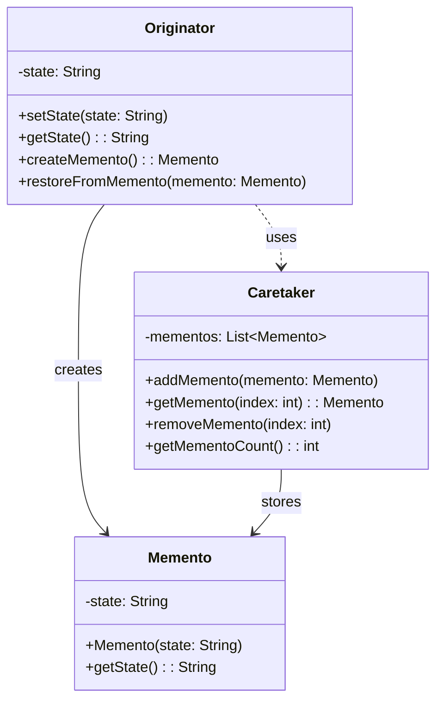

# 备忘录模式 (Memento Pattern)

## 概述

备忘录模式是一种行为型设计模式，它允许在不破坏封装性的前提下，捕获一个对象的内部状态，并在该对象之外保存这个状态。这样以后就可以将该对象恢复到原先保存的状态。

### 核心思想

备忘录模式的核心思想是将对象的状态保存在一个独立的备忘录对象中，而不是直接暴露对象的内部结构。这样既保护了对象的封装性，又提供了状态恢复的能力。

### 主要特点

- **状态保存**：能够保存对象在某个时刻的完整状态
- **封装保护**：不破坏对象的封装性
- **状态恢复**：可以将对象恢复到之前保存的状态
- **撤销支持**：为撤销操作提供基础支持

## 使用场景

### 适用情况

1. **撤销操作**：需要提供撤销功能的应用程序
2. **状态回滚**：需要在某些条件下回滚到之前状态
3. **快照功能**：需要保存对象状态快照
4. **事务处理**：需要在事务失败时恢复状态
5. **游戏存档**：游戏中的存档和读档功能
6. **编辑器应用**：文本编辑器、图形编辑器的撤销重做

### 不适用情况

1. **状态简单**：对象状态非常简单，直接复制更高效
2. **内存敏感**：内存资源非常有限的环境
3. **状态频繁变化**：状态变化非常频繁，保存成本过高
4. **无撤销需求**：应用程序不需要撤销或回滚功能

## UML类图



## 核心组件

### 1. 发起人 (Originator)

发起人是需要保存状态的对象，它创建备忘录来保存当前状态，也可以使用备忘录来恢复状态。

### 2. 备忘录 (Memento)

备忘录存储发起人对象的内部状态。备忘录可以保护其内容不被发起人以外的任何对象访问。

### 3. 管理者 (Caretaker)

管理者负责保存备忘录，但不能对备忘录的内容进行操作或检查。

## Java实现示例

### 示例1：文本编辑器的撤销功能

```java
import java.util.*;
import java.time.LocalDateTime;
import java.time.format.DateTimeFormatter;

// 备忘录接口
interface TextMemento {
    String getContent();
    int getCursorPosition();
    LocalDateTime getTimestamp();
    String getDescription();
}

// 具体备忘录实现
class TextMementoImpl implements TextMemento {
    private final String content;
    private final int cursorPosition;
    private final LocalDateTime timestamp;
    private final String description;
    
    public TextMementoImpl(String content, int cursorPosition, String description) {
        this.content = content;
        this.cursorPosition = cursorPosition;
        this.timestamp = LocalDateTime.now();
        this.description = description;
    }
    
    @Override
    public String getContent() {
        return content;
    }
    
    @Override
    public int getCursorPosition() {
        return cursorPosition;
    }
    
    @Override
    public LocalDateTime getTimestamp() {
        return timestamp;
    }
    
    @Override
    public String getDescription() {
        return description;
    }
    
    @Override
    public String toString() {
        return String.format("[%s] %s - 内容长度: %d, 光标位置: %d",
            timestamp.format(DateTimeFormatter.ofPattern("HH:mm:ss")),
            description, content.length(), cursorPosition);
    }
}

// 发起人：文本编辑器
class TextEditor {
    private StringBuilder content;
    private int cursorPosition;
    private String fileName;
    
    public TextEditor(String fileName) {
        this.content = new StringBuilder();
        this.cursorPosition = 0;
        this.fileName = fileName;
    }
    
    // 插入文本
    public void insertText(String text) {
        content.insert(cursorPosition, text);
        cursorPosition += text.length();
    }
    
    // 删除文本
    public void deleteText(int length) {
        if (cursorPosition >= length) {
            content.delete(cursorPosition - length, cursorPosition);
            cursorPosition -= length;
        }
    }
    
    // 移动光标
    public void moveCursor(int position) {
        if (position >= 0 && position <= content.length()) {
            this.cursorPosition = position;
        }
    }
    
    // 替换文本
    public void replaceText(int start, int end, String newText) {
        if (start >= 0 && end <= content.length() && start <= end) {
            content.replace(start, end, newText);
            cursorPosition = start + newText.length();
        }
    }
    
    // 创建备忘录
    public TextMemento createMemento(String description) {
        return new TextMementoImpl(content.toString(), cursorPosition, description);
    }
    
    // 从备忘录恢复状态
    public void restoreFromMemento(TextMemento memento) {
        this.content = new StringBuilder(memento.getContent());
        this.cursorPosition = memento.getCursorPosition();
    }
    
    // 获取当前内容
    public String getContent() {
        return content.toString();
    }
    
    // 获取光标位置
    public int getCursorPosition() {
        return cursorPosition;
    }
    
    // 获取文件名
    public String getFileName() {
        return fileName;
    }
    
    // 显示当前状态
    public void displayStatus() {
        System.out.println("=== 编辑器状态 ===");
        System.out.println("文件: " + fileName);
        System.out.println("内容: \"" + content.toString() + "\"");
        System.out.println("光标位置: " + cursorPosition);
        System.out.println("内容长度: " + content.length());
        
        // 显示光标位置的可视化
        StringBuilder visualization = new StringBuilder(content.toString());
        if (cursorPosition <= visualization.length()) {
            visualization.insert(cursorPosition, "|");
        }
        System.out.println("可视化: \"" + visualization.toString() + "\"");
        System.out.println();
    }
}

// 管理者：撤销重做管理器
class UndoRedoManager {
    private List<TextMemento> history;
    private int currentIndex;
    private final int maxHistorySize;
    
    public UndoRedoManager(int maxHistorySize) {
        this.history = new ArrayList<>();
        this.currentIndex = -1;
        this.maxHistorySize = maxHistorySize;
    }
    
    // 保存状态
    public void saveState(TextMemento memento) {
        // 如果当前不在历史记录的末尾，删除后面的记录
        if (currentIndex < history.size() - 1) {
            history.subList(currentIndex + 1, history.size()).clear();
        }
        
        // 添加新的备忘录
        history.add(memento);
        currentIndex++;
        
        // 如果超过最大历史记录数，删除最早的记录
        if (history.size() > maxHistorySize) {
            history.remove(0);
            currentIndex--;
        }
    }
    
    // 撤销操作
    public TextMemento undo() {
        if (canUndo()) {
            currentIndex--;
            return history.get(currentIndex);
        }
        return null;
    }
    
    // 重做操作
    public TextMemento redo() {
        if (canRedo()) {
            currentIndex++;
            return history.get(currentIndex);
        }
        return null;
    }
    
    // 检查是否可以撤销
    public boolean canUndo() {
        return currentIndex > 0;
    }
    
    // 检查是否可以重做
    public boolean canRedo() {
        return currentIndex < history.size() - 1;
    }
    
    // 获取历史记录
    public List<TextMemento> getHistory() {
        return new ArrayList<>(history);
    }
    
    // 获取当前索引
    public int getCurrentIndex() {
        return currentIndex;
    }
    
    // 清空历史记录
    public void clearHistory() {
        history.clear();
        currentIndex = -1;
    }
    
    // 显示历史记录
    public void displayHistory() {
        System.out.println("=== 操作历史 ===");
        for (int i = 0; i < history.size(); i++) {
            String marker = (i == currentIndex) ? ">>> " : "    ";
            System.out.println(marker + (i + 1) + ". " + history.get(i));
        }
        System.out.println("当前位置: " + (currentIndex + 1) + "/" + history.size());
        System.out.println("可撤销: " + canUndo() + ", 可重做: " + canRedo());
        System.out.println();
    }
}

// 使用示例
public class TextEditorExample {
    public static void main(String[] args) {
        System.out.println("=== 文本编辑器撤销重做演示 ===");
        
        // 创建文本编辑器和撤销重做管理器
        TextEditor editor = new TextEditor("document.txt");
        UndoRedoManager undoRedoManager = new UndoRedoManager(10);
        
        // 保存初始状态
        undoRedoManager.saveState(editor.createMemento("初始状态"));
        editor.displayStatus();
        
        // 场景1：输入文本
        System.out.println("=== 场景1：输入文本 ===");
        editor.insertText("Hello");
        undoRedoManager.saveState(editor.createMemento("输入 'Hello'"));
        editor.displayStatus();
        
        editor.insertText(" World");
        undoRedoManager.saveState(editor.createMemento("输入 ' World'"));
        editor.displayStatus();
        
        editor.insertText("!");
        undoRedoManager.saveState(editor.createMemento("输入 '!'"));
        editor.displayStatus();
        
        // 显示历史记录
        undoRedoManager.displayHistory();
        
        // 场景2：撤销操作
        System.out.println("=== 场景2：撤销操作 ===");
        
        // 撤销最后一次操作
        TextMemento memento = undoRedoManager.undo();
        if (memento != null) {
            editor.restoreFromMemento(memento);
            System.out.println("撤销成功，恢复到: " + memento.getDescription());
            editor.displayStatus();
        }
        
        // 再次撤销
        memento = undoRedoManager.undo();
        if (memento != null) {
            editor.restoreFromMemento(memento);
            System.out.println("撤销成功，恢复到: " + memento.getDescription());
            editor.displayStatus();
        }
        
        undoRedoManager.displayHistory();
        
        // 场景3：重做操作
        System.out.println("=== 场景3：重做操作 ===");
        
        memento = undoRedoManager.redo();
        if (memento != null) {
            editor.restoreFromMemento(memento);
            System.out.println("重做成功，恢复到: " + memento.getDescription());
            editor.displayStatus();
        }
        
        // 场景4：在中间位置进行新操作
        System.out.println("=== 场景4：在中间位置进行新操作 ===");
        
        editor.moveCursor(5); // 移动到 "Hello" 后面
        editor.insertText(", Java");
        undoRedoManager.saveState(editor.createMemento("插入 ', Java'"));
        editor.displayStatus();
        
        undoRedoManager.displayHistory();
        
        // 场景5：文本替换
        System.out.println("=== 场景5：文本替换 ===");
        
        editor.replaceText(0, 5, "Hi"); // 将 "Hello" 替换为 "Hi"
        undoRedoManager.saveState(editor.createMemento("替换 'Hello' 为 'Hi'"));
        editor.displayStatus();
        
        // 场景6：删除操作
        System.out.println("=== 场景6：删除操作 ===");
        
        editor.moveCursor(editor.getContent().length()); // 移动到末尾
        editor.deleteText(6); // 删除 " World"
        undoRedoManager.saveState(editor.createMemento("删除 ' World'"));
        editor.displayStatus();
        
        // 最终历史记录
        undoRedoManager.displayHistory();
        
        // 演示连续撤销
        System.out.println("=== 连续撤销演示 ===");
        while (undoRedoManager.canUndo()) {
            memento = undoRedoManager.undo();
            editor.restoreFromMemento(memento);
            System.out.println("撤销到: " + memento.getDescription());
            System.out.println("当前内容: \"" + editor.getContent() + "\"");
        }
    }
}
```

### 示例2：游戏状态管理系统

```java
import java.util.*;
import java.time.LocalDateTime;

// 游戏角色类
class GameCharacter {
    private String name;
    private int level;
    private int health;
    private int mana;
    private int experience;
    private Position position;
    private List<String> inventory;
    private Map<String, Integer> skills;
    
    public GameCharacter(String name) {
        this.name = name;
        this.level = 1;
        this.health = 100;
        this.mana = 50;
        this.experience = 0;
        this.position = new Position(0, 0);
        this.inventory = new ArrayList<>();
        this.skills = new HashMap<>();
        
        // 初始技能
        skills.put("攻击", 1);
        skills.put("防御", 1);
    }
    
    // 升级
    public void levelUp() {
        level++;
        health += 20;
        mana += 10;
        System.out.println(name + " 升级到 " + level + " 级!");
    }
    
    // 获得经验
    public void gainExperience(int exp) {
        experience += exp;
        System.out.println(name + " 获得 " + exp + " 点经验");
        
        // 检查是否可以升级
        int requiredExp = level * 100;
        if (experience >= requiredExp) {
            experience -= requiredExp;
            levelUp();
        }
    }
    
    // 受到伤害
    public void takeDamage(int damage) {
        health = Math.max(0, health - damage);
        System.out.println(name + " 受到 " + damage + " 点伤害，剩余生命值: " + health);
    }
    
    // 恢复生命值
    public void heal(int amount) {
        health = Math.min(100 + (level - 1) * 20, health + amount);
        System.out.println(name + " 恢复 " + amount + " 点生命值，当前生命值: " + health);
    }
    
    // 移动
    public void moveTo(int x, int y) {
        position.setX(x);
        position.setY(y);
        System.out.println(name + " 移动到位置 (" + x + ", " + y + ")");
    }
    
    // 添加物品
    public void addItem(String item) {
        inventory.add(item);
        System.out.println(name + " 获得物品: " + item);
    }
    
    // 使用物品
    public boolean useItem(String item) {
        if (inventory.remove(item)) {
            System.out.println(name + " 使用了物品: " + item);
            return true;
        }
        return false;
    }
    
    // 提升技能
    public void improveSkill(String skillName, int points) {
        skills.put(skillName, skills.getOrDefault(skillName, 0) + points);
        System.out.println(name + " 的 " + skillName + " 技能提升 " + points + " 点");
    }
    
    // 创建备忘录
    public GameMemento createMemento(String description) {
        return new GameMementoImpl(
            name, level, health, mana, experience,
            new Position(position.getX(), position.getY()),
            new ArrayList<>(inventory),
            new HashMap<>(skills),
            description
        );
    }
    
    // 从备忘录恢复
    public void restoreFromMemento(GameMemento memento) {
        this.level = memento.getLevel();
        this.health = memento.getHealth();
        this.mana = memento.getMana();
        this.experience = memento.getExperience();
        this.position = new Position(memento.getPosition().getX(), memento.getPosition().getY());
        this.inventory = new ArrayList<>(memento.getInventory());
        this.skills = new HashMap<>(memento.getSkills());
    }
    
    // 显示状态
    public void displayStatus() {
        System.out.println("=== " + name + " 的状态 ===");
        System.out.println("等级: " + level);
        System.out.println("生命值: " + health);
        System.out.println("魔法值: " + mana);
        System.out.println("经验值: " + experience);
        System.out.println("位置: (" + position.getX() + ", " + position.getY() + ")");
        System.out.println("背包: " + inventory);
        System.out.println("技能: " + skills);
        System.out.println();
    }
    
    // Getters
    public String getName() { return name; }
    public int getLevel() { return level; }
    public int getHealth() { return health; }
    public int getMana() { return mana; }
    public int getExperience() { return experience; }
    public Position getPosition() { return position; }
    public List<String> getInventory() { return new ArrayList<>(inventory); }
    public Map<String, Integer> getSkills() { return new HashMap<>(skills); }
}

// 位置类
class Position {
    private int x, y;
    
    public Position(int x, int y) {
        this.x = x;
        this.y = y;
    }
    
    public int getX() { return x; }
    public int getY() { return y; }
    public void setX(int x) { this.x = x; }
    public void setY(int y) { this.y = y; }
}

// 游戏备忘录接口
interface GameMemento {
    String getName();
    int getLevel();
    int getHealth();
    int getMana();
    int getExperience();
    Position getPosition();
    List<String> getInventory();
    Map<String, Integer> getSkills();
    LocalDateTime getTimestamp();
    String getDescription();
}

// 游戏备忘录实现
class GameMementoImpl implements GameMemento {
    private final String name;
    private final int level;
    private final int health;
    private final int mana;
    private final int experience;
    private final Position position;
    private final List<String> inventory;
    private final Map<String, Integer> skills;
    private final LocalDateTime timestamp;
    private final String description;
    
    public GameMementoImpl(String name, int level, int health, int mana, int experience,
                          Position position, List<String> inventory, Map<String, Integer> skills,
                          String description) {
        this.name = name;
        this.level = level;
        this.health = health;
        this.mana = mana;
        this.experience = experience;
        this.position = position;
        this.inventory = inventory;
        this.skills = skills;
        this.timestamp = LocalDateTime.now();
        this.description = description;
    }
    
    @Override
    public String getName() { return name; }
    
    @Override
    public int getLevel() { return level; }
    
    @Override
    public int getHealth() { return health; }
    
    @Override
    public int getMana() { return mana; }
    
    @Override
    public int getExperience() { return experience; }
    
    @Override
    public Position getPosition() { return position; }
    
    @Override
    public List<String> getInventory() { return inventory; }
    
    @Override
    public Map<String, Integer> getSkills() { return skills; }
    
    @Override
    public LocalDateTime getTimestamp() { return timestamp; }
    
    @Override
    public String getDescription() { return description; }
    
    @Override
    public String toString() {
        return String.format("[%s] %s - 等级:%d, 生命:%d, 位置:(%d,%d)",
            timestamp.format(java.time.format.DateTimeFormatter.ofPattern("HH:mm:ss")),
            description, level, health, position.getX(), position.getY());
    }
}

// 游戏存档管理器
class GameSaveManager {
    private List<GameMemento> saveSlots;
    private final int maxSaveSlots;
    
    public GameSaveManager(int maxSaveSlots) {
        this.saveSlots = new ArrayList<>();
        this.maxSaveSlots = maxSaveSlots;
    }
    
    // 保存游戏
    public int saveGame(GameMemento memento) {
        if (saveSlots.size() >= maxSaveSlots) {
            // 如果存档槽已满，删除最早的存档
            saveSlots.remove(0);
        }
        
        saveSlots.add(memento);
        int slotIndex = saveSlots.size() - 1;
        System.out.println("游戏已保存到存档槽 " + (slotIndex + 1) + ": " + memento.getDescription());
        return slotIndex;
    }
    
    // 加载游戏
    public GameMemento loadGame(int slotIndex) {
        if (slotIndex >= 0 && slotIndex < saveSlots.size()) {
            GameMemento memento = saveSlots.get(slotIndex);
            System.out.println("从存档槽 " + (slotIndex + 1) + " 加载游戏: " + memento.getDescription());
            return memento;
        }
        System.out.println("无效的存档槽: " + (slotIndex + 1));
        return null;
    }
    
    // 删除存档
    public boolean deleteSave(int slotIndex) {
        if (slotIndex >= 0 && slotIndex < saveSlots.size()) {
            GameMemento removed = saveSlots.remove(slotIndex);
            System.out.println("删除存档: " + removed.getDescription());
            return true;
        }
        return false;
    }
    
    // 获取所有存档
    public List<GameMemento> getAllSaves() {
        return new ArrayList<>(saveSlots);
    }
    
    // 显示存档列表
    public void displaySaveSlots() {
        System.out.println("=== 存档列表 ===");
        if (saveSlots.isEmpty()) {
            System.out.println("没有存档");
        } else {
            for (int i = 0; i < saveSlots.size(); i++) {
                System.out.println((i + 1) + ". " + saveSlots.get(i));
            }
        }
        System.out.println("存档数量: " + saveSlots.size() + "/" + maxSaveSlots);
        System.out.println();
    }
    
    // 清空所有存档
    public void clearAllSaves() {
        saveSlots.clear();
        System.out.println("所有存档已清空");
    }
}

// 使用示例
public class GameExample {
    public static void main(String[] args) {
        System.out.println("=== 游戏状态管理演示 ===");
        
        // 创建游戏角色和存档管理器
        GameCharacter hero = new GameCharacter("勇者");
        GameSaveManager saveManager = new GameSaveManager(5);
        
        // 显示初始状态
        hero.displayStatus();
        
        // 保存初始状态
        saveManager.saveGame(hero.createMemento("游戏开始"));
        
        // 场景1：角色成长
        System.out.println("=== 场景1：角色成长 ===");
        hero.gainExperience(80);
        hero.addItem("铁剑");
        hero.addItem("生命药水");
        hero.moveTo(10, 5);
        hero.displayStatus();
        
        // 保存进度
        saveManager.saveGame(hero.createMemento("获得装备和经验"));
        
        // 场景2：战斗和升级
        System.out.println("=== 场景2：战斗和升级 ===");
        hero.takeDamage(30);
        hero.gainExperience(50); // 这会触发升级
        hero.improveSkill("攻击", 2);
        hero.addItem("魔法书");
        hero.displayStatus();
        
        // 保存升级后的状态
        saveManager.saveGame(hero.createMemento("升级到2级"));
        
        // 场景3：探索和收集
        System.out.println("=== 场景3：探索和收集 ===");
        hero.moveTo(25, 15);
        hero.addItem("宝石");
        hero.addItem("魔法药水");
        hero.improveSkill("防御", 1);
        hero.improveSkill("魔法", 3);
        hero.displayStatus();
        
        // 保存探索进度
        saveManager.saveGame(hero.createMemento("探索新区域"));
        
        // 场景4：危险战斗
        System.out.println("=== 场景4：危险战斗 ===");
        hero.takeDamage(60); // 受到重伤
        hero.useItem("生命药水");
        hero.heal(40);
        hero.displayStatus();
        
        // 显示所有存档
        saveManager.displaySaveSlots();
        
        // 场景5：意外死亡，需要读档
        System.out.println("=== 场景5：意外死亡，读取存档 ===");
        hero.takeDamage(100); // 角色死亡
        System.out.println("角色死亡！需要读取存档...");
        hero.displayStatus();
        
        // 读取最近的存档
        GameMemento lastSave = saveManager.loadGame(3); // 加载第4个存档（探索新区域）
        if (lastSave != null) {
            hero.restoreFromMemento(lastSave);
            System.out.println("成功读取存档，角色状态已恢复:");
            hero.displayStatus();
        }
        
        // 场景6：继续游戏
        System.out.println("=== 场景6：继续游戏 ===");
        hero.gainExperience(120); // 再次升级
        hero.addItem("传说武器");
        hero.moveTo(50, 30);
        hero.improveSkill("攻击", 3);
        hero.displayStatus();
        
        // 保存最终状态
        saveManager.saveGame(hero.createMemento("获得传说武器"));
        
        // 显示最终存档列表
        saveManager.displaySaveSlots();
        
        // 演示存档管理
        System.out.println("=== 存档管理演示 ===");
        
        // 删除中间的存档
        saveManager.deleteSave(1);
        saveManager.displaySaveSlots();
        
        // 测试读取不同的存档
        System.out.println("\n=== 测试读取不同存档 ===");
        GameMemento earlyGame = saveManager.loadGame(0);
        if (earlyGame != null) {
            System.out.println("读取早期存档:");
            hero.restoreFromMemento(earlyGame);
            hero.displayStatus();
        }
        
        GameMemento lateGame = saveManager.loadGame(saveManager.getAllSaves().size() - 1);
        if (lateGame != null) {
            System.out.println("读取最新存档:");
            hero.restoreFromMemento(lateGame);
            hero.displayStatus();
        }
    }
}
```

## 优缺点分析

### ✅ 优点

1. **封装性保护**
   - 不破坏对象的封装性
   - 备忘录对象保护内部状态不被外部直接访问

2. **状态恢复**
   - 提供了可靠的状态恢复机制
   - 支持多个状态点的保存和恢复

3. **撤销支持**
   - 为撤销操作提供了基础支持
   - 可以实现多级撤销和重做

4. **简化发起人**
   - 发起人不需要管理多个历史状态
   - 状态管理的责任被转移到管理者

5. **灵活性**
   - 可以选择性地保存状态
   - 支持不同类型的备忘录

### ❌ 缺点

1. **内存开销**
   - 需要额外的内存来存储备忘录对象
   - 频繁保存状态会消耗大量内存

2. **性能影响**
   - 创建备忘录需要复制对象状态
   - 对于复杂对象，复制成本较高

3. **管理复杂性**
   - 需要管理备忘录的生命周期
   - 可能需要实现备忘录的清理机制

4. **深拷贝问题**
   - 如果对象包含引用类型，需要实现深拷贝
   - 可能导致循环引用问题

5. **版本兼容性**
   - 对象结构变化时，旧的备忘录可能不兼容
   - 需要考虑向后兼容性

## 与其他模式的对比

### 🆚 备忘录模式 vs 命令模式

| 特性 | 备忘录模式 | 命令模式 |
|------|------------|----------|
| **目的** | 保存和恢复对象状态 | 封装请求为对象 |
| **撤销机制** | 通过状态恢复实现撤销 | 通过逆向命令实现撤销 |
| **内存使用** | 保存完整状态，内存开销大 | 只保存命令，内存开销小 |
| **恢复精度** | 精确恢复到指定状态 | 通过逆向操作恢复 |
| **适用场景** | 复杂状态的完整保存 | 操作的封装和撤销 |

### 🆚 备忘录模式 vs 原型模式

| 特性 | 备忘录模式 | 原型模式 |
|------|------------|----------|
| **目的** | 状态保存和恢复 | 对象克隆 |
| **使用时机** | 需要撤销功能时 | 需要创建相似对象时 |
| **状态管理** | 外部管理备忘录 | 对象自身负责克隆 |
| **封装性** | 保护对象封装性 | 可能暴露内部结构 |

### 🆚 备忘录模式 vs 状态模式

| 特性 | 备忘录模式 | 状态模式 |
|------|------------|----------|
| **关注点** | 状态的保存和恢复 | 状态的转换和行为 |
| **状态变化** | 外部控制状态恢复 | 内部控制状态转换 |
| **使用目的** | 撤销和回滚 | 状态相关的行为变化 |
| **复杂度** | 相对简单 | 较为复杂 |

## 实际应用场景

### 1. IDE和编辑器

```java
// IDE中的撤销重做系统
class IDEUndoRedoSystem {
    private UndoRedoManager undoRedoManager;
    private CodeEditor editor;
    
    public IDEUndoRedoSystem() {
        this.undoRedoManager = new UndoRedoManager(50); // 支持50步撤销
        this.editor = new CodeEditor();
    }
    
    public void executeCommand(EditorCommand command) {
        // 保存执行前的状态
        undoRedoManager.saveState(editor.createMemento(command.getDescription()));
        
        // 执行命令
        command.execute(editor);
    }
    
    public void undo() {
        TextMemento memento = undoRedoManager.undo();
        if (memento != null) {
            editor.restoreFromMemento(memento);
        }
    }
    
    public void redo() {
        TextMemento memento = undoRedoManager.redo();
        if (memento != null) {
            editor.restoreFromMemento(memento);
        }
    }
}
```

### 2. 数据库事务

```java
// 数据库事务中的回滚机制
class DatabaseTransaction {
    private List<TableMemento> beforeStates;
    private boolean committed;
    
    public DatabaseTransaction() {
        this.beforeStates = new ArrayList<>();
        this.committed = false;
    }
    
    public void modifyTable(DatabaseTable table) {
        // 保存修改前的状态
        beforeStates.add(table.createMemento("修改前状态"));
        
        // 执行修改操作
        // ...
    }
    
    public void commit() {
        // 提交事务，清空备忘录
        beforeStates.clear();
        committed = true;
    }
    
    public void rollback() {
        if (!committed) {
            // 回滚所有修改
            for (int i = beforeStates.size() - 1; i >= 0; i--) {
                TableMemento memento = beforeStates.get(i);
                // 恢复表状态
                // table.restoreFromMemento(memento);
            }
            beforeStates.clear();
        }
    }
}
```

### 3. 图形编辑器

```java
// 图形编辑器中的操作历史
class GraphicsEditor {
    private Canvas canvas;
    private UndoRedoManager undoRedoManager;
    
    public GraphicsEditor() {
        this.canvas = new Canvas();
        this.undoRedoManager = new UndoRedoManager(30);
    }
    
    public void drawShape(Shape shape) {
        undoRedoManager.saveState(canvas.createMemento("绘制" + shape.getType()));
        canvas.addShape(shape);
    }
    
    public void deleteShape(Shape shape) {
        undoRedoManager.saveState(canvas.createMemento("删除" + shape.getType()));
        canvas.removeShape(shape);
    }
    
    public void moveShape(Shape shape, int deltaX, int deltaY) {
        undoRedoManager.saveState(canvas.createMemento("移动" + shape.getType()));
        shape.move(deltaX, deltaY);
    }
}
```

## 模式变种和扩展

### 1. 增量备忘录模式

```java
// 增量备忘录：只保存变化的部分
class IncrementalMemento {
    private Map<String, Object> changes;
    private LocalDateTime timestamp;
    private String description;
    
    public IncrementalMemento(Map<String, Object> changes, String description) {
        this.changes = new HashMap<>(changes);
        this.timestamp = LocalDateTime.now();
        this.description = description;
    }
    
    public Map<String, Object> getChanges() {
        return new HashMap<>(changes);
    }
    
    public LocalDateTime getTimestamp() {
        return timestamp;
    }
    
    public String getDescription() {
        return description;
    }
}

class IncrementalOriginator {
    private Map<String, Object> state;
    private Map<String, Object> previousState;
    
    public IncrementalOriginator() {
        this.state = new HashMap<>();
        this.previousState = new HashMap<>();
    }
    
    public void setState(String key, Object value) {
        previousState.put(key, state.get(key));
        state.put(key, value);
    }
    
    public IncrementalMemento createIncrementalMemento(String description) {
        Map<String, Object> changes = new HashMap<>();
        
        // 找出变化的属性
        for (String key : state.keySet()) {
            Object currentValue = state.get(key);
            Object previousValue = previousState.get(key);
            
            if (!Objects.equals(currentValue, previousValue)) {
                changes.put(key, previousValue); // 保存旧值用于恢复
            }
        }
        
        return new IncrementalMemento(changes, description);
    }
    
    public void restoreFromIncrementalMemento(IncrementalMemento memento) {
        Map<String, Object> changes = memento.getChanges();
        for (Map.Entry<String, Object> entry : changes.entrySet()) {
            state.put(entry.getKey(), entry.getValue());
        }
    }
}
```

### 2. 压缩备忘录模式

```java
// 压缩备忘录：对备忘录数据进行压缩
class CompressedMemento {
    private byte[] compressedData;
    private LocalDateTime timestamp;
    private String description;
    
    public CompressedMemento(Object state, String description) {
        this.compressedData = compress(serialize(state));
        this.timestamp = LocalDateTime.now();
        this.description = description;
    }
    
    public Object getState() {
        return deserialize(decompress(compressedData));
    }
    
    private byte[] serialize(Object obj) {
        // 序列化对象为字节数组
        try (ByteArrayOutputStream bos = new ByteArrayOutputStream();
             ObjectOutputStream oos = new ObjectOutputStream(bos)) {
            oos.writeObject(obj);
            return bos.toByteArray();
        } catch (IOException e) {
            throw new RuntimeException("序列化失败", e);
        }
    }
    
    private Object deserialize(byte[] data) {
        // 从字节数组反序列化对象
        try (ByteArrayInputStream bis = new ByteArrayInputStream(data);
             ObjectInputStream ois = new ObjectInputStream(bis)) {
            return ois.readObject();
        } catch (IOException | ClassNotFoundException e) {
            throw new RuntimeException("反序列化失败", e);
        }
    }
    
    private byte[] compress(byte[] data) {
        // 使用GZIP压缩数据
        try (ByteArrayOutputStream bos = new ByteArrayOutputStream();
             GZIPOutputStream gzipOut = new GZIPOutputStream(bos)) {
            gzipOut.write(data);
            gzipOut.finish();
            return bos.toByteArray();
        } catch (IOException e) {
            throw new RuntimeException("压缩失败", e);
        }
    }
    
    private byte[] decompress(byte[] compressedData) {
        // 解压缩数据
        try (ByteArrayInputStream bis = new ByteArrayInputStream(compressedData);
             GZIPInputStream gzipIn = new GZIPInputStream(bis);
             ByteArrayOutputStream bos = new ByteArrayOutputStream()) {
            
            byte[] buffer = new byte[1024];
            int len;
            while ((len = gzipIn.read(buffer)) != -1) {
                bos.write(buffer, 0, len);
            }
            return bos.toByteArray();
        } catch (IOException e) {
            throw new RuntimeException("解压缩失败", e);
        }
    }
    
    public LocalDateTime getTimestamp() {
        return timestamp;
    }
    
    public String getDescription() {
        return description;
    }
    
    public long getCompressedSize() {
        return compressedData.length;
    }
}
```

### 3. 分层备忘录模式

```java
// 分层备忘录：支持不同层次的状态保存
interface LayeredMemento {
    String getLayer();
    LocalDateTime getTimestamp();
    String getDescription();
}

class UILayerMemento implements LayeredMemento {
    private Map<String, Object> uiState;
    private LocalDateTime timestamp;
    private String description;
    
    public UILayerMemento(Map<String, Object> uiState, String description) {
        this.uiState = new HashMap<>(uiState);
        this.timestamp = LocalDateTime.now();
        this.description = description;
    }
    
    @Override
    public String getLayer() {
        return "UI";
    }
    
    @Override
    public LocalDateTime getTimestamp() {
        return timestamp;
    }
    
    @Override
    public String getDescription() {
        return description;
    }
    
    public Map<String, Object> getUIState() {
        return new HashMap<>(uiState);
    }
}

class DataLayerMemento implements LayeredMemento {
    private Map<String, Object> dataState;
    private LocalDateTime timestamp;
    private String description;
    
    public DataLayerMemento(Map<String, Object> dataState, String description) {
        this.dataState = new HashMap<>(dataState);
        this.timestamp = LocalDateTime.now();
        this.description = description;
    }
    
    @Override
    public String getLayer() {
        return "Data";
    }
    
    @Override
    public LocalDateTime getTimestamp() {
        return timestamp;
    }
    
    @Override
    public String getDescription() {
        return description;
    }
    
    public Map<String, Object> getDataState() {
        return new HashMap<>(dataState);
    }
}

class LayeredMementoManager {
    private Map<String, List<LayeredMemento>> layeredHistory;
    private final int maxHistoryPerLayer;
    
    public LayeredMementoManager(int maxHistoryPerLayer) {
        this.layeredHistory = new HashMap<>();
        this.maxHistoryPerLayer = maxHistoryPerLayer;
    }
    
    public void saveMemento(LayeredMemento memento) {
        String layer = memento.getLayer();
        layeredHistory.computeIfAbsent(layer, k -> new ArrayList<>());
        
        List<LayeredMemento> history = layeredHistory.get(layer);
        history.add(memento);
        
        // 限制历史记录数量
        if (history.size() > maxHistoryPerLayer) {
            history.remove(0);
        }
    }
    
    public LayeredMemento getLatestMemento(String layer) {
        List<LayeredMemento> history = layeredHistory.get(layer);
        if (history != null && !history.isEmpty()) {
            return history.get(history.size() - 1);
        }
        return null;
    }
    
    public List<LayeredMemento> getLayerHistory(String layer) {
        return layeredHistory.getOrDefault(layer, new ArrayList<>());
    }
    
    public void clearLayer(String layer) {
        layeredHistory.remove(layer);
    }
    
    public void clearAllLayers() {
        layeredHistory.clear();
    }
}
```

## 最佳实践

### 1. 备忘录设计原则

```java
// 良好的备忘录设计
public abstract class AbstractMemento {
    private final LocalDateTime timestamp;
    private final String description;
    private final String version;
    
    protected AbstractMemento(String description) {
        this.timestamp = LocalDateTime.now();
        this.description = description;
        this.version = "1.0"; // 版本信息用于兼容性检查
    }
    
    public LocalDateTime getTimestamp() {
        return timestamp;
    }
    
    public String getDescription() {
        return description;
    }
    
    public String getVersion() {
        return version;
    }
    
    // 抽象方法：子类实现具体的状态获取
    public abstract Object getState();
    
    // 验证备忘录的有效性
    public abstract boolean isValid();
    
    // 获取备忘录的大小（用于内存管理）
    public abstract long getSize();
}
```

### 2. 内存管理策略

```java
// 智能内存管理的备忘录管理器
class SmartMementoManager {
    private List<WeakReference<TextMemento>> mementos;
    private final int maxMemoryUsage; // 最大内存使用量（字节）
    private final int maxMementoCount; // 最大备忘录数量
    private long currentMemoryUsage;
    
    public SmartMementoManager(int maxMemoryUsage, int maxMementoCount) {
        this.mementos = new ArrayList<>();
        this.maxMemoryUsage = maxMemoryUsage;
        this.maxMementoCount = maxMementoCount;
        this.currentMemoryUsage = 0;
    }
    
    public void addMemento(TextMemento memento) {
        // 清理已被垃圾回收的弱引用
        cleanupWeakReferences();
        
        // 检查内存使用量
        long mementoSize = estimateSize(memento);
        if (currentMemoryUsage + mementoSize > maxMemoryUsage) {
            // 删除最早的备忘录以释放内存
            removeOldestMementos(mementoSize);
        }
        
        // 检查数量限制
        if (mementos.size() >= maxMementoCount) {
            removeOldestMemento();
        }
        
        // 添加新的备忘录
        mementos.add(new WeakReference<>(memento));
        currentMemoryUsage += mementoSize;
    }
    
    private void cleanupWeakReferences() {
        mementos.removeIf(ref -> ref.get() == null);
    }
    
    private void removeOldestMementos(long requiredSpace) {
        while (currentMemoryUsage + requiredSpace > maxMemoryUsage && !mementos.isEmpty()) {
            removeOldestMemento();
        }
    }
    
    private void removeOldestMemento() {
        if (!mementos.isEmpty()) {
            WeakReference<TextMemento> oldest = mementos.remove(0);
            TextMemento memento = oldest.get();
            if (memento != null) {
                currentMemoryUsage -= estimateSize(memento);
            }
        }
    }
    
    private long estimateSize(TextMemento memento) {
        // 估算备忘录的内存大小
        return memento.getContent().length() * 2 + 64; // 简单估算
    }
    
    public List<TextMemento> getAvailableMementos() {
        List<TextMemento> available = new ArrayList<>();
        for (WeakReference<TextMemento> ref : mementos) {
            TextMemento memento = ref.get();
            if (memento != null) {
                available.add(memento);
            }
        }
        return available;
    }
    
    public void forceGarbageCollection() {
        System.gc();
        cleanupWeakReferences();
        
        // 重新计算内存使用量
        currentMemoryUsage = 0;
        for (WeakReference<TextMemento> ref : mementos) {
            TextMemento memento = ref.get();
            if (memento != null) {
                currentMemoryUsage += estimateSize(memento);
            }
        }
    }
    
    public long getCurrentMemoryUsage() {
        return currentMemoryUsage;
    }
    
    public int getMementoCount() {
        cleanupWeakReferences();
        return mementos.size();
    }
}
```

### 3. 异步备忘录保存

```java
// 异步备忘录保存
class AsyncMementoManager {
    private final ExecutorService executor;
    private final BlockingQueue<TextMemento> mementoQueue;
    private final List<TextMemento> savedMementos;
    private volatile boolean running;
    
    public AsyncMementoManager() {
        this.executor = Executors.newSingleThreadExecutor(r -> {
            Thread t = new Thread(r, "MementoSaver");
            t.setDaemon(true);
            return t;
        });
        this.mementoQueue = new LinkedBlockingQueue<>();
        this.savedMementos = Collections.synchronizedList(new ArrayList<>());
        this.running = true;
        
        // 启动异步保存线程
        startAsyncSaver();
    }
    
    public CompletableFuture<Void> saveMementoAsync(TextMemento memento) {
        return CompletableFuture.runAsync(() -> {
            try {
                mementoQueue.put(memento);
            } catch (InterruptedException e) {
                Thread.currentThread().interrupt();
                throw new RuntimeException("保存备忘录被中断", e);
            }
        }, executor);
    }
    
    private void startAsyncSaver() {
        executor.submit(() -> {
            while (running) {
                try {
                    TextMemento memento = mementoQueue.take();
                    
                    // 模拟耗时的保存操作
                    Thread.sleep(10);
                    
                    savedMementos.add(memento);
                    
                    // 限制保存的备忘录数量
                    if (savedMementos.size() > 100) {
                        savedMementos.remove(0);
                    }
                    
                } catch (InterruptedException e) {
                    Thread.currentThread().interrupt();
                    break;
                }
            }
        });
    }
    
    public List<TextMemento> getSavedMementos() {
        return new ArrayList<>(savedMementos);
    }
    
    public void shutdown() {
        running = false;
        executor.shutdown();
        try {
            if (!executor.awaitTermination(5, TimeUnit.SECONDS)) {
                executor.shutdownNow();
            }
        } catch (InterruptedException e) {
            executor.shutdownNow();
            Thread.currentThread().interrupt();
        }
    }
}
```

### 4. 备忘录序列化和持久化

```java
// 可序列化的备忘录
class SerializableMemento implements Serializable {
    private static final long serialVersionUID = 1L;
    
    private final String content;
    private final int cursorPosition;
    private final LocalDateTime timestamp;
    private final String description;
    private final String version;
    
    public SerializableMemento(String content, int cursorPosition, String description) {
        this.content = content;
        this.cursorPosition = cursorPosition;
        this.timestamp = LocalDateTime.now();
        this.description = description;
        this.version = "1.0";
    }
    
    // Getters
    public String getContent() { return content; }
    public int getCursorPosition() { return cursorPosition; }
    public LocalDateTime getTimestamp() { return timestamp; }
    public String getDescription() { return description; }
    public String getVersion() { return version; }
    
    // 序列化到文件
    public void saveToFile(String filePath) throws IOException {
        try (ObjectOutputStream oos = new ObjectOutputStream(
                new FileOutputStream(filePath))) {
            oos.writeObject(this);
        }
    }
    
    // 从文件反序列化
    public static SerializableMemento loadFromFile(String filePath) 
            throws IOException, ClassNotFoundException {
        try (ObjectInputStream ois = new ObjectInputStream(
                new FileInputStream(filePath))) {
            return (SerializableMemento) ois.readObject();
        }
    }
}

// 持久化备忘录管理器
class PersistentMementoManager {
    private final String saveDirectory;
    private final String filePrefix;
    private int nextFileIndex;
    
    public PersistentMementoManager(String saveDirectory, String filePrefix) {
        this.saveDirectory = saveDirectory;
        this.filePrefix = filePrefix;
        this.nextFileIndex = 0;
        
        // 创建保存目录
        File dir = new File(saveDirectory);
        if (!dir.exists()) {
            dir.mkdirs();
        }
        
        // 扫描现有文件，确定下一个文件索引
        scanExistingFiles();
    }
    
    private void scanExistingFiles() {
        File dir = new File(saveDirectory);
        File[] files = dir.listFiles((d, name) -> 
            name.startsWith(filePrefix) && name.endsWith(".memento"));
        
        if (files != null) {
            for (File file : files) {
                String name = file.getName();
                String indexStr = name.substring(filePrefix.length(), 
                    name.lastIndexOf(".memento"));
                try {
                    int index = Integer.parseInt(indexStr);
                    nextFileIndex = Math.max(nextFileIndex, index + 1);
                } catch (NumberFormatException e) {
                    // 忽略无效的文件名
                }
            }
        }
    }
    
    public String saveMemento(SerializableMemento memento) throws IOException {
        String fileName = filePrefix + nextFileIndex + ".memento";
        String filePath = saveDirectory + File.separator + fileName;
        
        memento.saveToFile(filePath);
        nextFileIndex++;
        
        return filePath;
    }
    
    public SerializableMemento loadMemento(String filePath) 
            throws IOException, ClassNotFoundException {
        return SerializableMemento.loadFromFile(filePath);
    }
    
    public List<String> listSavedMementos() {
        File dir = new File(saveDirectory);
        File[] files = dir.listFiles((d, name) -> 
            name.startsWith(filePrefix) && name.endsWith(".memento"));
        
        List<String> filePaths = new ArrayList<>();
        if (files != null) {
            Arrays.sort(files, (f1, f2) -> f1.getName().compareTo(f2.getName()));
            for (File file : files) {
                filePaths.add(file.getAbsolutePath());
            }
        }
        
        return filePaths;
    }
    
    public boolean deleteMemento(String filePath) {
        File file = new File(filePath);
        return file.exists() && file.delete();
    }
    
    public void cleanupOldMementos(int maxCount) {
        List<String> mementos = listSavedMementos();
        
        while (mementos.size() > maxCount) {
            String oldest = mementos.remove(0);
            deleteMemento(oldest);
        }
    }
}
```

### 5. 线程安全的备忘录管理

```java
// 线程安全的备忘录管理器
class ThreadSafeMementoManager {
    private final List<TextMemento> mementos;
    private final ReadWriteLock lock;
    private final int maxSize;
    
    public ThreadSafeMementoManager(int maxSize) {
        this.mementos = new ArrayList<>();
        this.lock = new ReentrantReadWriteLock();
        this.maxSize = maxSize;
    }
    
    public void addMemento(TextMemento memento) {
        lock.writeLock().lock();
        try {
            mementos.add(memento);
            
            // 限制大小
            if (mementos.size() > maxSize) {
                mementos.remove(0);
            }
        } finally {
            lock.writeLock().unlock();
        }
    }
    
    public TextMemento getMemento(int index) {
        lock.readLock().lock();
        try {
            if (index >= 0 && index < mementos.size()) {
                return mementos.get(index);
            }
            return null;
        } finally {
            lock.readLock().unlock();
        }
    }
    
    public List<TextMemento> getAllMementos() {
        lock.readLock().lock();
        try {
            return new ArrayList<>(mementos);
        } finally {
            lock.readLock().unlock();
        }
    }
    
    public int size() {
        lock.readLock().lock();
        try {
            return mementos.size();
        } finally {
            lock.readLock().unlock();
        }
    }
    
    public void clear() {
        lock.writeLock().lock();
        try {
            mementos.clear();
        } finally {
            lock.writeLock().unlock();
        }
    }
}
```

## 总结

备忘录模式是一种强大的行为型设计模式，它为对象状态的保存和恢复提供了优雅的解决方案。通过将状态保存在独立的备忘录对象中，该模式既保护了对象的封装性，又提供了灵活的撤销和回滚功能。

### 关键要点

1. **封装性保护**：备忘录模式的核心优势是在不破坏对象封装性的前提下保存状态
2. **责任分离**：发起人负责创建和使用备忘录，管理者负责存储备忘录，职责清晰
3. **灵活的状态管理**：支持多种备忘录变种，如增量备忘录、压缩备忘录等
4. **内存管理**：需要合理管理备忘录的生命周期，避免内存泄漏
5. **性能考虑**：对于复杂对象，需要权衡状态保存的成本和收益

### 适用建议

- **适合使用**：需要撤销功能的应用、状态回滚场景、快照功能
- **谨慎使用**：内存敏感的环境、状态变化频繁的场景
- **最佳实践**：结合具体需求选择合适的备忘录变种，实现合理的内存管理策略

备忘录模式在现代软件开发中有着广泛的应用，从简单的文本编辑器到复杂的游戏系统，都能看到它的身影。掌握这个模式不仅能帮助我们更好地设计撤销功能，还能加深对面向对象设计原则的理解。