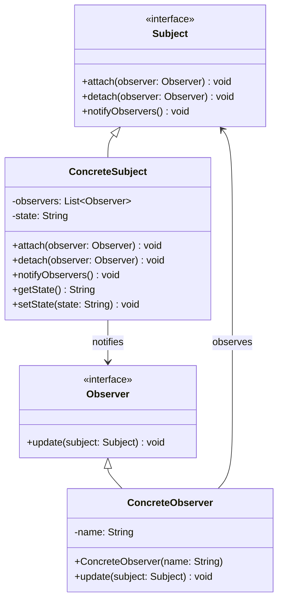

# 观察者模式 (Observer Pattern)

## 概述

观察者模式是一种行为型设计模式，它定义了对象间的一种一对多的依赖关系，当一个对象的状态发生改变时，所有依赖于它的对象都得到通知并被自动更新。观察者模式也被称为发布-订阅(Publish-Subscribe)模式。

### 核心思想

观察者模式的核心思想是**建立一种松耦合的通知机制**，通过这种方式来：

- **实现对象间的松耦合**：主题和观察者之间只通过抽象接口进行交互
- **支持广播通信**：一个主题可以通知多个观察者
- **动态的订阅关系**：观察者可以在运行时订阅或取消订阅
- **遵循开闭原则**：可以独立地改变主题和观察者
- **分离关注点**：主题专注于状态管理，观察者专注于响应变化

## 使用场景

### 🎯 适用情况

1. **当一个抽象模型有两个方面**：其中一个方面依赖于另一个方面
2. **当对一个对象的改变需要同时改变其他对象**：而不知道具体有多少对象有待改变
3. **当一个对象必须通知其他对象**：而它又不能假定其他对象是谁
4. **GUI事件处理**：按钮点击、窗口关闭等事件的处理
5. **模型-视图架构**：MVC、MVP、MVVM等架构模式
6. **消息系统**：发布-订阅消息系统
7. **股票价格监控**：股票价格变化时通知所有投资者
8. **新闻订阅系统**：新闻发布时通知所有订阅者

### 🚫 不适用情况

1. **观察者数量过多**：可能导致性能问题
2. **通知逻辑复杂**：如果通知逻辑很复杂，可能需要其他模式
3. **强耦合需求**：如果主题和观察者需要紧密耦合

## UML 类图



## 核心组件

### 1. 抽象主题 (Subject)
定义了添加、删除和通知观察者的接口。

### 2. 具体主题 (ConcreteSubject)
实现抽象主题接口，维护观察者列表，状态改变时通知所有观察者。

### 3. 抽象观察者 (Observer)
定义了观察者的更新接口。

### 4. 具体观察者 (ConcreteObserver)
实现抽象观察者接口，定义对主题状态变化的具体响应。

## Java 示例

### 示例1：股票价格监控系统

```java
// 抽象主题接口
interface Subject {
    void attach(Observer observer);
    void detach(Observer observer);
    void notifyObservers();
}

// 抽象观察者接口
interface Observer {
    void update(Subject subject);
}

// 具体主题：股票
class Stock implements Subject {
    private List<Observer> observers;
    private String symbol;
    private double price;
    private double change;
    
    public Stock(String symbol, double price) {
        this.symbol = symbol;
        this.price = price;
        this.change = 0.0;
        this.observers = new ArrayList<>();
    }
    
    @Override
    public void attach(Observer observer) {
        observers.add(observer);
        System.out.println("观察者已订阅股票: " + symbol);
    }
    
    @Override
    public void detach(Observer observer) {
        observers.remove(observer);
        System.out.println("观察者已取消订阅股票: " + symbol);
    }
    
    @Override
    public void notifyObservers() {
        System.out.println("\n=== 通知所有观察者 ===");
        for (Observer observer : observers) {
            observer.update(this);
        }
    }
    
    public void setPrice(double newPrice) {
        double oldPrice = this.price;
        this.price = newPrice;
        this.change = newPrice - oldPrice;
        
        System.out.println(String.format("股票 %s 价格变化: %.2f -> %.2f (变化: %+.2f)", 
                          symbol, oldPrice, newPrice, change));
        
        // 价格变化时通知所有观察者
        notifyObservers();
    }
    
    // Getters
    public String getSymbol() { return symbol; }
    public double getPrice() { return price; }
    public double getChange() { return change; }
}

// 具体观察者：投资者
class Investor implements Observer {
    private String name;
    private double threshold; // 关注阈值
    
    public Investor(String name, double threshold) {
        this.name = name;
        this.threshold = threshold;
    }
    
    @Override
    public void update(Subject subject) {
        if (subject instanceof Stock) {
            Stock stock = (Stock) subject;
            double changePercent = Math.abs(stock.getChange() / stock.getPrice() * 100);
            
            System.out.println(String.format("[%s] 收到通知 - %s: %.2f (变化: %+.2f, %.2f%%)", 
                              name, stock.getSymbol(), stock.getPrice(), 
                              stock.getChange(), changePercent));
            
            // 根据阈值决定是否采取行动
            if (changePercent >= threshold) {
                if (stock.getChange() > 0) {
                    System.out.println("  -> " + name + " 考虑卖出 " + stock.getSymbol());
                } else {
                    System.out.println("  -> " + name + " 考虑买入 " + stock.getSymbol());
                }
            }
        }
    }
    
    public String getName() {
        return name;
    }
}

// 具体观察者：交易系统
class TradingSystem implements Observer {
    private String systemName;
    private Map<String, Integer> positions; // 持仓
    
    public TradingSystem(String systemName) {
        this.systemName = systemName;
        this.positions = new HashMap<>();
    }
    
    @Override
    public void update(Subject subject) {
        if (subject instanceof Stock) {
            Stock stock = (Stock) subject;
            String symbol = stock.getSymbol();
            double changePercent = stock.getChange() / stock.getPrice() * 100;
            
            System.out.println(String.format("[%s] 系统分析 - %s: %.2f%% 变化", 
                              systemName, symbol, changePercent));
            
            // 自动交易逻辑
            if (changePercent > 5) {
                // 涨幅超过5%，考虑止盈
                if (positions.getOrDefault(symbol, 0) > 0) {
                    System.out.println("  -> 系统执行止盈卖出");
                    positions.put(symbol, 0);
                }
            } else if (changePercent < -5) {
                // 跌幅超过5%，考虑抄底
                System.out.println("  -> 系统执行抄底买入");
                positions.put(symbol, positions.getOrDefault(symbol, 0) + 100);
            }
        }
    }
}

// 使用示例
public class StockMarketExample {
    public static void main(String[] args) {
        // 创建股票
        Stock appleStock = new Stock("AAPL", 150.0);
        Stock googleStock = new Stock("GOOGL", 2800.0);
        
        // 创建观察者
        Investor alice = new Investor("Alice", 3.0); // 3%阈值
        Investor bob = new Investor("Bob", 5.0);     // 5%阈值
        TradingSystem autoTrader = new TradingSystem("AutoTrader");
        
        // 订阅股票
        appleStock.attach(alice);
        appleStock.attach(bob);
        appleStock.attach(autoTrader);
        
        googleStock.attach(alice);
        googleStock.attach(autoTrader);
        
        System.out.println("\n=== 股票价格变化模拟 ===");
        
        // 模拟价格变化
        appleStock.setPrice(155.0);  // +3.33%
        Thread.sleep(1000);
        
        appleStock.setPrice(160.0);  // +6.67%
        Thread.sleep(1000);
        
        googleStock.setPrice(2650.0); // -5.36%
        Thread.sleep(1000);
        
        // Bob 取消订阅 Apple
        System.out.println("\n=== Bob 取消订阅 AAPL ===");
        appleStock.detach(bob);
        
        appleStock.setPrice(145.0);  // -9.38%
    }
}
```

### 示例2：新闻发布系统

```java
// 新闻类型枚举
enum NewsType {
    BREAKING, SPORTS, TECHNOLOGY, FINANCE, ENTERTAINMENT
}

// 新闻实体
class News {
    private String title;
    private String content;
    private NewsType type;
    private Date publishTime;
    
    public News(String title, String content, NewsType type) {
        this.title = title;
        this.content = content;
        this.type = type;
        this.publishTime = new Date();
    }
    
    // Getters
    public String getTitle() { return title; }
    public String getContent() { return content; }
    public NewsType getType() { return type; }
    public Date getPublishTime() { return publishTime; }
    
    @Override
    public String toString() {
        return String.format("[%s] %s", type, title);
    }
}

// 新闻发布者接口
interface NewsPublisher {
    void subscribe(NewsSubscriber subscriber);
    void unsubscribe(NewsSubscriber subscriber);
    void notifySubscribers(News news);
}

// 新闻订阅者接口
interface NewsSubscriber {
    void receiveNews(News news);
    Set<NewsType> getInterestedTypes();
    String getSubscriberName();
}

// 具体新闻发布者：新闻机构
class NewsAgency implements NewsPublisher {
    private String agencyName;
    private List<NewsSubscriber> subscribers;
    private List<News> publishedNews;
    
    public NewsAgency(String agencyName) {
        this.agencyName = agencyName;
        this.subscribers = new ArrayList<>();
        this.publishedNews = new ArrayList<>();
    }
    
    @Override
    public void subscribe(NewsSubscriber subscriber) {
        subscribers.add(subscriber);
        System.out.println(subscriber.getSubscriberName() + " 订阅了 " + agencyName);
    }
    
    @Override
    public void unsubscribe(NewsSubscriber subscriber) {
        subscribers.remove(subscriber);
        System.out.println(subscriber.getSubscriberName() + " 取消订阅了 " + agencyName);
    }
    
    @Override
    public void notifySubscribers(News news) {
        System.out.println("\n=== " + agencyName + " 发布新闻 ===");
        System.out.println(news);
        
        for (NewsSubscriber subscriber : subscribers) {
            // 只通知对该类型新闻感兴趣的订阅者
            if (subscriber.getInterestedTypes().contains(news.getType())) {
                subscriber.receiveNews(news);
            }
        }
    }
    
    public void publishNews(String title, String content, NewsType type) {
        News news = new News(title, content, type);
        publishedNews.add(news);
        notifySubscribers(news);
    }
    
    public String getAgencyName() {
        return agencyName;
    }
}

// 具体订阅者：用户
class User implements NewsSubscriber {
    private String name;
    private Set<NewsType> interestedTypes;
    private List<News> receivedNews;
    
    public User(String name, NewsType... interestedTypes) {
        this.name = name;
        this.interestedTypes = new HashSet<>(Arrays.asList(interestedTypes));
        this.receivedNews = new ArrayList<>();
    }
    
    @Override
    public void receiveNews(News news) {
        receivedNews.add(news);
        System.out.println("  -> [" + name + "] 收到新闻: " + news.getTitle());
    }
    
    @Override
    public Set<NewsType> getInterestedTypes() {
        return interestedTypes;
    }
    
    @Override
    public String getSubscriberName() {
        return name;
    }
    
    public void addInterest(NewsType type) {
        interestedTypes.add(type);
        System.out.println(name + " 新增关注类型: " + type);
    }
    
    public void removeInterest(NewsType type) {
        interestedTypes.remove(type);
        System.out.println(name + " 取消关注类型: " + type);
    }
    
    public void showReceivedNews() {
        System.out.println("\n=== " + name + " 的新闻列表 ===");
        for (News news : receivedNews) {
            System.out.println("  " + news);
        }
    }
}

// 具体订阅者：新闻聚合器
class NewsAggregator implements NewsSubscriber {
    private String name;
    private Set<NewsType> interestedTypes;
    private Map<NewsType, List<News>> categorizedNews;
    
    public NewsAggregator(String name) {
        this.name = name;
        this.interestedTypes = EnumSet.allOf(NewsType.class); // 关注所有类型
        this.categorizedNews = new HashMap<>();
        
        // 初始化分类
        for (NewsType type : NewsType.values()) {
            categorizedNews.put(type, new ArrayList<>());
        }
    }
    
    @Override
    public void receiveNews(News news) {
        categorizedNews.get(news.getType()).add(news);
        System.out.println("  -> [" + name + "] 聚合新闻: " + news.getTitle() + 
                          " (分类: " + news.getType() + ")");
        
        // 分析热点
        analyzeHotTopics();
    }
    
    @Override
    public Set<NewsType> getInterestedTypes() {
        return interestedTypes;
    }
    
    @Override
    public String getSubscriberName() {
        return name;
    }
    
    private void analyzeHotTopics() {
        // 简单的热点分析：统计各类型新闻数量
        NewsType hotType = null;
        int maxCount = 0;
        
        for (Map.Entry<NewsType, List<News>> entry : categorizedNews.entrySet()) {
            int count = entry.getValue().size();
            if (count > maxCount) {
                maxCount = count;
                hotType = entry.getKey();
            }
        }
        
        if (hotType != null && maxCount > 1) {
            System.out.println("    [分析] 当前热点类型: " + hotType + " (" + maxCount + " 条新闻)");
        }
    }
    
    public void showStatistics() {
        System.out.println("\n=== " + name + " 统计信息 ===");
        for (Map.Entry<NewsType, List<News>> entry : categorizedNews.entrySet()) {
            System.out.println(entry.getKey() + ": " + entry.getValue().size() + " 条新闻");
        }
    }
}

// 使用示例
public class NewsSystemExample {
    public static void main(String[] args) throws InterruptedException {
        // 创建新闻机构
        NewsAgency cnn = new NewsAgency("CNN");
        NewsAgency techCrunch = new NewsAgency("TechCrunch");
        
        // 创建订阅者
        User alice = new User("Alice", NewsType.TECHNOLOGY, NewsType.FINANCE);
        User bob = new User("Bob", NewsType.SPORTS, NewsType.ENTERTAINMENT);
        User charlie = new User("Charlie", NewsType.BREAKING);
        
        NewsAggregator aggregator = new NewsAggregator("新闻聚合器");
        
        // 订阅关系
        cnn.subscribe(alice);
        cnn.subscribe(bob);
        cnn.subscribe(charlie);
        cnn.subscribe(aggregator);
        
        techCrunch.subscribe(alice);
        techCrunch.subscribe(aggregator);
        
        // 发布新闻
        cnn.publishNews("重大突发事件", "详细内容...", NewsType.BREAKING);
        Thread.sleep(500);
        
        techCrunch.publishNews("AI技术新突破", "人工智能领域...", NewsType.TECHNOLOGY);
        Thread.sleep(500);
        
        cnn.publishNews("股市大涨", "今日股市...", NewsType.FINANCE);
        Thread.sleep(500);
        
        cnn.publishNews("体育赛事结果", "比赛结果...", NewsType.SPORTS);
        Thread.sleep(500);
        
        // Alice 新增关注娱乐新闻
        System.out.println("\n=== Alice 调整订阅偏好 ===");
        alice.addInterest(NewsType.ENTERTAINMENT);
        
        cnn.publishNews("明星八卦", "娱乐新闻...", NewsType.ENTERTAINMENT);
        
        // 显示结果
        alice.showReceivedNews();
        bob.showReceivedNews();
        aggregator.showStatistics();
    }
}
```

## 优缺点分析

### ✅ 优点

1. **松耦合**
   - 主题和观察者之间是松耦合的
   - 主题只知道观察者实现了特定接口

2. **动态关系**
   - 可以在运行时建立对象间的关系
   - 支持动态添加和删除观察者

3. **广播通信**
   - 支持一对多的通信方式
   - 主题可以同时通知多个观察者

4. **开闭原则**
   - 可以独立扩展主题和观察者
   - 增加新的观察者不需要修改主题

5. **分离关注点**
   - 主题专注于状态管理
   - 观察者专注于响应处理

### ❌ 缺点

1. **性能问题**
   - 观察者数量过多时，通知所有观察者会影响性能
   - 如果观察者的更新操作复杂，会导致性能下降

2. **内存泄漏风险**
   - 如果观察者没有正确取消订阅，可能导致内存泄漏
   - 主题持有观察者的引用

3. **循环依赖**
   - 观察者的更新操作可能触发其他更新
   - 可能导致循环调用

4. **调试困难**
   - 间接的调用关系使得调试变得困难
   - 很难追踪通知的传播路径

## 与其他模式的对比

### 🆚 观察者模式 vs 发布-订阅模式

| 特性 | 观察者模式 | 发布-订阅模式 |
|------|------------|---------------|
| **耦合程度** | 主题和观察者直接耦合 | 通过消息代理解耦 |
| **通信方式** | 直接通信 | 通过中介通信 |
| **同步性** | 通常是同步的 | 可以是异步的 |
| **复杂度** | 相对简单 | 相对复杂 |
| **适用场景** | 简单的一对多通知 | 复杂的分布式系统 |

### 🆚 观察者模式 vs 中介者模式

| 特性 | 观察者模式 | 中介者模式 |
|------|------------|------------|
| **通信方向** | 一对多（单向） | 多对多（双向） |
| **关系类型** | 主题-观察者关系 | 同事对象间的协调 |
| **通信目的** | 状态变化通知 | 对象间的交互协调 |
| **中心化程度** | 主题是通知中心 | 中介者是交互中心 |

## 实际应用场景

### 1. GUI 事件处理

```java
// Swing 中的事件监听就是观察者模式
public class GUIExample {
    public static void main(String[] args) {
        JButton button = new JButton("点击我");
        
        // 添加多个监听器（观察者）
        button.addActionListener(e -> System.out.println("监听器1: 按钮被点击"));
        button.addActionListener(e -> System.out.println("监听器2: 记录点击日志"));
        button.addActionListener(e -> System.out.println("监听器3: 更新UI状态"));
        
        JFrame frame = new JFrame("观察者模式示例");
        frame.add(button);
        frame.setDefaultCloseOperation(JFrame.EXIT_ON_CLOSE);
        frame.pack();
        frame.setVisible(true);
    }
}
```

### 2. Spring 事件机制

```java
// Spring 中的事件发布和监听
@Component
public class OrderService {
    
    @Autowired
    private ApplicationEventPublisher eventPublisher;
    
    public void createOrder(Order order) {
        // 创建订单逻辑
        saveOrder(order);
        
        // 发布订单创建事件
        OrderCreatedEvent event = new OrderCreatedEvent(this, order);
        eventPublisher.publishEvent(event);
    }
}

@EventListener
@Component
public class EmailNotificationService {
    
    public void handleOrderCreated(OrderCreatedEvent event) {
        Order order = event.getOrder();
        // 发送邮件通知
        sendOrderConfirmationEmail(order);
    }
}

@EventListener
@Component
public class InventoryService {
    
    public void handleOrderCreated(OrderCreatedEvent event) {
        Order order = event.getOrder();
        // 更新库存
        updateInventory(order);
    }
}
```

### 3. 响应式编程

```java
// RxJava 中的观察者模式
public class ReactiveExample {
    public static void main(String[] args) {
        Observable<String> observable = Observable.create(emitter -> {
            emitter.onNext("Hello");
            emitter.onNext("World");
            emitter.onComplete();
        });
        
        // 多个观察者
        observable.subscribe(data -> System.out.println("观察者1: " + data));
        observable.subscribe(data -> System.out.println("观察者2: " + data.toUpperCase()));
    }
}
```

## 模式变种和扩展

### 1. 推模型 vs 拉模型

```java
// 推模型：主题推送具体数据
interface PushObserver {
    void update(String data);
}

class PushSubject {
    private List<PushObserver> observers = new ArrayList<>();
    private String data;
    
    public void attach(PushObserver observer) {
        observers.add(observer);
    }
    
    public void setData(String data) {
        this.data = data;
        notifyObservers();
    }
    
    private void notifyObservers() {
        for (PushObserver observer : observers) {
            observer.update(data); // 推送具体数据
        }
    }
}

// 拉模型：观察者主动获取数据
interface PullObserver {
    void update(PullSubject subject);
}

class PullSubject {
    private List<PullObserver> observers = new ArrayList<>();
    private String data;
    
    public void attach(PullObserver observer) {
        observers.add(observer);
    }
    
    public void setData(String data) {
        this.data = data;
        notifyObservers();
    }
    
    public String getData() {
        return data;
    }
    
    private void notifyObservers() {
        for (PullObserver observer : observers) {
            observer.update(this); // 传递主题引用
        }
    }
}
```

### 2. 异步观察者模式

```java
// 异步通知的观察者模式
class AsyncSubject {
    private List<Observer> observers = new ArrayList<>();
    private ExecutorService executor = Executors.newCachedThreadPool();
    
    public void attach(Observer observer) {
        observers.add(observer);
    }
    
    public void notifyObserversAsync() {
        for (Observer observer : observers) {
            executor.submit(() -> {
                try {
                    observer.update(this);
                } catch (Exception e) {
                    System.err.println("观察者更新失败: " + e.getMessage());
                }
            });
        }
    }
    
    public void shutdown() {
        executor.shutdown();
    }
}
```

### 3. 带优先级的观察者模式

```java
// 支持优先级的观察者
interface PriorityObserver extends Observer {
    int getPriority(); // 优先级，数字越小优先级越高
}

class PrioritySubject {
    private List<PriorityObserver> observers = new ArrayList<>();
    
    public void attach(PriorityObserver observer) {
        observers.add(observer);
        // 按优先级排序
        observers.sort(Comparator.comparingInt(PriorityObserver::getPriority));
    }
    
    public void notifyObservers() {
        for (PriorityObserver observer : observers) {
            observer.update(this);
        }
    }
}

// 具体的优先级观察者
class HighPriorityObserver implements PriorityObserver {
    @Override
    public void update(Subject subject) {
        System.out.println("高优先级观察者处理");
    }
    
    @Override
    public int getPriority() {
        return 1; // 高优先级
    }
}

class LowPriorityObserver implements PriorityObserver {
    @Override
    public void update(Subject subject) {
        System.out.println("低优先级观察者处理");
    }
    
    @Override
    public int getPriority() {
        return 10; // 低优先级
    }
}
```

### 4. 事件类型过滤的观察者模式

```java
// 支持事件类型过滤的观察者模式
class Event {
    private String type;
    private Object data;
    private long timestamp;
    
    public Event(String type, Object data) {
        this.type = type;
        this.data = data;
        this.timestamp = System.currentTimeMillis();
    }
    
    // Getters
    public String getType() { return type; }
    public Object getData() { return data; }
    public long getTimestamp() { return timestamp; }
}

interface EventObserver {
    void onEvent(Event event);
    Set<String> getInterestedEventTypes();
}

class EventSubject {
    private List<EventObserver> observers = new ArrayList<>();
    
    public void attach(EventObserver observer) {
        observers.add(observer);
    }
    
    public void detach(EventObserver observer) {
        observers.remove(observer);
    }
    
    public void publishEvent(Event event) {
        for (EventObserver observer : observers) {
            if (observer.getInterestedEventTypes().contains(event.getType())) {
                observer.onEvent(event);
            }
        }
    }
}

// 具体的事件观察者
class UserActivityObserver implements EventObserver {
    private Set<String> interestedTypes;
    
    public UserActivityObserver() {
        this.interestedTypes = Set.of("USER_LOGIN", "USER_LOGOUT", "USER_REGISTER");
    }
    
    @Override
    public void onEvent(Event event) {
        System.out.println("用户活动监控: " + event.getType() + " - " + event.getData());
    }
    
    @Override
    public Set<String> getInterestedEventTypes() {
        return interestedTypes;
    }
}
```

## 最佳实践

### 1. 观察者接口设计

```java
// 良好的观察者接口设计
interface SmartObserver<T> {
    // 基本更新方法
    void update(T subject);
    
    // 观察者标识
    String getObserverId();
    
    // 是否对特定事件感兴趣
    boolean isInterestedIn(String eventType);
    
    // 错误处理
    void onError(Exception error);
    
    // 生命周期方法
    default void onAttached(T subject) {}
    default void onDetached(T subject) {}
}

// 抽象观察者基类
abstract class AbstractObserver<T> implements SmartObserver<T> {
    protected String observerId;
    protected Set<String> interestedEvents;
    
    public AbstractObserver(String observerId) {
        this.observerId = observerId;
        this.interestedEvents = new HashSet<>();
    }
    
    @Override
    public String getObserverId() {
        return observerId;
    }
    
    @Override
    public boolean isInterestedIn(String eventType) {
        return interestedEvents.isEmpty() || interestedEvents.contains(eventType);
    }
    
    @Override
    public void onError(Exception error) {
        System.err.println("观察者 " + observerId + " 处理错误: " + error.getMessage());
    }
    
    protected void addInterestedEvent(String eventType) {
        interestedEvents.add(eventType);
    }
}
```

### 2. 主题接口设计

```java
// 良好的主题接口设计
interface SmartSubject<T extends SmartObserver> {
    // 基本操作
    void attach(T observer);
    void detach(T observer);
    void notifyObservers();
    void notifyObservers(String eventType);
    
    // 批量操作
    void attachAll(Collection<T> observers);
    void detachAll();
    
    // 查询操作
    int getObserverCount();
    List<T> getObservers();
    boolean hasObserver(T observer);
    
    // 生命周期
    void start();
    void stop();
}

// 抽象主题基类
abstract class AbstractSubject<T extends SmartObserver> implements SmartSubject<T> {
    protected final List<T> observers;
    protected final ExecutorService notificationExecutor;
    protected volatile boolean active;
    
    public AbstractSubject() {
        this.observers = Collections.synchronizedList(new ArrayList<>());
        this.notificationExecutor = Executors.newCachedThreadPool();
        this.active = true;
    }
    
    @Override
    public void attach(T observer) {
        if (!active) {
            throw new IllegalStateException("主题已停止，无法添加观察者");
        }
        
        if (!observers.contains(observer)) {
            observers.add(observer);
            observer.onAttached((T) this);
            System.out.println("观察者已添加: " + observer.getObserverId());
        }
    }
    
    @Override
    public void detach(T observer) {
        if (observers.remove(observer)) {
            observer.onDetached((T) this);
            System.out.println("观察者已移除: " + observer.getObserverId());
        }
    }
    
    @Override
    public void attachAll(Collection<T> observers) {
        for (T observer : observers) {
            attach(observer);
        }
    }
    
    @Override
    public void detachAll() {
        List<T> observersCopy = new ArrayList<>(observers);
        for (T observer : observersCopy) {
            detach(observer);
        }
    }
    
    @Override
    public void notifyObservers() {
        notifyObservers(null);
    }
    
    @Override
    public void notifyObservers(String eventType) {
        if (!active) {
            return;
        }
        
        List<T> observersCopy = new ArrayList<>(observers);
        for (T observer : observersCopy) {
            if (eventType == null || observer.isInterestedIn(eventType)) {
                notificationExecutor.submit(() -> {
                    try {
                        observer.update((T) this);
                    } catch (Exception e) {
                        observer.onError(e);
                    }
                });
            }
        }
    }
    
    @Override
    public int getObserverCount() {
        return observers.size();
    }
    
    @Override
    public List<T> getObservers() {
        return new ArrayList<>(observers);
    }
    
    @Override
    public boolean hasObserver(T observer) {
        return observers.contains(observer);
    }
    
    @Override
    public void start() {
        active = true;
    }
    
    @Override
    public void stop() {
        active = false;
        notificationExecutor.shutdown();
        try {
            if (!notificationExecutor.awaitTermination(5, TimeUnit.SECONDS)) {
                notificationExecutor.shutdownNow();
            }
        } catch (InterruptedException e) {
            notificationExecutor.shutdownNow();
            Thread.currentThread().interrupt();
        }
    }
}
```

### 3. 内存泄漏防护

```java
// 防止内存泄漏的观察者管理
class LeakSafeSubject {
    private final Set<WeakReference<Observer>> observers;
    private final ReferenceQueue<Observer> referenceQueue;
    
    public LeakSafeSubject() {
        this.observers = Collections.synchronizedSet(new HashSet<>());
        this.referenceQueue = new ReferenceQueue<>();
        
        // 启动清理线程
        startCleanupThread();
    }
    
    public void attach(Observer observer) {
        cleanupDeadReferences();
        observers.add(new WeakReference<>(observer, referenceQueue));
    }
    
    public void detach(Observer observer) {
        observers.removeIf(ref -> {
            Observer obs = ref.get();
            return obs == null || obs.equals(observer);
        });
    }
    
    public void notifyObservers() {
        cleanupDeadReferences();
        
        for (WeakReference<Observer> ref : new HashSet<>(observers)) {
            Observer observer = ref.get();
            if (observer != null) {
                try {
                    observer.update(this);
                } catch (Exception e) {
                    System.err.println("通知观察者失败: " + e.getMessage());
                }
            } else {
                observers.remove(ref);
            }
        }
    }
    
    private void cleanupDeadReferences() {
        Reference<? extends Observer> ref;
        while ((ref = referenceQueue.poll()) != null) {
            observers.remove(ref);
        }
    }
    
    private void startCleanupThread() {
        Thread cleanupThread = new Thread(() -> {
            while (!Thread.currentThread().isInterrupted()) {
                try {
                    Reference<? extends Observer> ref = referenceQueue.remove(1000);
                    if (ref != null) {
                        observers.remove(ref);
                    }
                } catch (InterruptedException e) {
                    Thread.currentThread().interrupt();
                    break;
                }
            }
        });
        cleanupThread.setDaemon(true);
        cleanupThread.start();
    }
}
```

### 4. 性能优化策略

```java
// 高性能观察者模式实现
class HighPerformanceSubject {
    private final CopyOnWriteArrayList<Observer> observers;
    private final ExecutorService notificationPool;
    private final AtomicLong notificationCount;
    
    public HighPerformanceSubject() {
        this.observers = new CopyOnWriteArrayList<>();
        this.notificationPool = ForkJoinPool.commonPool();
        this.notificationCount = new AtomicLong(0);
    }
    
    public void attach(Observer observer) {
        observers.add(observer);
    }
    
    public void detach(Observer observer) {
        observers.remove(observer);
    }
    
    // 并行通知观察者
    public void notifyObserversParallel() {
        if (observers.isEmpty()) {
            return;
        }
        
        notificationCount.incrementAndGet();
        
        // 使用并行流进行通知
        observers.parallelStream().forEach(observer -> {
            try {
                observer.update(this);
            } catch (Exception e) {
                System.err.println("观察者更新失败: " + e.getMessage());
            }
        });
    }
    
    // 批量通知
    public void notifyObserversBatch(int batchSize) {
        if (observers.isEmpty()) {
            return;
        }
        
        List<Observer> observerList = new ArrayList<>(observers);
        
        for (int i = 0; i < observerList.size(); i += batchSize) {
            int endIndex = Math.min(i + batchSize, observerList.size());
            List<Observer> batch = observerList.subList(i, endIndex);
            
            notificationPool.submit(() -> {
                for (Observer observer : batch) {
                    try {
                        observer.update(this);
                    } catch (Exception e) {
                        System.err.println("观察者更新失败: " + e.getMessage());
                    }
                }
            });
        }
    }
    
    public long getNotificationCount() {
        return notificationCount.get();
    }
}
```

### 5. 监控和调试

```java
// 可监控的观察者模式
class MonitorableSubject {
    private final List<Observer> observers;
    private final Map<Observer, ObserverMetrics> metrics;
    private final AtomicLong totalNotifications;
    
    public MonitorableSubject() {
        this.observers = new ArrayList<>();
        this.metrics = new ConcurrentHashMap<>();
        this.totalNotifications = new AtomicLong(0);
    }
    
    public void attach(Observer observer) {
        observers.add(observer);
        metrics.put(observer, new ObserverMetrics());
        System.out.println("[监控] 观察者已添加，当前总数: " + observers.size());
    }
    
    public void detach(Observer observer) {
        observers.remove(observer);
        ObserverMetrics removed = metrics.remove(observer);
        if (removed != null) {
            System.out.println("[监控] 观察者已移除，处理了 " + removed.getUpdateCount() + " 次更新");
        }
    }
    
    public void notifyObservers() {
        long startTime = System.nanoTime();
        totalNotifications.incrementAndGet();
        
        for (Observer observer : observers) {
            ObserverMetrics metric = metrics.get(observer);
            long observerStartTime = System.nanoTime();
            
            try {
                observer.update(this);
                metric.recordSuccess(System.nanoTime() - observerStartTime);
            } catch (Exception e) {
                metric.recordError();
                System.err.println("[监控] 观察者更新失败: " + e.getMessage());
            }
        }
        
        long totalTime = System.nanoTime() - startTime;
        System.out.println(String.format("[监控] 通知完成，耗时: %.2f ms，观察者数量: %d", 
                          totalTime / 1_000_000.0, observers.size()));
    }
    
    public void printStatistics() {
        System.out.println("\n=== 观察者统计信息 ===");
        System.out.println("总通知次数: " + totalNotifications.get());
        System.out.println("观察者数量: " + observers.size());
        
        metrics.forEach((observer, metric) -> {
            System.out.println(String.format("观察者 %s: 更新%d次, 错误%d次, 平均耗时%.2fms",
                              observer.getClass().getSimpleName(),
                              metric.getUpdateCount(),
                              metric.getErrorCount(),
                              metric.getAverageUpdateTime() / 1_000_000.0));
        });
    }
}

// 观察者指标
class ObserverMetrics {
    private final AtomicLong updateCount = new AtomicLong(0);
    private final AtomicLong errorCount = new AtomicLong(0);
    private final AtomicLong totalUpdateTime = new AtomicLong(0);
    
    public void recordSuccess(long updateTimeNanos) {
        updateCount.incrementAndGet();
        totalUpdateTime.addAndGet(updateTimeNanos);
    }
    
    public void recordError() {
        errorCount.incrementAndGet();
    }
    
    public long getUpdateCount() {
        return updateCount.get();
    }
    
    public long getErrorCount() {
        return errorCount.get();
    }
    
    public double getAverageUpdateTime() {
        long count = updateCount.get();
        return count > 0 ? (double) totalUpdateTime.get() / count : 0;
    }
}
```

## 总结

观察者模式是一种非常重要的行为型设计模式，它建立了对象间的一种一对多的依赖关系，实现了松耦合的通知机制。这种模式在现代软件开发中有着广泛的应用。

### 🎯 核心价值

1. **松耦合**：主题和观察者之间保持松耦合关系
2. **动态性**：支持运行时动态添加和删除观察者
3. **广播性**：支持一对多的通信方式
4. **可扩展性**：易于扩展新的观察者类型
5. **分离关注点**：主题专注状态管理，观察者专注响应处理

### 💡 使用建议

1. **合理控制观察者数量**：避免观察者过多导致性能问题
2. **注意内存泄漏**：确保观察者能够正确取消订阅
3. **异常处理**：观察者的异常不应影响其他观察者
4. **避免循环依赖**：防止观察者更新操作引起循环调用
5. **考虑异步通知**：在性能要求高的场景中使用异步通知

### 🚀 实际应用

观察者模式在以下领域有重要应用：

- **GUI框架**：事件监听和处理机制
- **MVC架构**：模型变化通知视图更新
- **消息系统**：发布-订阅消息传递
- **响应式编程**：数据流的观察和响应
- **Spring框架**：事件发布和监听机制
- **股票交易系统**：价格变化通知
- **新闻系统**：新闻发布和订阅

通过合理运用观察者模式，我们可以构建出更加灵活、可维护和可扩展的软件系统，特别是在需要处理对象间动态通知关系的场景中。