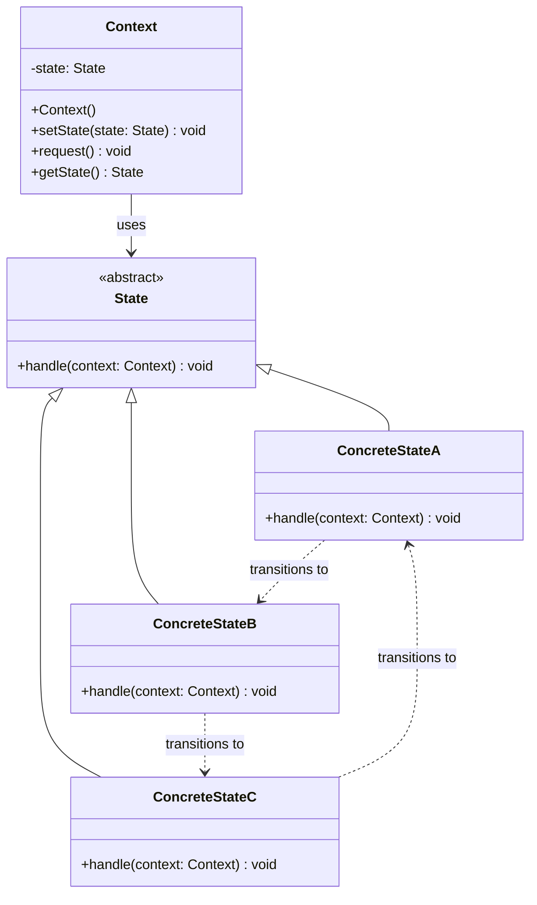

# 状态模式 (State Pattern)

## 概述

状态模式是一种行为型设计模式，它允许对象在其内部状态改变时改变它的行为。对象看起来好像修改了它的类。状态模式将状态相关的行为局部化，并且将不同状态的行为分割开来，使得状态转换变得更加明确。

### 核心思想

状态模式的核心思想是**将状态相关的行为封装到独立的状态类中**，通过这种方式来：

- **消除复杂的条件语句**：避免大量的if-else或switch-case语句
- **状态行为局部化**：每个状态的行为都封装在对应的状态类中
- **状态转换明确化**：状态之间的转换逻辑清晰可见
- **遵循开闭原则**：可以独立地增加新状态而不影响现有代码
- **单一职责原则**：每个状态类只负责一种状态的行为

## 使用场景

### 🎯 适用情况

1. **对象的行为依赖于它的状态**：并且它必须在运行时根据状态改变它的行为
2. **操作中含有庞大的多分支条件语句**：这些条件语句的分支依赖于对象的状态
3. **状态转换逻辑复杂**：需要明确的状态转换规则
4. **游戏开发**：角色状态、游戏关卡状态等
5. **工作流系统**：订单状态、审批流程状态等
6. **设备控制**：电梯、自动售货机、音响设备等
7. **网络连接**：TCP连接状态管理
8. **用户界面**：按钮的启用/禁用状态

### 🚫 不适用情况

1. **状态很少改变**：如果状态转换很少发生
2. **状态转换逻辑简单**：简单的布尔状态可能不需要状态模式
3. **性能要求极高**：状态模式会增加一定的性能开销

## UML 类图



## 核心组件

### 1. 环境类 (Context)
定义客户感兴趣的接口，维护一个具体状态类的实例，这个实例定义当前状态。

### 2. 抽象状态类 (State)
定义一个接口以封装与Context的一个特定状态相关的行为。

### 3. 具体状态类 (ConcreteState)
每一个具体状态类都实现了与Context的一个状态相关的行为。

## Java 示例

### 示例1：自动售货机状态管理

```java
// 抽象状态接口
interface VendingMachineState {
    void insertCoin(VendingMachine machine);
    void selectProduct(VendingMachine machine, String product);
    void dispenseProduct(VendingMachine machine);
    void refund(VendingMachine machine);
    String getStateName();
}

// 环境类：自动售货机
class VendingMachine {
    private VendingMachineState currentState;
    private Map<String, Integer> inventory;
    private Map<String, Double> prices;
    private double insertedMoney;
    private String selectedProduct;
    
    // 状态实例
    private final VendingMachineState idleState;
    private final VendingMachineState coinInsertedState;
    private final VendingMachineState productSelectedState;
    private final VendingMachineState dispensingState;
    private final VendingMachineState outOfStockState;
    
    public VendingMachine() {
        // 初始化状态
        this.idleState = new IdleState();
        this.coinInsertedState = new CoinInsertedState();
        this.productSelectedState = new ProductSelectedState();
        this.dispensingState = new DispensingState();
        this.outOfStockState = new OutOfStockState();
        
        // 初始化库存和价格
        this.inventory = new HashMap<>();
        this.prices = new HashMap<>();
        initializeInventory();
        
        // 设置初始状态
        this.currentState = idleState;
        this.insertedMoney = 0.0;
    }
    
    private void initializeInventory() {
        inventory.put("可乐", 10);
        inventory.put("雪碧", 8);
        inventory.put("橙汁", 5);
        
        prices.put("可乐", 3.0);
        prices.put("雪碧", 3.0);
        prices.put("橙汁", 4.0);
    }
    
    // 状态转换方法
    public void setState(VendingMachineState state) {
        System.out.println("状态转换: " + currentState.getStateName() + " -> " + state.getStateName());
        this.currentState = state;
    }
    
    // 委托给当前状态的方法
    public void insertCoin(double amount) {
        System.out.println("\n=== 投入硬币: " + amount + "元 ===");
        insertedMoney += amount;
        currentState.insertCoin(this);
    }
    
    public void selectProduct(String product) {
        System.out.println("\n=== 选择商品: " + product + " ===");
        selectedProduct = product;
        currentState.selectProduct(this, product);
    }
    
    public void dispenseProduct() {
        System.out.println("\n=== 请求出货 ===");
        currentState.dispenseProduct(this);
    }
    
    public void refund() {
        System.out.println("\n=== 请求退款 ===");
        currentState.refund(this);
    }
    
    // 业务逻辑方法
    public boolean hasProduct(String product) {
        return inventory.containsKey(product) && inventory.get(product) > 0;
    }
    
    public boolean hasEnoughMoney(String product) {
        return insertedMoney >= prices.get(product);
    }
    
    public void decreaseInventory(String product) {
        inventory.put(product, inventory.get(product) - 1);
    }
    
    public double getChange(String product) {
        return insertedMoney - prices.get(product);
    }
    
    public void resetTransaction() {
        insertedMoney = 0.0;
        selectedProduct = null;
    }
    
    // Getters
    public double getInsertedMoney() { return insertedMoney; }
    public String getSelectedProduct() { return selectedProduct; }
    public VendingMachineState getIdleState() { return idleState; }
    public VendingMachineState getCoinInsertedState() { return coinInsertedState; }
    public VendingMachineState getProductSelectedState() { return productSelectedState; }
    public VendingMachineState getDispensingState() { return dispensingState; }
    public VendingMachineState getOutOfStockState() { return outOfStockState; }
    public VendingMachineState getCurrentState() { return currentState; }
    
    public void showStatus() {
        System.out.println("当前状态: " + currentState.getStateName());
        System.out.println("已投入金额: " + insertedMoney + "元");
        System.out.println("选择商品: " + (selectedProduct != null ? selectedProduct : "无"));
        System.out.println("库存情况: " + inventory);
    }
}

// 具体状态1：空闲状态
class IdleState implements VendingMachineState {
    @Override
    public void insertCoin(VendingMachine machine) {
        System.out.println("硬币已接收，请选择商品");
        machine.setState(machine.getCoinInsertedState());
    }
    
    @Override
    public void selectProduct(VendingMachine machine, String product) {
        System.out.println("请先投入硬币");
    }
    
    @Override
    public void dispenseProduct(VendingMachine machine) {
        System.out.println("请先投入硬币并选择商品");
    }
    
    @Override
    public void refund(VendingMachine machine) {
        System.out.println("没有可退款的金额");
    }
    
    @Override
    public String getStateName() {
        return "空闲状态";
    }
}

// 具体状态2：已投币状态
class CoinInsertedState implements VendingMachineState {
    @Override
    public void insertCoin(VendingMachine machine) {
        System.out.println("继续接收硬币，当前金额: " + machine.getInsertedMoney() + "元");
    }
    
    @Override
    public void selectProduct(VendingMachine machine, String product) {
        if (!machine.hasProduct(product)) {
            System.out.println("商品 " + product + " 缺货，请选择其他商品或退款");
            machine.setState(machine.getOutOfStockState());
            return;
        }
        
        if (!machine.hasEnoughMoney(product)) {
            System.out.println("金额不足，请继续投币或选择其他商品");
            return;
        }
        
        System.out.println("商品已选择: " + product);
        machine.setState(machine.getProductSelectedState());
    }
    
    @Override
    public void dispenseProduct(VendingMachine machine) {
        System.out.println("请先选择商品");
    }
    
    @Override
    public void refund(VendingMachine machine) {
        System.out.println("退款: " + machine.getInsertedMoney() + "元");
        machine.resetTransaction();
        machine.setState(machine.getIdleState());
    }
    
    @Override
    public String getStateName() {
        return "已投币状态";
    }
}

// 具体状态3：已选商品状态
class ProductSelectedState implements VendingMachineState {
    @Override
    public void insertCoin(VendingMachine machine) {
        System.out.println("继续接收硬币，当前金额: " + machine.getInsertedMoney() + "元");
    }
    
    @Override
    public void selectProduct(VendingMachine machine, String product) {
        System.out.println("重新选择商品: " + product);
        // 重新检查商品和金额
        machine.setState(machine.getCoinInsertedState());
        selectProduct(machine, product);
    }
    
    @Override
    public void dispenseProduct(VendingMachine machine) {
        System.out.println("正在出货...");
        machine.setState(machine.getDispensingState());
        
        // 模拟出货过程
        try {
            Thread.sleep(1000);
        } catch (InterruptedException e) {
            Thread.currentThread().interrupt();
        }
        
        String product = machine.getSelectedProduct();
        machine.decreaseInventory(product);
        
        double change = machine.getChange(product);
        System.out.println("商品已出货: " + product);
        if (change > 0) {
            System.out.println("找零: " + change + "元");
        }
        
        machine.resetTransaction();
        machine.setState(machine.getIdleState());
    }
    
    @Override
    public void refund(VendingMachine machine) {
        System.out.println("退款: " + machine.getInsertedMoney() + "元");
        machine.resetTransaction();
        machine.setState(machine.getIdleState());
    }
    
    @Override
    public String getStateName() {
        return "已选商品状态";
    }
}

// 具体状态4：出货状态
class DispensingState implements VendingMachineState {
    @Override
    public void insertCoin(VendingMachine machine) {
        System.out.println("正在出货中，请稍候");
    }
    
    @Override
    public void selectProduct(VendingMachine machine, String product) {
        System.out.println("正在出货中，请稍候");
    }
    
    @Override
    public void dispenseProduct(VendingMachine machine) {
        System.out.println("正在出货中，请稍候");
    }
    
    @Override
    public void refund(VendingMachine machine) {
        System.out.println("正在出货中，无法退款");
    }
    
    @Override
    public String getStateName() {
        return "出货状态";
    }
}

// 具体状态5：缺货状态
class OutOfStockState implements VendingMachineState {
    @Override
    public void insertCoin(VendingMachine machine) {
        System.out.println("商品缺货，请选择其他商品或退款");
    }
    
    @Override
    public void selectProduct(VendingMachine machine, String product) {
        if (machine.hasProduct(product)) {
            System.out.println("重新选择商品: " + product);
            machine.setState(machine.getCoinInsertedState());
            machine.getCoinInsertedState().selectProduct(machine, product);
        } else {
            System.out.println("商品 " + product + " 仍然缺货");
        }
    }
    
    @Override
    public void dispenseProduct(VendingMachine machine) {
        System.out.println("商品缺货，无法出货");
    }
    
    @Override
    public void refund(VendingMachine machine) {
        System.out.println("退款: " + machine.getInsertedMoney() + "元");
        machine.resetTransaction();
        machine.setState(machine.getIdleState());
    }
    
    @Override
    public String getStateName() {
        return "缺货状态";
    }
}

// 使用示例
public class VendingMachineExample {
    public static void main(String[] args) throws InterruptedException {
        VendingMachine machine = new VendingMachine();
        
        System.out.println("=== 自动售货机状态模式演示 ===");
        machine.showStatus();
        
        // 场景1：正常购买流程
        System.out.println("\n=== 场景1：正常购买流程 ===");
        machine.insertCoin(2.0);
        machine.selectProduct("可乐"); // 金额不足
        machine.insertCoin(1.5);
        machine.selectProduct("可乐"); // 金额足够
        machine.dispenseProduct();
        
        Thread.sleep(1000);
        machine.showStatus();
        
        // 场景2：选择缺货商品
        System.out.println("\n=== 场景2：选择缺货商品 ===");
        // 先把橙汁买完
        for (int i = 0; i < 5; i++) {
            machine.insertCoin(4.0);
            machine.selectProduct("橙汁");
            machine.dispenseProduct();
            Thread.sleep(500);
        }
        
        // 再次尝试购买橙汁
        machine.insertCoin(4.0);
        machine.selectProduct("橙汁"); // 缺货
        machine.selectProduct("雪碧"); // 改选雪碧
        machine.dispenseProduct();
        
        Thread.sleep(1000);
        machine.showStatus();
        
        // 场景3：退款操作
        System.out.println("\n=== 场景3：退款操作 ===");
        machine.insertCoin(5.0);
        machine.refund();
        
        machine.showStatus();
    }
}
```

### 示例2：游戏角色状态管理

```java
// 游戏角色状态接口
interface PlayerState {
    void move(GamePlayer player);
    void attack(GamePlayer player);
    void defend(GamePlayer player);
    void useSkill(GamePlayer player);
    void takeDamage(GamePlayer player, int damage);
    String getStateName();
    boolean canTransitionTo(PlayerState newState);
}

// 游戏角色类
class GamePlayer {
    private String name;
    private int health;
    private int maxHealth;
    private int mana;
    private int maxMana;
    private int stamina;
    private int maxStamina;
    private PlayerState currentState;
    
    // 状态实例
    private final PlayerState normalState;
    private final PlayerState combatState;
    private final PlayerState defendingState;
    private final PlayerState castingState;
    private final PlayerState stunned State;
    private final PlayerState deadState;
    
    public GamePlayer(String name) {
        this.name = name;
        this.maxHealth = 100;
        this.maxMana = 50;
        this.maxStamina = 30;
        this.health = maxHealth;
        this.mana = maxMana;
        this.stamina = maxStamina;
        
        // 初始化状态
        this.normalState = new NormalState();
        this.combatState = new CombatState();
        this.defendingState = new DefendingState();
        this.castingState = new CastingState();
        this.stunnedState = new StunnedState();
        this.deadState = new DeadState();
        
        this.currentState = normalState;
    }
    
    public void setState(PlayerState newState) {
        if (currentState.canTransitionTo(newState)) {
            System.out.println(name + " 状态转换: " + currentState.getStateName() + " -> " + newState.getStateName());
            this.currentState = newState;
        } else {
            System.out.println("无法从 " + currentState.getStateName() + " 转换到 " + newState.getStateName());
        }
    }
    
    // 委托给当前状态的方法
    public void move() {
        System.out.println("\n" + name + " 尝试移动");
        currentState.move(this);
    }
    
    public void attack() {
        System.out.println("\n" + name + " 尝试攻击");
        currentState.attack(this);
    }
    
    public void defend() {
        System.out.println("\n" + name + " 尝试防御");
        currentState.defend(this);
    }
    
    public void useSkill() {
        System.out.println("\n" + name + " 尝试使用技能");
        currentState.useSkill(this);
    }
    
    public void takeDamage(int damage) {
        System.out.println("\n" + name + " 受到 " + damage + " 点伤害");
        currentState.takeDamage(this, damage);
    }
    
    // 业务逻辑方法
    public void reduceHealth(int amount) {
        health = Math.max(0, health - amount);
        if (health == 0 && !(currentState instanceof DeadState)) {
            setState(deadState);
        }
    }
    
    public void reduceMana(int amount) {
        mana = Math.max(0, mana - amount);
    }
    
    public void reduceStamina(int amount) {
        stamina = Math.max(0, stamina - amount);
    }
    
    public void restoreHealth(int amount) {
        health = Math.min(maxHealth, health + amount);
    }
    
    public void restoreMana(int amount) {
        mana = Math.min(maxMana, mana + amount);
    }
    
    public void restoreStamina(int amount) {
        stamina = Math.min(maxStamina, stamina + amount);
    }
    
    // Getters
    public String getName() { return name; }
    public int getHealth() { return health; }
    public int getMana() { return mana; }
    public int getStamina() { return stamina; }
    public boolean isAlive() { return health > 0; }
    public boolean hasMana(int required) { return mana >= required; }
    public boolean hasStamina(int required) { return stamina >= required; }
    
    public PlayerState getNormalState() { return normalState; }
    public PlayerState getCombatState() { return combatState; }
    public PlayerState getDefendingState() { return defendingState; }
    public PlayerState getCastingState() { return castingState; }
    public PlayerState getStunnedState() { return stunnedState; }
    public PlayerState getDeadState() { return deadState; }
    public PlayerState getCurrentState() { return currentState; }
    
    public void showStatus() {
        System.out.println(String.format("%s 状态: %s | 生命: %d/%d | 法力: %d/%d | 体力: %d/%d",
                          name, currentState.getStateName(), health, maxHealth, 
                          mana, maxMana, stamina, maxStamina));
    }
}

// 具体状态1：正常状态
class NormalState implements PlayerState {
    @Override
    public void move(GamePlayer player) {
        if (player.hasStamina(1)) {
            System.out.println(player.getName() + " 正常移动");
            player.reduceStamina(1);
        } else {
            System.out.println(player.getName() + " 体力不足，无法移动");
        }
    }
    
    @Override
    public void attack(GamePlayer player) {
        if (player.hasStamina(5)) {
            System.out.println(player.getName() + " 发起攻击");
            player.reduceStamina(5);
            player.setState(player.getCombatState());
        } else {
            System.out.println(player.getName() + " 体力不足，无法攻击");
        }
    }
    
    @Override
    public void defend(GamePlayer player) {
        System.out.println(player.getName() + " 进入防御姿态");
        player.setState(player.getDefendingState());
    }
    
    @Override
    public void useSkill(GamePlayer player) {
        if (player.hasMana(10)) {
            System.out.println(player.getName() + " 开始施法");
            player.setState(player.getCastingState());
        } else {
            System.out.println(player.getName() + " 法力不足，无法施法");
        }
    }
    
    @Override
    public void takeDamage(GamePlayer player, int damage) {
        player.reduceHealth(damage);
        System.out.println(player.getName() + " 受到伤害，剩余生命: " + player.getHealth());
    }
    
    @Override
    public String getStateName() {
        return "正常状态";
    }
    
    @Override
    public boolean canTransitionTo(PlayerState newState) {
        return !(newState instanceof NormalState);
    }
}

// 具体状态2：战斗状态
class CombatState implements PlayerState {
    private int combatTurns = 0;
    
    @Override
    public void move(GamePlayer player) {
        if (player.hasStamina(2)) {
            System.out.println(player.getName() + " 在战斗中移动（消耗更多体力）");
            player.reduceStamina(2);
        } else {
            System.out.println(player.getName() + " 体力不足，无法移动");
        }
    }
    
    @Override
    public void attack(GamePlayer player) {
        if (player.hasStamina(3)) {
            System.out.println(player.getName() + " 连续攻击");
            player.reduceStamina(3);
            combatTurns++;
            
            if (combatTurns >= 3) {
                System.out.println(player.getName() + " 战斗结束，回到正常状态");
                combatTurns = 0;
                player.setState(player.getNormalState());
            }
        } else {
            System.out.println(player.getName() + " 体力不足，无法攻击");
        }
    }
    
    @Override
    public void defend(GamePlayer player) {
        System.out.println(player.getName() + " 在战斗中防御");
        player.setState(player.getDefendingState());
    }
    
    @Override
    public void useSkill(GamePlayer player) {
        if (player.hasMana(15)) {
            System.out.println(player.getName() + " 在战斗中施法");
            player.setState(player.getCastingState());
        } else {
            System.out.println(player.getName() + " 法力不足，无法施法");
        }
    }
    
    @Override
    public void takeDamage(GamePlayer player, int damage) {
        player.reduceHealth(damage);
        System.out.println(player.getName() + " 在战斗中受到伤害，剩余生命: " + player.getHealth());
        
        if (damage > 20) {
            System.out.println(player.getName() + " 受到重击，被击晕");
            player.setState(player.getStunnedState());
        }
    }
    
    @Override
    public String getStateName() {
        return "战斗状态";
    }
    
    @Override
    public boolean canTransitionTo(PlayerState newState) {
        return !(newState instanceof CombatState);
    }
}

// 具体状态3：防御状态
class DefendingState implements PlayerState {
    @Override
    public void move(GamePlayer player) {
        System.out.println(player.getName() + " 防御状态下无法移动");
    }
    
    @Override
    public void attack(GamePlayer player) {
        System.out.println(player.getName() + " 取消防御，发起攻击");
        player.setState(player.getCombatState());
        player.getCombatState().attack(player);
    }
    
    @Override
    public void defend(GamePlayer player) {
        System.out.println(player.getName() + " 继续防御");
        player.restoreStamina(2);
    }
    
    @Override
    public void useSkill(GamePlayer player) {
        System.out.println(player.getName() + " 防御状态下无法施法");
    }
    
    @Override
    public void takeDamage(GamePlayer player, int damage) {
        int reducedDamage = damage / 2;
        player.reduceHealth(reducedDamage);
        System.out.println(player.getName() + " 防御减免伤害，实际受到 " + reducedDamage + " 点伤害");
        
        // 防御后回到正常状态
        player.setState(player.getNormalState());
    }
    
    @Override
    public String getStateName() {
        return "防御状态";
    }
    
    @Override
    public boolean canTransitionTo(PlayerState newState) {
        return true;
    }
}

// 具体状态4：施法状态
class CastingState implements PlayerState {
    @Override
    public void move(GamePlayer player) {
        System.out.println(player.getName() + " 施法被打断");
        player.setState(player.getNormalState());
    }
    
    @Override
    public void attack(GamePlayer player) {
        System.out.println(player.getName() + " 施法被打断");
        player.setState(player.getNormalState());
    }
    
    @Override
    public void defend(GamePlayer player) {
        System.out.println(player.getName() + " 施法被打断");
        player.setState(player.getDefendingState());
    }
    
    @Override
    public void useSkill(GamePlayer player) {
        System.out.println(player.getName() + " 技能施法完成");
        player.reduceMana(10);
        
        // 模拟施法时间
        try {
            Thread.sleep(1000);
        } catch (InterruptedException e) {
            Thread.currentThread().interrupt();
        }
        
        System.out.println(player.getName() + " 释放了强力技能");
        player.setState(player.getNormalState());
    }
    
    @Override
    public void takeDamage(GamePlayer player, int damage) {
        player.reduceHealth(damage * 2); // 施法时受到双倍伤害
        System.out.println(player.getName() + " 施法时受到双倍伤害: " + (damage * 2));
        System.out.println(player.getName() + " 施法被打断");
        player.setState(player.getNormalState());
    }
    
    @Override
    public String getStateName() {
        return "施法状态";
    }
    
    @Override
    public boolean canTransitionTo(PlayerState newState) {
        return true;
    }
}

// 具体状态5：眩晕状态
class StunnedState implements PlayerState {
    private int stunDuration = 2;
    
    @Override
    public void move(GamePlayer player) {
        System.out.println(player.getName() + " 被眩晕，无法移动");
        checkStunRecovery(player);
    }
    
    @Override
    public void attack(GamePlayer player) {
        System.out.println(player.getName() + " 被眩晕，无法攻击");
        checkStunRecovery(player);
    }
    
    @Override
    public void defend(GamePlayer player) {
        System.out.println(player.getName() + " 被眩晕，无法防御");
        checkStunRecovery(player);
    }
    
    @Override
    public void useSkill(GamePlayer player) {
        System.out.println(player.getName() + " 被眩晕，无法施法");
        checkStunRecovery(player);
    }
    
    @Override
    public void takeDamage(GamePlayer player, int damage) {
        player.reduceHealth(damage);
        System.out.println(player.getName() + " 眩晕中受到伤害: " + damage);
        checkStunRecovery(player);
    }
    
    private void checkStunRecovery(GamePlayer player) {
        stunDuration--;
        if (stunDuration <= 0) {
            System.out.println(player.getName() + " 从眩晕中恢复");
            stunDuration = 2; // 重置眩晕时间
            player.setState(player.getNormalState());
        } else {
            System.out.println(player.getName() + " 还需要 " + stunDuration + " 回合恢复");
        }
    }
    
    @Override
    public String getStateName() {
        return "眩晕状态";
    }
    
    @Override
    public boolean canTransitionTo(PlayerState newState) {
        return newState instanceof DeadState || newState instanceof NormalState;
    }
}

// 具体状态6：死亡状态
class DeadState implements PlayerState {
    @Override
    public void move(GamePlayer player) {
        System.out.println(player.getName() + " 已死亡，无法移动");
    }
    
    @Override
    public void attack(GamePlayer player) {
        System.out.println(player.getName() + " 已死亡，无法攻击");
    }
    
    @Override
    public void defend(GamePlayer player) {
        System.out.println(player.getName() + " 已死亡，无法防御");
    }
    
    @Override
    public void useSkill(GamePlayer player) {
        System.out.println(player.getName() + " 已死亡，无法施法");
    }
    
    @Override
    public void takeDamage(GamePlayer player, int damage) {
        System.out.println(player.getName() + " 已死亡，无法再受到伤害");
    }
    
    @Override
    public String getStateName() {
        return "死亡状态";
    }
    
    @Override
    public boolean canTransitionTo(PlayerState newState) {
        return false; // 死亡状态无法转换到其他状态
    }
}

// 使用示例
public class GamePlayerExample {
    public static void main(String[] args) throws InterruptedException {
        GamePlayer player = new GamePlayer("勇士");
        
        System.out.println("=== 游戏角色状态模式演示 ===");
        player.showStatus();
        
        // 场景1：正常战斗流程
        System.out.println("\n=== 场景1：正常战斗流程 ===");
        player.move();
        player.attack();
        player.attack();
        player.attack();
        player.attack(); // 战斗结束
        
        player.showStatus();
        
        // 场景2：防御和受伤
        System.out.println("\n=== 场景2：防御和受伤 ===");
        player.defend();
        player.takeDamage(20); // 防御减免
        
        player.showStatus();
        
        // 场景3：施法过程
        System.out.println("\n=== 场景3：施法过程 ===");
        player.useSkill();
        Thread.sleep(500);
        player.useSkill(); // 完成施法
        
        player.showStatus();
        
        // 场景4：眩晕状态
        System.out.println("\n=== 场景4：眩晕状态 ===");
        player.takeDamage(25); // 受到重击，被眩晕
        player.attack(); // 眩晕中无法行动
        player.move(); // 眩晕恢复
        
        player.showStatus();
        
        // 场景5：死亡状态
        System.out.println("\n=== 场景5：死亡状态 ===");
        player.takeDamage(100); // 致命伤害
        player.attack(); // 死亡后无法行动
        
        player.showStatus();
    }
}
```

## 优缺点分析

### ✅ 优点

1. **消除复杂的条件语句**
   - 避免大量的if-else或switch-case语句
   - 代码更加清晰和易于理解

2. **状态行为局部化**
   - 每个状态的行为都封装在对应的状态类中
   - 状态相关的代码集中管理

3. **状态转换明确**
   - 状态之间的转换逻辑清晰可见
   - 易于理解和维护状态转换规则

4. **遵循开闭原则**
   - 可以独立地增加新状态而不影响现有代码
   - 易于扩展新的状态和行为

5. **单一职责原则**
   - 每个状态类只负责一种状态的行为
   - 职责分离明确

### ❌ 缺点

1. **增加类的数量**
   - 每个状态都需要一个类，可能导致类数量增加
   - 简单的状态可能过度设计

2. **状态转换复杂性**
   - 状态之间的转换关系可能变得复杂
   - 需要仔细设计状态转换逻辑

3. **性能开销**
   - 状态切换需要创建对象或方法调用
   - 可能带来一定的性能开销

4. **调试困难**
   - 状态转换的动态性可能使调试变得困难
   - 需要跟踪状态变化过程

## 与其他模式的对比

### 🆚 状态模式 vs 策略模式

| 特性 | 状态模式 | 策略模式 |
|------|----------|----------|
| **目的** | 根据状态改变行为 | 根据策略选择算法 |
| **状态/策略数量** | 通常较少且固定 | 可以很多且灵活 |
| **转换** | 状态间可以相互转换 | 策略间独立，不转换 |
| **上下文感知** | 状态通常了解其他状态 | 策略通常不了解其他策略 |
| **生命周期** | 状态可能有生命周期 | 策略通常是无状态的 |

### 🆚 状态模式 vs 命令模式

| 特性 | 状态模式 | 命令模式 |
|------|----------|----------|
| **关注点** | 对象状态变化 | 请求封装和执行 |
| **行为变化** | 根据状态改变行为 | 封装不同的操作 |
| **撤销操作** | 通常不支持 | 天然支持撤销 |
| **队列操作** | 不适用 | 支持队列和批处理 |

## 实际应用场景

### 1. TCP 连接状态管理

```java
// TCP连接状态管理
public class TCPConnection {
    private TCPState currentState;
    
    // 状态实例
    private final TCPState closedState = new ClosedState();
    private final TCPState listenState = new ListenState();
    private final TCPState establishedState = new EstablishedState();
    
    public void open() {
        currentState.open(this);
    }
    
    public void close() {
        currentState.close(this);
    }
    
    public void acknowledge() {
        currentState.acknowledge(this);
    }
}

interface TCPState {
    void open(TCPConnection connection);
    void close(TCPConnection connection);
    void acknowledge(TCPConnection connection);
}
```

### 2. 工作流状态管理

```java
// 订单工作流状态管理
public class OrderWorkflow {
    private WorkflowState currentState;
    
    // 状态转换
    public void submit() {
        currentState.submit(this);
    }
    
    public void approve() {
        currentState.approve(this);
    }
    
    public void reject() {
        currentState.reject(this);
    }
    
    public void ship() {
        currentState.ship(this);
    }
}

interface WorkflowState {
    void submit(OrderWorkflow workflow);
    void approve(OrderWorkflow workflow);
    void reject(OrderWorkflow workflow);
    void ship(OrderWorkflow workflow);
}
```

### 3. UI 组件状态管理

```java
// UI按钮状态管理
public class Button {
    private ButtonState currentState;
    
    public void click() {
        currentState.click(this);
    }
    
    public void enable() {
        currentState.enable(this);
    }
    
    public void disable() {
        currentState.disable(this);
    }
}

interface ButtonState {
    void click(Button button);
    void enable(Button button);
    void disable(Button button);
}
```

## 模式变种和扩展

### 1. 状态机模式

```java
// 有限状态机实现
class StateMachine<T extends Enum<T>, E extends Enum<E>> {
    private T currentState;
    private Map<StateTransition<T, E>, T> transitions;
    private Map<T, StateHandler<T, E>> handlers;
    
    public StateMachine(T initialState) {
        this.currentState = initialState;
        this.transitions = new HashMap<>();
        this.handlers = new HashMap<>();
    }
    
    public void addTransition(T from, E event, T to) {
        transitions.put(new StateTransition<>(from, event), to);
    }
    
    public void addHandler(T state, StateHandler<T, E> handler) {
        handlers.put(state, handler);
    }
    
    public boolean fire(E event) {
        StateTransition<T, E> transition = new StateTransition<>(currentState, event);
        T nextState = transitions.get(transition);
        
        if (nextState != null) {
            // 执行状态处理器
            StateHandler<T, E> handler = handlers.get(currentState);
            if (handler != null) {
                handler.onExit(currentState, event, nextState);
            }
            
            T previousState = currentState;
            currentState = nextState;
            
            handler = handlers.get(currentState);
            if (handler != null) {
                handler.onEnter(previousState, event, currentState);
            }
            
            return true;
        }
        
        return false;
    }
    
    public T getCurrentState() {
        return currentState;
    }
}

// 状态转换键
class StateTransition<T extends Enum<T>, E extends Enum<E>> {
    private final T state;
    private final E event;
    
    public StateTransition(T state, E event) {
        this.state = state;
        this.event = event;
    }
    
    @Override
    public boolean equals(Object obj) {
        if (this == obj) return true;
        if (obj == null || getClass() != obj.getClass()) return false;
        StateTransition<?, ?> that = (StateTransition<?, ?>) obj;
        return Objects.equals(state, that.state) && Objects.equals(event, that.event);
    }
    
    @Override
    public int hashCode() {
        return Objects.hash(state, event);
    }
}

// 状态处理器
interface StateHandler<T extends Enum<T>, E extends Enum<E>> {
    default void onEnter(T from, E event, T to) {}
    default void onExit(T from, E event, T to) {}
}
```

### 2. 分层状态模式

```java
// 分层状态模式
abstract class HierarchicalState {
    protected HierarchicalState parentState;
    protected Map<String, HierarchicalState> childStates;
    
    public HierarchicalState(HierarchicalState parent) {
        this.parentState = parent;
        this.childStates = new HashMap<>();
    }
    
    public void addChildState(String name, HierarchicalState child) {
        childStates.put(name, child);
    }
    
    public abstract void handle(String event, StateContext context);
    
    protected void delegateToParent(String event, StateContext context) {
        if (parentState != null) {
            parentState.handle(event, context);
        }
    }
}

// 状态上下文
class StateContext {
    private HierarchicalState currentState;
    private Stack<HierarchicalState> stateStack;
    
    public StateContext(HierarchicalState initialState) {
        this.currentState = initialState;
        this.stateStack = new Stack<>();
    }
    
    public void pushState(HierarchicalState newState) {
        stateStack.push(currentState);
        currentState = newState;
    }
    
    public void popState() {
        if (!stateStack.isEmpty()) {
            currentState = stateStack.pop();
        }
    }
    
    public void handleEvent(String event) {
        currentState.handle(event, this);
    }
}
```

### 3. 异步状态模式

```java
// 异步状态模式
class AsyncStateMachine {
    private volatile State currentState;
    private final ExecutorService executor;
    private final List<StateChangeListener> listeners;
    
    public AsyncStateMachine(State initialState) {
        this.currentState = initialState;
        this.executor = Executors.newSingleThreadExecutor();
        this.listeners = new CopyOnWriteArrayList<>();
    }
    
    public CompletableFuture<Boolean> transitionTo(State newState) {
        return CompletableFuture.supplyAsync(() -> {
            State oldState = currentState;
            
            // 检查转换是否有效
            if (!currentState.canTransitionTo(newState)) {
                return false;
            }
            
            // 执行状态转换
            currentState.onExit();
            currentState = newState;
            currentState.onEnter();
            
            // 通知监听器
            notifyListeners(oldState, newState);
            
            return true;
        }, executor);
    }
    
    public void addStateChangeListener(StateChangeListener listener) {
        listeners.add(listener);
    }
    
    private void notifyListeners(State from, State to) {
        for (StateChangeListener listener : listeners) {
            try {
                listener.onStateChanged(from, to);
            } catch (Exception e) {
                System.err.println("状态变化监听器异常: " + e.getMessage());
            }
        }
    }
    
    public void shutdown() {
        executor.shutdown();
    }
}

interface StateChangeListener {
    void onStateChanged(State from, State to);
}
```

## 最佳实践

### 1. 状态接口设计原则

```java
// 良好的状态接口设计
interface RobustState {
    // 基本状态操作
    void enter(StateContext context);
    void exit(StateContext context);
    
    // 事件处理
    boolean handle(String event, StateContext context);
    
    // 状态查询
    String getStateName();
    Set<String> getSupportedEvents();
    
    // 转换验证
    boolean canTransitionTo(RobustState newState);
    Set<RobustState> getAllowedTransitions();
    
    // 状态属性
    boolean isTerminalState();
    boolean isInitialState();
    
    // 错误处理
    void onError(Exception error, StateContext context);
}

// 抽象状态基类
abstract class AbstractState implements RobustState {
    protected final String stateName;
    protected final Set<String> supportedEvents;
    protected final Set<RobustState> allowedTransitions;
    
    public AbstractState(String stateName) {
        this.stateName = stateName;
        this.supportedEvents = new HashSet<>();
        this.allowedTransitions = new HashSet<>();
        initializeSupportedEvents();
        initializeAllowedTransitions();
    }
    
    protected abstract void initializeSupportedEvents();
    protected abstract void initializeAllowedTransitions();
    
    @Override
    public void enter(StateContext context) {
        System.out.println("进入状态: " + stateName);
    }
    
    @Override
    public void exit(StateContext context) {
        System.out.println("退出状态: " + stateName);
    }
    
    @Override
    public String getStateName() {
        return stateName;
    }
    
    @Override
    public Set<String> getSupportedEvents() {
        return new HashSet<>(supportedEvents);
    }
    
    @Override
    public boolean canTransitionTo(RobustState newState) {
        return allowedTransitions.contains(newState);
    }
    
    @Override
    public Set<RobustState> getAllowedTransitions() {
        return new HashSet<>(allowedTransitions);
    }
    
    @Override
    public boolean isTerminalState() {
        return allowedTransitions.isEmpty();
    }
    
    @Override
    public boolean isInitialState() {
        return false;
    }
    
    @Override
    public void onError(Exception error, StateContext context) {
        System.err.println("状态 " + stateName + " 处理错误: " + error.getMessage());
    }
}
```

### 2. 状态上下文设计

```java
// 强大的状态上下文
class RobustStateContext {
    private RobustState currentState;
    private final Map<String, Object> properties;
    private final List<StateTransitionListener> listeners;
    private final StateTransitionHistory history;
    private final StateValidator validator;
    
    public RobustStateContext(RobustState initialState) {
        this.currentState = initialState;
        this.properties = new ConcurrentHashMap<>();
        this.listeners = new CopyOnWriteArrayList<>();
        this.history = new StateTransitionHistory();
        this.validator = new StateValidator();
        
        currentState.enter(this);
    }
    
    public boolean fireEvent(String event) {
        try {
            // 验证事件
            if (!currentState.getSupportedEvents().contains(event)) {
                System.out.println("状态 " + currentState.getStateName() + " 不支持事件: " + event);
                return false;
            }
            
            // 处理事件
            boolean handled = currentState.handle(event, this);
            
            if (handled) {
                history.recordEvent(currentState, event);
            }
            
            return handled;
            
        } catch (Exception e) {
            currentState.onError(e, this);
            return false;
        }
    }
    
    public boolean transitionTo(RobustState newState) {
        try {
            // 验证转换
            if (!validator.validateTransition(currentState, newState)) {
                return false;
            }
            
            RobustState oldState = currentState;
            
            // 执行转换
            currentState.exit(this);
            currentState = newState;
            currentState.enter(this);
            
            // 记录历史
            history.recordTransition(oldState, newState);
            
            // 通知监听器
            notifyListeners(oldState, newState);
            
            return true;
            
        } catch (Exception e) {
            currentState.onError(e, this);
            return false;
        }
    }
    
    // 属性管理
    public void setProperty(String key, Object value) {
        properties.put(key, value);
    }
    
    @SuppressWarnings("unchecked")
    public <T> T getProperty(String key, Class<T> type) {
        Object value = properties.get(key);
        return type.isInstance(value) ? (T) value : null;
    }
    
    // 监听器管理
    public void addTransitionListener(StateTransitionListener listener) {
        listeners.add(listener);
    }
    
    private void notifyListeners(RobustState from, RobustState to) {
        for (StateTransitionListener listener : listeners) {
            try {
                listener.onTransition(from, to, this);
            } catch (Exception e) {
                System.err.println("状态转换监听器异常: " + e.getMessage());
            }
        }
    }
    
    // Getters
    public RobustState getCurrentState() {
        return currentState;
    }
    
    public StateTransitionHistory getHistory() {
        return history;
    }
}

// 状态转换监听器
interface StateTransitionListener {
    void onTransition(RobustState from, RobustState to, RobustStateContext context);
}

// 状态验证器
class StateValidator {
    public boolean validateTransition(RobustState from, RobustState to) {
        if (from == null || to == null) {
            return false;
        }
        
        if (from.equals(to)) {
            return false; // 不允许转换到自己
        }
        
        return from.canTransitionTo(to);
    }
}

// 状态转换历史
class StateTransitionHistory {
    private final List<TransitionRecord> transitions;
    private final List<EventRecord> events;
    
    public StateTransitionHistory() {
        this.transitions = new ArrayList<>();
        this.events = new ArrayList<>();
    }
    
    public void recordTransition(RobustState from, RobustState to) {
        transitions.add(new TransitionRecord(from, to, System.currentTimeMillis()));
    }
    
    public void recordEvent(RobustState state, String event) {
        events.add(new EventRecord(state, event, System.currentTimeMillis()));
    }
    
    public List<TransitionRecord> getTransitions() {
        return new ArrayList<>(transitions);
    }
    
    public List<EventRecord> getEvents() {
        return new ArrayList<>(events);
    }
    
    // 转换记录
    public static class TransitionRecord {
        private final RobustState from;
        private final RobustState to;
        private final long timestamp;
        
        public TransitionRecord(RobustState from, RobustState to, long timestamp) {
            this.from = from;
            this.to = to;
            this.timestamp = timestamp;
        }
        
        public RobustState getFrom() { return from; }
        public RobustState getTo() { return to; }
        public long getTimestamp() { return timestamp; }
    }
    
    // 事件记录
    public static class EventRecord {
        private final RobustState state;
        private final String event;
        private final long timestamp;
        
        public EventRecord(RobustState state, String event, long timestamp) {
            this.state = state;
            this.event = event;
            this.timestamp = timestamp;
        }
        
        public RobustState getState() { return state; }
        public String getEvent() { return event; }
        public long getTimestamp() { return timestamp; }
    }
}
```

### 3. 性能优化策略

```java
// 状态池化
class StatePool {
    private final Map<Class<? extends RobustState>, Queue<RobustState>> statePool;
    private final int maxPoolSize;
    
    public StatePool(int maxPoolSize) {
        this.statePool = new ConcurrentHashMap<>();
        this.maxPoolSize = maxPoolSize;
    }
    
    @SuppressWarnings("unchecked")
    public <T extends RobustState> T borrowState(Class<T> stateClass) {
        Queue<RobustState> pool = statePool.get(stateClass);
        if (pool != null && !pool.isEmpty()) {
            return (T) pool.poll();
        }
        
        try {
            return stateClass.getDeclaredConstructor().newInstance();
        } catch (Exception e) {
            throw new RuntimeException("无法创建状态实例: " + stateClass.getName(), e);
        }
    }
    
    public void returnState(RobustState state) {
        if (state == null) return;
        
        Queue<RobustState> pool = statePool.computeIfAbsent(
            state.getClass(), 
            k -> new ConcurrentLinkedQueue<>()
        );
        
        if (pool.size() < maxPoolSize) {
            // 重置状态
            if (state instanceof Resettable) {
                ((Resettable) state).reset();
            }
            pool.offer(state);
        }
    }
}

// 可重置接口
interface Resettable {
    void reset();
}

// 状态缓存
class StateCache {
    private final Map<String, RobustState> cache;
    private final int maxSize;
    
    public StateCache(int maxSize) {
        this.maxSize = maxSize;
        this.cache = new LinkedHashMap<String, RobustState>(maxSize + 1, 0.75f, true) {
            @Override
            protected boolean removeEldestEntry(Map.Entry<String, RobustState> eldest) {
                return size() > StateCache.this.maxSize;
            }
        };
    }
    
    public RobustState getState(String stateName) {
        return cache.get(stateName);
    }
    
    public void putState(String stateName, RobustState state) {
        cache.put(stateName, state);
    }
}
```

### 4. 监控和调试

```java
// 状态监控器
class StateMonitor {
    private final Map<String, StateMetrics> metrics;
    private final List<StateObserver> observers;
    
    public StateMonitor() {
        this.metrics = new ConcurrentHashMap<>();
        this.observers = new CopyOnWriteArrayList<>();
    }
    
    public void recordStateEntry(String stateName) {
        StateMetrics metric = metrics.computeIfAbsent(stateName, StateMetrics::new);
        metric.incrementEntryCount();
        metric.setLastEntryTime(System.currentTimeMillis());
        
        notifyObservers("STATE_ENTRY", stateName);
    }
    
    public void recordStateExit(String stateName, long duration) {
        StateMetrics metric = metrics.get(stateName);
        if (metric != null) {
            metric.addDuration(duration);
        }
        
        notifyObservers("STATE_EXIT", stateName);
    }
    
    public void recordTransition(String fromState, String toState) {
        String transitionKey = fromState + "->" + toState;
        StateMetrics metric = metrics.computeIfAbsent(transitionKey, StateMetrics::new);
        metric.incrementEntryCount();
        
        notifyObservers("STATE_TRANSITION", transitionKey);
    }
    
    public StateMetrics getMetrics(String stateName) {
        return metrics.get(stateName);
    }
    
    public Map<String, StateMetrics> getAllMetrics() {
        return new HashMap<>(metrics);
    }
    
    public void addObserver(StateObserver observer) {
        observers.add(observer);
    }
    
    private void notifyObservers(String eventType, String details) {
        for (StateObserver observer : observers) {
            try {
                observer.onStateEvent(eventType, details);
            } catch (Exception e) {
                System.err.println("状态观察者异常: " + e.getMessage());
            }
        }
    }
}

// 状态指标
class StateMetrics {
    private final String name;
    private final AtomicLong entryCount;
    private final AtomicLong totalDuration;
    private volatile long lastEntryTime;
    private volatile long minDuration = Long.MAX_VALUE;
    private volatile long maxDuration = Long.MIN_VALUE;
    
    public StateMetrics(String name) {
        this.name = name;
        this.entryCount = new AtomicLong(0);
        this.totalDuration = new AtomicLong(0);
    }
    
    public void incrementEntryCount() {
        entryCount.incrementAndGet();
    }
    
    public void addDuration(long duration) {
        totalDuration.addAndGet(duration);
        
        // 更新最小和最大持续时间
        synchronized (this) {
            if (duration < minDuration) {
                minDuration = duration;
            }
            if (duration > maxDuration) {
                maxDuration = duration;
            }
        }
    }
    
    public void setLastEntryTime(long time) {
        this.lastEntryTime = time;
    }
    
    // Getters
    public String getName() { return name; }
    public long getEntryCount() { return entryCount.get(); }
    public long getTotalDuration() { return totalDuration.get(); }
    public long getAverageDuration() {
        long count = entryCount.get();
        return count > 0 ? totalDuration.get() / count : 0;
    }
    public long getMinDuration() { return minDuration == Long.MAX_VALUE ? 0 : minDuration; }
    public long getMaxDuration() { return maxDuration == Long.MIN_VALUE ? 0 : maxDuration; }
    public long getLastEntryTime() { return lastEntryTime; }
}

// 状态观察者
interface StateObserver {
    void onStateEvent(String eventType, String details);
}

// 状态调试器
class StateDebugger implements StateObserver {
    private final boolean enabled;
    private final PrintWriter logWriter;
    
    public StateDebugger(boolean enabled, PrintWriter logWriter) {
        this.enabled = enabled;
        this.logWriter = logWriter;
    }
    
    @Override
    public void onStateEvent(String eventType, String details) {
        if (enabled && logWriter != null) {
            String timestamp = new SimpleDateFormat("yyyy-MM-dd HH:mm:ss.SSS")
                .format(new Date());
            logWriter.println(String.format("[%s] %s: %s", timestamp, eventType, details));
            logWriter.flush();
        }
    }
    
    public void dumpStateTransitions(StateTransitionHistory history) {
        if (!enabled || logWriter == null) return;
        
        logWriter.println("\n=== 状态转换历史 ===");
        for (StateTransitionHistory.TransitionRecord record : history.getTransitions()) {
            String timestamp = new SimpleDateFormat("yyyy-MM-dd HH:mm:ss.SSS")
                .format(new Date(record.getTimestamp()));
            logWriter.println(String.format("[%s] %s -> %s", 
                timestamp, 
                record.getFrom().getStateName(), 
                record.getTo().getStateName()));
        }
        
        logWriter.println("\n=== 事件历史 ===");
        for (StateTransitionHistory.EventRecord record : history.getEvents()) {
            String timestamp = new SimpleDateFormat("yyyy-MM-dd HH:mm:ss.SSS")
                .format(new Date(record.getTimestamp()));
            logWriter.println(String.format("[%s] %s: %s", 
                timestamp, 
                record.getState().getStateName(), 
                record.getEvent()));
        }
        
        logWriter.flush();
    }
}
```

## 总结

状态模式是一种强大的行为型设计模式，它通过将状态相关的行为封装到独立的状态类中，有效地解决了复杂的状态管理问题。

### 🎯 核心价值

1. **简化复杂逻辑**：消除大量的条件判断语句
2. **状态行为局部化**：每个状态的行为都集中管理
3. **状态转换明确**：状态之间的转换关系清晰可见
4. **易于扩展**：可以独立地添加新状态而不影响现有代码
5. **职责分离**：每个状态类只负责一种状态的行为

### 💡 使用建议

1. **适度使用**：不要为简单的状态过度设计
2. **状态设计**：仔细设计状态转换规则和状态接口
3. **性能考虑**：对于频繁的状态切换，考虑使用状态池化
4. **监控调试**：为复杂的状态机添加监控和调试功能
5. **文档化**：清楚地记录状态转换图和业务规则

### 🚀 实际应用

状态模式在现代软件开发中有着广泛的应用，从游戏开发中的角色状态管理，到企业应用中的工作流引擎，再到网络协议的连接状态管理，都能看到状态模式的身影。通过合理地应用状态模式，我们可以构建出更加清晰、可维护和可扩展的状态管理系统。