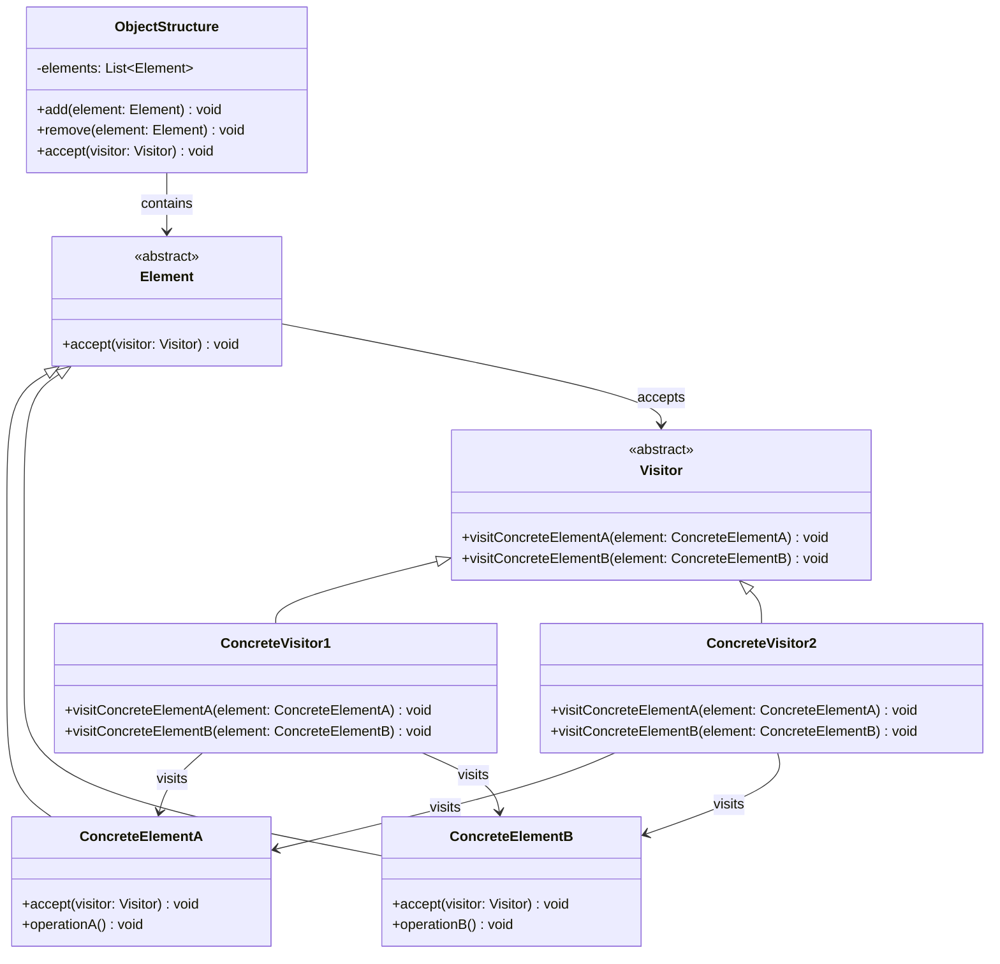

# 访问者模式 (Visitor Pattern)

## 概述

访问者模式是一种行为型设计模式，它允许你在不修改已有类的前提下，定义作用于这些类的新操作。访问者模式将数据结构与数据操作分离，使得操作集合可以独立变化。

### 核心思想

访问者模式的核心思想是**将操作从对象结构中分离出来**，通过这种方式来：

- **开放封闭原则**：对扩展开放，对修改封闭
- **操作集中化**：将相关操作集中在访问者类中
- **双重分派**：根据访问者和被访问元素的类型来决定执行哪个操作
- **数据与算法分离**：数据结构稳定，算法可以灵活变化
- **易于添加新操作**：添加新的访问者即可实现新的操作

## 使用场景

### 🎯 适用情况

1. **对象结构稳定，但操作多变**：数据结构很少改变，但经常需要在此结构上定义新的操作
2. **需要对对象结构中的对象进行很多不同的操作**：而且这些操作彼此没有关联
3. **对象结构包含很多类型的对象**：希望对这些对象实施一些依赖其具体类型的操作
4. **编译器设计**：语法树的遍历和处理
5. **文档处理**：对文档元素进行不同的操作（渲染、导出、统计等）
6. **图形系统**：对图形对象进行绘制、计算面积、序列化等操作
7. **数据分析**：对数据结构进行统计、转换、验证等操作

### 🚫 不适用情况

1. **对象结构经常变化**：如果需要经常添加新的元素类型
2. **操作简单且固定**：如果操作很简单且不会变化
3. **性能要求极高**：访问者模式会增加一定的性能开销
4. **类型安全要求严格**：双重分派可能会降低类型安全性

## UML 类图



## 核心组件

### 1. 访问者接口 (Visitor)
声明一个访问操作的接口，该操作以一个具体元素为参数。

### 2. 具体访问者 (ConcreteVisitor)
实现访问者接口，定义对每个具体元素的访问操作。

### 3. 元素接口 (Element)
定义一个accept方法，接受一个访问者对象作为参数。

### 4. 具体元素 (ConcreteElement)
实现元素接口，定义accept方法，通常是调用访问者的visit方法。

### 5. 对象结构 (ObjectStructure)
包含元素的容器，提供遍历其元素的方法，可以是组合模式或简单的集合。

## Java 示例

### 示例1：文档处理系统

```java
// 访问者接口
interface DocumentVisitor {
    void visitTextElement(TextElement element);
    void visitImageElement(ImageElement element);
    void visitTableElement(TableElement element);
    void visitListElement(ListElement element);
}

// 文档元素接口
abstract class DocumentElement {
    protected String id;
    protected Map<String, Object> attributes;
    
    public DocumentElement(String id) {
        this.id = id;
        this.attributes = new HashMap<>();
    }
    
    public abstract void accept(DocumentVisitor visitor);
    
    // 通用方法
    public String getId() { return id; }
    public void setAttribute(String key, Object value) { attributes.put(key, value); }
    public Object getAttribute(String key) { return attributes.get(key); }
    public Map<String, Object> getAttributes() { return new HashMap<>(attributes); }
}

// 具体元素1：文本元素
class TextElement extends DocumentElement {
    private String content;
    private String fontFamily;
    private int fontSize;
    private String color;
    
    public TextElement(String id, String content) {
        super(id);
        this.content = content;
        this.fontFamily = "Arial";
        this.fontSize = 12;
        this.color = "black";
    }
    
    @Override
    public void accept(DocumentVisitor visitor) {
        visitor.visitTextElement(this);
    }
    
    // Getters and Setters
    public String getContent() { return content; }
    public void setContent(String content) { this.content = content; }
    public String getFontFamily() { return fontFamily; }
    public void setFontFamily(String fontFamily) { this.fontFamily = fontFamily; }
    public int getFontSize() { return fontSize; }
    public void setFontSize(int fontSize) { this.fontSize = fontSize; }
    public String getColor() { return color; }
    public void setColor(String color) { this.color = color; }
    
    public int getWordCount() {
        return content.trim().isEmpty() ? 0 : content.trim().split("\\s+").length;
    }
}

// 具体元素2：图片元素
class ImageElement extends DocumentElement {
    private String src;
    private int width;
    private int height;
    private String altText;
    
    public ImageElement(String id, String src, int width, int height) {
        super(id);
        this.src = src;
        this.width = width;
        this.height = height;
        this.altText = "";
    }
    
    @Override
    public void accept(DocumentVisitor visitor) {
        visitor.visitImageElement(this);
    }
    
    // Getters and Setters
    public String getSrc() { return src; }
    public void setSrc(String src) { this.src = src; }
    public int getWidth() { return width; }
    public void setWidth(int width) { this.width = width; }
    public int getHeight() { return height; }
    public void setHeight(int height) { this.height = height; }
    public String getAltText() { return altText; }
    public void setAltText(String altText) { this.altText = altText; }
    
    public long getFileSize() {
        // 模拟获取文件大小
        return (long) (width * height * 0.1);
    }
}

// 具体元素3：表格元素
class TableElement extends DocumentElement {
    private List<List<String>> rows;
    private List<String> headers;
    private String borderStyle;
    
    public TableElement(String id) {
        super(id);
        this.rows = new ArrayList<>();
        this.headers = new ArrayList<>();
        this.borderStyle = "solid";
    }
    
    @Override
    public void accept(DocumentVisitor visitor) {
        visitor.visitTableElement(this);
    }
    
    public void addHeader(String header) {
        headers.add(header);
    }
    
    public void addRow(List<String> row) {
        rows.add(new ArrayList<>(row));
    }
    
    // Getters and Setters
    public List<List<String>> getRows() { return new ArrayList<>(rows); }
    public List<String> getHeaders() { return new ArrayList<>(headers); }
    public String getBorderStyle() { return borderStyle; }
    public void setBorderStyle(String borderStyle) { this.borderStyle = borderStyle; }
    
    public int getRowCount() { return rows.size(); }
    public int getColumnCount() { return headers.size(); }
    public int getCellCount() { return getRowCount() * getColumnCount(); }
}

// 具体元素4：列表元素
class ListElement extends DocumentElement {
    private List<String> items;
    private String listType; // "ordered" or "unordered"
    private String marker;
    
    public ListElement(String id, String listType) {
        super(id);
        this.items = new ArrayList<>();
        this.listType = listType;
        this.marker = listType.equals("ordered") ? "1." : "•";
    }
    
    @Override
    public void accept(DocumentVisitor visitor) {
        visitor.visitListElement(this);
    }
    
    public void addItem(String item) {
        items.add(item);
    }
    
    // Getters and Setters
    public List<String> getItems() { return new ArrayList<>(items); }
    public String getListType() { return listType; }
    public String getMarker() { return marker; }
    public void setMarker(String marker) { this.marker = marker; }
    
    public int getItemCount() { return items.size(); }
}

// 具体访问者1：HTML渲染器
class HtmlRenderVisitor implements DocumentVisitor {
    private StringBuilder html;
    private int indentLevel;
    
    public HtmlRenderVisitor() {
        this.html = new StringBuilder();
        this.indentLevel = 0;
    }
    
    @Override
    public void visitTextElement(TextElement element) {
        appendIndent();
        html.append(String.format(
            "<p id=\"%s\" style=\"font-family: %s; font-size: %dpx; color: %s;\">%s</p>\n",
            element.getId(),
            element.getFontFamily(),
            element.getFontSize(),
            element.getColor(),
            escapeHtml(element.getContent())
        ));
    }
    
    @Override
    public void visitImageElement(ImageElement element) {
        appendIndent();
        html.append(String.format(
            "\n",
            element.getId(),
            element.getSrc(),
            element.getWidth(),
            element.getHeight(),
            escapeHtml(element.getAltText())
        ));
    }
    
    @Override
    public void visitTableElement(TableElement element) {
        appendIndent();
        html.append(String.format("<table id=\"%s\" style=\"border: 1px %s;\">\n", 
                                 element.getId(), element.getBorderStyle()));
        indentLevel++;
        
        // 渲染表头
        if (!element.getHeaders().isEmpty()) {
            appendIndent();
            html.append("<thead>\n");
            indentLevel++;
            appendIndent();
            html.append("<tr>\n");
            indentLevel++;
            
            for (String header : element.getHeaders()) {
                appendIndent();
                html.append(String.format("<th>%s</th>\n", escapeHtml(header)));
            }
            
            indentLevel--;
            appendIndent();
            html.append("</tr>\n");
            indentLevel--;
            appendIndent();
            html.append("</thead>\n");
        }
        
        // 渲染表体
        if (!element.getRows().isEmpty()) {
            appendIndent();
            html.append("<tbody>\n");
            indentLevel++;
            
            for (List<String> row : element.getRows()) {
                appendIndent();
                html.append("<tr>\n");
                indentLevel++;
                
                for (String cell : row) {
                    appendIndent();
                    html.append(String.format("<td>%s</td>\n", escapeHtml(cell)));
                }
                
                indentLevel--;
                appendIndent();
                html.append("</tr>\n");
            }
            
            indentLevel--;
            appendIndent();
            html.append("</tbody>\n");
        }
        
        indentLevel--;
        appendIndent();
        html.append("</table>\n");
    }
    
    @Override
    public void visitListElement(ListElement element) {
        appendIndent();
        String tag = element.getListType().equals("ordered") ? "ol" : "ul";
        html.append(String.format("<%s id=\"%s\">\n", tag, element.getId()));
        indentLevel++;
        
        for (String item : element.getItems()) {
            appendIndent();
            html.append(String.format("<li>%s</li>\n", escapeHtml(item)));
        }
        
        indentLevel--;
        appendIndent();
        html.append(String.format("</%s>\n", tag));
    }
    
    private void appendIndent() {
        for (int i = 0; i < indentLevel; i++) {
            html.append("  ");
        }
    }
    
    private String escapeHtml(String text) {
        return text.replace("&", "&amp;")
                  .replace("<", "&lt;")
                  .replace(">", "&gt;")
                  .replace("\"", "&quot;")
                  .replace("'", "&#39;");
    }
    
    public String getHtml() {
        return html.toString();
    }
    
    public void reset() {
        html.setLength(0);
        indentLevel = 0;
    }
}

// 具体访问者2：统计分析器
class StatisticsVisitor implements DocumentVisitor {
    private int textElementCount;
    private int imageElementCount;
    private int tableElementCount;
    private int listElementCount;
    private int totalWordCount;
    private long totalImageSize;
    private int totalTableCells;
    private int totalListItems;
    private Map<String, Integer> fontFamilyUsage;
    private Map<Integer, Integer> fontSizeUsage;
    
    public StatisticsVisitor() {
        reset();
    }
    
    @Override
    public void visitTextElement(TextElement element) {
        textElementCount++;
        totalWordCount += element.getWordCount();
        
        // 统计字体使用情况
        fontFamilyUsage.merge(element.getFontFamily(), 1, Integer::sum);
        fontSizeUsage.merge(element.getFontSize(), 1, Integer::sum);
    }
    
    @Override
    public void visitImageElement(ImageElement element) {
        imageElementCount++;
        totalImageSize += element.getFileSize();
    }
    
    @Override
    public void visitTableElement(TableElement element) {
        tableElementCount++;
        totalTableCells += element.getCellCount();
    }
    
    @Override
    public void visitListElement(ListElement element) {
        listElementCount++;
        totalListItems += element.getItemCount();
    }
    
    public void reset() {
        textElementCount = 0;
        imageElementCount = 0;
        tableElementCount = 0;
        listElementCount = 0;
        totalWordCount = 0;
        totalImageSize = 0;
        totalTableCells = 0;
        totalListItems = 0;
        fontFamilyUsage = new HashMap<>();
        fontSizeUsage = new HashMap<>();
    }
    
    public DocumentStatistics getStatistics() {
        return new DocumentStatistics(
            textElementCount, imageElementCount, tableElementCount, listElementCount,
            totalWordCount, totalImageSize, totalTableCells, totalListItems,
            new HashMap<>(fontFamilyUsage), new HashMap<>(fontSizeUsage)
        );
    }
    
    public void printStatistics() {
        System.out.println("=== 文档统计信息 ===");
        System.out.println("元素统计:");
        System.out.println("  文本元素: " + textElementCount);
        System.out.println("  图片元素: " + imageElementCount);
        System.out.println("  表格元素: " + tableElementCount);
        System.out.println("  列表元素: " + listElementCount);
        System.out.println("  总元素数: " + getTotalElementCount());
        
        System.out.println("\n内容统计:");
        System.out.println("  总字数: " + totalWordCount);
        System.out.println("  图片总大小: " + totalImageSize + " bytes");
        System.out.println("  表格总单元格数: " + totalTableCells);
        System.out.println("  列表总项目数: " + totalListItems);
        
        System.out.println("\n字体使用统计:");
        fontFamilyUsage.forEach((font, count) -> 
            System.out.println("  " + font + ": " + count + " 次"));
        
        System.out.println("\n字体大小统计:");
        fontSizeUsage.entrySet().stream()
            .sorted(Map.Entry.comparingByKey())
            .forEach(entry -> 
                System.out.println("  " + entry.getKey() + "px: " + entry.getValue() + " 次"));
    }
    
    public int getTotalElementCount() {
        return textElementCount + imageElementCount + tableElementCount + listElementCount;
    }
}

// 统计结果数据类
class DocumentStatistics {
    private final int textElementCount;
    private final int imageElementCount;
    private final int tableElementCount;
    private final int listElementCount;
    private final int totalWordCount;
    private final long totalImageSize;
    private final int totalTableCells;
    private final int totalListItems;
    private final Map<String, Integer> fontFamilyUsage;
    private final Map<Integer, Integer> fontSizeUsage;
    
    public DocumentStatistics(int textElementCount, int imageElementCount, 
                            int tableElementCount, int listElementCount,
                            int totalWordCount, long totalImageSize, 
                            int totalTableCells, int totalListItems,
                            Map<String, Integer> fontFamilyUsage, 
                            Map<Integer, Integer> fontSizeUsage) {
        this.textElementCount = textElementCount;
        this.imageElementCount = imageElementCount;
        this.tableElementCount = tableElementCount;
        this.listElementCount = listElementCount;
        this.totalWordCount = totalWordCount;
        this.totalImageSize = totalImageSize;
        this.totalTableCells = totalTableCells;
        this.totalListItems = totalListItems;
        this.fontFamilyUsage = fontFamilyUsage;
        this.fontSizeUsage = fontSizeUsage;
    }
    
    // Getters
    public int getTextElementCount() { return textElementCount; }
    public int getImageElementCount() { return imageElementCount; }
    public int getTableElementCount() { return tableElementCount; }
    public int getListElementCount() { return listElementCount; }
    public int getTotalElementCount() { 
        return textElementCount + imageElementCount + tableElementCount + listElementCount; 
    }
    public int getTotalWordCount() { return totalWordCount; }
    public long getTotalImageSize() { return totalImageSize; }
    public int getTotalTableCells() { return totalTableCells; }
    public int getTotalListItems() { return totalListItems; }
    public Map<String, Integer> getFontFamilyUsage() { return new HashMap<>(fontFamilyUsage); }
    public Map<Integer, Integer> getFontSizeUsage() { return new HashMap<>(fontSizeUsage); }
}

// 具体访问者3：导出器
class ExportVisitor implements DocumentVisitor {
    private StringBuilder content;
    private String format; // "markdown", "plain", "json"
    
    public ExportVisitor(String format) {
        this.format = format.toLowerCase();
        this.content = new StringBuilder();
    }
    
    @Override
    public void visitTextElement(TextElement element) {
        switch (format) {
            case "markdown":
                content.append(element.getContent()).append("\n\n");
                break;
            case "plain":
                content.append(element.getContent()).append("\n");
                break;
            case "json":
                content.append(String.format(
                    "{\"type\":\"text\",\"id\":\"%s\",\"content\":\"%s\",\"fontSize\":%d},\n",
                    element.getId(), escapeJson(element.getContent()), element.getFontSize()));
                break;
        }
    }
    
    @Override
    public void visitImageElement(ImageElement element) {
        switch (format) {
            case "markdown":
                content.append(String.format("\n\n", 
                    element.getAltText(), element.getSrc()));
                break;
            case "plain":
                content.append(String.format("[图片: %s]\n", element.getSrc()));
                break;
            case "json":
                content.append(String.format(
                    "{\"type\":\"image\",\"id\":\"%s\",\"src\":\"%s\",\"width\":%d,\"height\":%d},\n",
                    element.getId(), element.getSrc(), element.getWidth(), element.getHeight()));
                break;
        }
    }
    
    @Override
    public void visitTableElement(TableElement element) {
        switch (format) {
            case "markdown":
                exportTableAsMarkdown(element);
                break;
            case "plain":
                exportTableAsPlain(element);
                break;
            case "json":
                exportTableAsJson(element);
                break;
        }
    }
    
    @Override
    public void visitListElement(ListElement element) {
        switch (format) {
            case "markdown":
                exportListAsMarkdown(element);
                break;
            case "plain":
                exportListAsPlain(element);
                break;
            case "json":
                exportListAsJson(element);
                break;
        }
    }
    
    private void exportTableAsMarkdown(TableElement element) {
        // 表头
        if (!element.getHeaders().isEmpty()) {
            content.append("| ");
            for (String header : element.getHeaders()) {
                content.append(header).append(" | ");
            }
            content.append("\n");
            
            // 分隔线
            content.append("| ");
            for (int i = 0; i < element.getHeaders().size(); i++) {
                content.append("--- | ");
            }
            content.append("\n");
        }
        
        // 数据行
        for (List<String> row : element.getRows()) {
            content.append("| ");
            for (String cell : row) {
                content.append(cell).append(" | ");
            }
            content.append("\n");
        }
        content.append("\n");
    }
    
    private void exportTableAsPlain(TableElement element) {
        content.append("[表格]\n");
        if (!element.getHeaders().isEmpty()) {
            content.append("表头: ").append(String.join(", ", element.getHeaders())).append("\n");
        }
        for (int i = 0; i < element.getRows().size(); i++) {
            content.append("行").append(i + 1).append(": ")
                   .append(String.join(", ", element.getRows().get(i))).append("\n");
        }
        content.append("\n");
    }
    
    private void exportTableAsJson(TableElement element) {
        content.append(String.format(
            "{\"type\":\"table\",\"id\":\"%s\",\"headers\":%s,\"rows\":%s},\n",
            element.getId(),
            listToJsonArray(element.getHeaders()),
            rowsToJsonArray(element.getRows())
        ));
    }
    
    private void exportListAsMarkdown(ListElement element) {
        String marker = element.getListType().equals("ordered") ? "1. " : "- ";
        for (int i = 0; i < element.getItems().size(); i++) {
            if (element.getListType().equals("ordered")) {
                content.append(i + 1).append(". ");
            } else {
                content.append("- ");
            }
            content.append(element.getItems().get(i)).append("\n");
        }
        content.append("\n");
    }
    
    private void exportListAsPlain(ListElement element) {
        content.append("[列表]\n");
        for (int i = 0; i < element.getItems().size(); i++) {
            content.append("  ").append(i + 1).append(". ")
                   .append(element.getItems().get(i)).append("\n");
        }
        content.append("\n");
    }
    
    private void exportListAsJson(ListElement element) {
        content.append(String.format(
            "{\"type\":\"list\",\"id\":\"%s\",\"listType\":\"%s\",\"items\":%s},\n",
            element.getId(),
            element.getListType(),
            listToJsonArray(element.getItems())
        ));
    }
    
    private String escapeJson(String text) {
        return text.replace("\\", "\\\\")
                  .replace("\"", "\\\"")
                  .replace("\n", "\\n")
                  .replace("\r", "\\r")
                  .replace("\t", "\\t");
    }
    
    private String listToJsonArray(List<String> list) {
        return "[\"" + String.join("\",\"", list.stream()
            .map(this::escapeJson)
            .collect(Collectors.toList())) + "\"]";
    }
    
    private String rowsToJsonArray(List<List<String>> rows) {
        return "[" + rows.stream()
            .map(this::listToJsonArray)
            .collect(Collectors.joining(",")) + "]";
    }
    
    public String getContent() {
        String result = content.toString();
        if (format.equals("json") && result.endsWith(",\n")) {
            result = result.substring(0, result.length() - 2); // 移除最后的逗号
        }
        return result;
    }
    
    public void reset() {
        content.setLength(0);
    }
}

// 文档结构类
class Document {
    private List<DocumentElement> elements;
    private String title;
    private String author;
    private Date createdDate;
    
    public Document(String title, String author) {
        this.elements = new ArrayList<>();
        this.title = title;
        this.author = author;
        this.createdDate = new Date();
    }
    
    public void addElement(DocumentElement element) {
        elements.add(element);
    }
    
    public void removeElement(DocumentElement element) {
        elements.remove(element);
    }
    
    public void accept(DocumentVisitor visitor) {
        for (DocumentElement element : elements) {
            element.accept(visitor);
        }
    }
    
    // Getters
    public List<DocumentElement> getElements() { return new ArrayList<>(elements); }
    public String getTitle() { return title; }
    public String getAuthor() { return author; }
    public Date getCreatedDate() { return new Date(createdDate.getTime()); }
    public int getElementCount() { return elements.size(); }
}

// 使用示例
public class DocumentProcessingExample {
    public static void main(String[] args) {
        // 创建文档
        Document document = new Document("技术文档", "张三");
        
        // 添加文档元素
        TextElement title = new TextElement("title", "访问者模式详解");
        title.setFontSize(24);
        title.setFontFamily("Microsoft YaHei");
        title.setColor("#333333");
        document.addElement(title);
        
        TextElement intro = new TextElement("intro", 
            "访问者模式是一种行为型设计模式，它允许你在不修改已有类的前提下，定义作用于这些类的新操作。");
        intro.setFontSize(14);
        document.addElement(intro);
        
        ImageElement diagram = new ImageElement("diagram", "/images/visitor-pattern.png", 600, 400);
        diagram.setAltText("访问者模式UML图");
        document.addElement(diagram);
        
        TableElement comparison = new TableElement("comparison");
        comparison.addHeader("特性");
        comparison.addHeader("访问者模式");
        comparison.addHeader("策略模式");
        comparison.addRow(Arrays.asList("目的", "在不修改类的情况下添加操作", "封装算法族"));
        comparison.addRow(Arrays.asList("结构稳定性", "要求对象结构稳定", "算法可以灵活变化"));
        comparison.addRow(Arrays.asList("扩展性", "易于添加新操作", "易于添加新算法"));
        document.addElement(comparison);
        
        ListElement advantages = new ListElement("advantages", "unordered");
        advantages.addItem("开放封闭原则：对扩展开放，对修改封闭");
        advantages.addItem("操作集中化：将相关操作集中在访问者类中");
        advantages.addItem("双重分派：根据访问者和被访问元素的类型来决定执行哪个操作");
        document.addElement(advantages);
        
        TextElement conclusion = new TextElement("conclusion", 
            "访问者模式在编译器设计、文档处理、图形系统等领域有着广泛的应用。");
        document.addElement(conclusion);
        
        System.out.println("=== 访问者模式演示 ===");
        System.out.println("文档: " + document.getTitle());
        System.out.println("作者: " + document.getAuthor());
        System.out.println("元素数量: " + document.getElementCount());
        
        // 场景1：HTML渲染
        System.out.println("\n=== 场景1：HTML渲染 ===");
        HtmlRenderVisitor htmlRenderer = new HtmlRenderVisitor();
        document.accept(htmlRenderer);
        System.out.println("生成的HTML:");
        System.out.println(htmlRenderer.getHtml());
        
        // 场景2：统计分析
        System.out.println("\n=== 场景2：统计分析 ===");
        StatisticsVisitor statisticsAnalyzer = new StatisticsVisitor();
        document.accept(statisticsAnalyzer);
        statisticsAnalyzer.printStatistics();
        
        // 场景3：导出为Markdown
        System.out.println("\n=== 场景3：导出为Markdown ===");
        ExportVisitor markdownExporter = new ExportVisitor("markdown");
        document.accept(markdownExporter);
        System.out.println("Markdown格式:");
        System.out.println(markdownExporter.getContent());
        
        // 场景4：导出为JSON
        System.out.println("\n=== 场景4：导出为JSON ===");
        ExportVisitor jsonExporter = new ExportVisitor("json");
        document.accept(jsonExporter);
        System.out.println("JSON格式:");
        System.out.println("[" + jsonExporter.getContent() + "]");
        
        // 场景5：获取统计数据
        System.out.println("\n=== 场景5：获取统计数据 ===");
        DocumentStatistics stats = statisticsAnalyzer.getStatistics();
        System.out.println("统计数据对象:");
        System.out.println("  总元素数: " + stats.getTotalElementCount());
        System.out.println("  总字数: " + stats.getTotalWordCount());
        System.out.println("  图片总大小: " + stats.getTotalImageSize() + " bytes");
    }
}
```

### 示例2：编译器语法树处理

```java
// 语法树节点访问者接口
interface ASTVisitor {
    void visitNumberNode(NumberNode node);
    void visitVariableNode(VariableNode node);
    void visitBinaryOpNode(BinaryOpNode node);
    void visitUnaryOpNode(UnaryOpNode node);
    void visitAssignmentNode(AssignmentNode node);
    void visitFunctionCallNode(FunctionCallNode node);
}

// 抽象语法树节点
abstract class ASTNode {
    protected int lineNumber;
    protected int columnNumber;
    
    public ASTNode(int lineNumber, int columnNumber) {
        this.lineNumber = lineNumber;
        this.columnNumber = columnNumber;
    }
    
    public abstract void accept(ASTVisitor visitor);
    public abstract String getNodeType();
    
    public int getLineNumber() { return lineNumber; }
    public int getColumnNumber() { return columnNumber; }
}

// 数字节点
class NumberNode extends ASTNode {
    private double value;
    
    public NumberNode(double value, int lineNumber, int columnNumber) {
        super(lineNumber, columnNumber);
        this.value = value;
    }
    
    @Override
    public void accept(ASTVisitor visitor) {
        visitor.visitNumberNode(this);
    }
    
    @Override
    public String getNodeType() {
        return "Number";
    }
    
    public double getValue() { return value; }
}

// 变量节点
class VariableNode extends ASTNode {
    private String name;
    
    public VariableNode(String name, int lineNumber, int columnNumber) {
        super(lineNumber, columnNumber);
        this.name = name;
    }
    
    @Override
    public void accept(ASTVisitor visitor) {
        visitor.visitVariableNode(this);
    }
    
    @Override
    public String getNodeType() {
        return "Variable";
    }
    
    public String getName() { return name; }
}

// 二元操作节点
class BinaryOpNode extends ASTNode {
    private ASTNode left;
    private ASTNode right;
    private String operator;
    
    public BinaryOpNode(ASTNode left, String operator, ASTNode right, 
                       int lineNumber, int columnNumber) {
        super(lineNumber, columnNumber);
        this.left = left;
        this.right = right;
        this.operator = operator;
    }
    
    @Override
    public void accept(ASTVisitor visitor) {
        visitor.visitBinaryOpNode(this);
    }
    
    @Override
    public String getNodeType() {
        return "BinaryOp";
    }
    
    public ASTNode getLeft() { return left; }
    public ASTNode getRight() { return right; }
    public String getOperator() { return operator; }
}

// 一元操作节点
class UnaryOpNode extends ASTNode {
    private ASTNode operand;
    private String operator;
    
    public UnaryOpNode(String operator, ASTNode operand, int lineNumber, int columnNumber) {
        super(lineNumber, columnNumber);
        this.operator = operator;
        this.operand = operand;
    }
    
    @Override
    public void accept(ASTVisitor visitor) {
        visitor.visitUnaryOpNode(this);
    }
    
    @Override
    public String getNodeType() {
        return "UnaryOp";
    }
    
    public ASTNode getOperand() { return operand; }
    public String getOperator() { return operator; }
}

// 赋值节点
class AssignmentNode extends ASTNode {
    private String variableName;
    private ASTNode value;
    
    public AssignmentNode(String variableName, ASTNode value, int lineNumber, int columnNumber) {
        super(lineNumber, columnNumber);
        this.variableName = variableName;
        this.value = value;
    }
    
    @Override
    public void accept(ASTVisitor visitor) {
        visitor.visitAssignmentNode(this);
    }
    
    @Override
    public String getNodeType() {
        return "Assignment";
    }
    
    public String getVariableName() { return variableName; }
    public ASTNode getValue() { return value; }
}

// 函数调用节点
class FunctionCallNode extends ASTNode {
    private String functionName;
    private List<ASTNode> arguments;
    
    public FunctionCallNode(String functionName, List<ASTNode> arguments, 
                           int lineNumber, int columnNumber) {
        super(lineNumber, columnNumber);
        this.functionName = functionName;
        this.arguments = new ArrayList<>(arguments);
    }
    
    @Override
    public void accept(ASTVisitor visitor) {
        visitor.visitFunctionCallNode(this);
    }
    
    @Override
    public String getNodeType() {
        return "FunctionCall";
    }
    
    public String getFunctionName() { return functionName; }
    public List<ASTNode> getArguments() { return new ArrayList<>(arguments); }
}

// 代码生成访问者
class CodeGeneratorVisitor implements ASTVisitor {
    private StringBuilder code;
    private String targetLanguage;
    private int indentLevel;
    
    public CodeGeneratorVisitor(String targetLanguage) {
        this.targetLanguage = targetLanguage;
        this.code = new StringBuilder();
        this.indentLevel = 0;
    }
    
    @Override
    public void visitNumberNode(NumberNode node) {
        if (node.getValue() == (int) node.getValue()) {
            code.append((int) node.getValue());
        } else {
            code.append(node.getValue());
        }
    }
    
    @Override
    public void visitVariableNode(VariableNode node) {
        code.append(node.getName());
    }
    
    @Override
    public void visitBinaryOpNode(BinaryOpNode node) {
        code.append("(");
        node.getLeft().accept(this);
        code.append(" ").append(convertOperator(node.getOperator())).append(" ");
        node.getRight().accept(this);
        code.append(")");
    }
    
    @Override
    public void visitUnaryOpNode(UnaryOpNode node) {
        code.append(convertOperator(node.getOperator()));
        node.getOperand().accept(this);
    }
    
    @Override
    public void visitAssignmentNode(AssignmentNode node) {
        appendIndent();
        if (targetLanguage.equals("java")) {
            code.append("double ");
        } else if (targetLanguage.equals("python")) {
            // Python不需要类型声明
        }
        code.append(node.getVariableName()).append(" = ");
        node.getValue().accept(this);
        code.append(getStatementTerminator()).append("\n");
    }
    
    @Override
    public void visitFunctionCallNode(FunctionCallNode node) {
        code.append(convertFunctionName(node.getFunctionName())).append("(");
        List<ASTNode> args = node.getArguments();
        for (int i = 0; i < args.size(); i++) {
            args.get(i).accept(this);
            if (i < args.size() - 1) {
                code.append(", ");
            }
        }
        code.append(")");
    }
    
    private String convertOperator(String operator) {
        switch (targetLanguage) {
            case "java":
            case "python":
                return operator; // 大多数操作符相同
            case "javascript":
                return operator;
            default:
                return operator;
        }
    }
    
    private String convertFunctionName(String functionName) {
        switch (targetLanguage) {
            case "java":
                switch (functionName) {
                    case "print": return "System.out.println";
                    case "sqrt": return "Math.sqrt";
                    case "pow": return "Math.pow";
                    default: return functionName;
                }
            case "python":
                switch (functionName) {
                    case "sqrt": return "math.sqrt";
                    case "pow": return "math.pow";
                    default: return functionName;
                }
            case "javascript":
                switch (functionName) {
                    case "print": return "console.log";
                    case "sqrt": return "Math.sqrt";
                    case "pow": return "Math.pow";
                    default: return functionName;
                }
            default:
                return functionName;
        }
    }
    
    private String getStatementTerminator() {
        switch (targetLanguage) {
            case "java":
            case "javascript":
                return ";";
            case "python":
                return "";
            default:
                return ";";
        }
    }
    
    private void appendIndent() {
        for (int i = 0; i < indentLevel; i++) {
            code.append("  ");
        }
    }
    
    public String getGeneratedCode() {
        return code.toString();
    }
    
    public void reset() {
        code.setLength(0);
        indentLevel = 0;
    }
}

// 语法分析访问者
class SyntaxAnalyzerVisitor implements ASTVisitor {
    private List<String> errors;
    private List<String> warnings;
    private Set<String> declaredVariables;
    private Set<String> usedVariables;
    
    public SyntaxAnalyzerVisitor() {
        this.errors = new ArrayList<>();
        this.warnings = new ArrayList<>();
        this.declaredVariables = new HashSet<>();
        this.usedVariables = new HashSet<>();
    }
    
    @Override
    public void visitNumberNode(NumberNode node) {
        // 检查数字范围
        if (Double.isInfinite(node.getValue()) || Double.isNaN(node.getValue())) {
            errors.add(String.format("行 %d:%d - 无效的数字值: %f", 
                node.getLineNumber(), node.getColumnNumber(), node.getValue()));
        }
    }
    
    @Override
    public void visitVariableNode(VariableNode node) {
        usedVariables.add(node.getName());
        
        // 检查变量是否已声明
        if (!declaredVariables.contains(node.getName())) {
            warnings.add(String.format("行 %d:%d - 使用了未声明的变量: %s", 
                node.getLineNumber(), node.getColumnNumber(), node.getName()));
        }
    }
    
    @Override
    public void visitBinaryOpNode(BinaryOpNode node) {
        // 递归检查左右操作数
        node.getLeft().accept(this);
        node.getRight().accept(this);
        
        // 检查除零操作
        if (node.getOperator().equals("/") && node.getRight() instanceof NumberNode) {
            NumberNode rightNumber = (NumberNode) node.getRight();
            if (rightNumber.getValue() == 0) {
                errors.add(String.format("行 %d:%d - 除零错误", 
                    node.getLineNumber(), node.getColumnNumber()));
            }
        }
    }
    
    @Override
    public void visitUnaryOpNode(UnaryOpNode node) {
        node.getOperand().accept(this);
        
        // 检查一元操作符的有效性
        if (!node.getOperator().equals("-") && !node.getOperator().equals("+") && 
            !node.getOperator().equals("!")) {
            errors.add(String.format("行 %d:%d - 无效的一元操作符: %s", 
                node.getLineNumber(), node.getColumnNumber(), node.getOperator()));
        }
    }
    
    @Override
    public void visitAssignmentNode(AssignmentNode node) {
        declaredVariables.add(node.getVariableName());
        node.getValue().accept(this);
        
        // 检查变量名的有效性
        if (!isValidVariableName(node.getVariableName())) {
            errors.add(String.format("行 %d:%d - 无效的变量名: %s", 
                node.getLineNumber(), node.getColumnNumber(), node.getVariableName()));
        }
    }
    
    @Override
    public void visitFunctionCallNode(FunctionCallNode node) {
        // 检查参数
        for (ASTNode arg : node.getArguments()) {
            arg.accept(this);
        }
        
        // 检查函数名的有效性
        if (!isValidFunctionName(node.getFunctionName())) {
            errors.add(String.format("行 %d:%d - 无效的函数名: %s", 
                node.getLineNumber(), node.getColumnNumber(), node.getFunctionName()));
        }
        
        // 检查参数数量
        checkArgumentCount(node);
    }
    
    private boolean isValidVariableName(String name) {
        return name.matches("[a-zA-Z_][a-zA-Z0-9_]*");
    }
    
    private boolean isValidFunctionName(String name) {
        return name.matches("[a-zA-Z_][a-zA-Z0-9_]*");
    }
    
    private void checkArgumentCount(FunctionCallNode node) {
        String funcName = node.getFunctionName();
        int argCount = node.getArguments().size();
        
        switch (funcName) {
            case "sqrt":
                if (argCount != 1) {
                    errors.add(String.format("行 %d:%d - 函数 %s 需要 1 个参数，但提供了 %d 个", 
                        node.getLineNumber(), node.getColumnNumber(), funcName, argCount));
                }
                break;
            case "pow":
                if (argCount != 2) {
                    errors.add(String.format("行 %d:%d - 函数 %s 需要 2 个参数，但提供了 %d 个", 
                        node.getLineNumber(), node.getColumnNumber(), funcName, argCount));
                }
                break;
            case "print":
                if (argCount == 0) {
                    warnings.add(String.format("行 %d:%d - 函数 %s 没有参数", 
                        node.getLineNumber(), node.getColumnNumber(), funcName));
                }
                break;
        }
    }
    
    public List<String> getErrors() {
        return new ArrayList<>(errors);
    }
    
    public List<String> getWarnings() {
        return new ArrayList<>(warnings);
    }
    
    public Set<String> getDeclaredVariables() {
        return new HashSet<>(declaredVariables);
    }
    
    public Set<String> getUsedVariables() {
        return new HashSet<>(usedVariables);
    }
    
    public Set<String> getUnusedVariables() {
        Set<String> unused = new HashSet<>(declaredVariables);
        unused.removeAll(usedVariables);
        return unused;
    }
    
    public boolean hasErrors() {
        return !errors.isEmpty();
    }
    
    public void printAnalysisResult() {
        System.out.println("=== 语法分析结果 ===");
        
        if (!errors.isEmpty()) {
            System.out.println("错误:");
            errors.forEach(error -> System.out.println("  " + error));
        }
        
        if (!warnings.isEmpty()) {
            System.out.println("警告:");
            warnings.forEach(warning -> System.out.println("  " + warning));
        }
        
        System.out.println("变量统计:");
        System.out.println("  已声明变量: " + declaredVariables);
        System.out.println("  已使用变量: " + usedVariables);
        
        Set<String> unused = getUnusedVariables();
        if (!unused.isEmpty()) {
            System.out.println("  未使用变量: " + unused);
        }
        
        if (errors.isEmpty() && warnings.isEmpty()) {
            System.out.println("语法分析通过，没有发现错误或警告。");
        }
    }
    
    public void reset() {
        errors.clear();
        warnings.clear();
        declaredVariables.clear();
        usedVariables.clear();
    }
}

// 优化访问者
class OptimizerVisitor implements ASTVisitor {
    private ASTNode optimizedNode;
    private int optimizationCount;
    private List<String> optimizations;
    
    public OptimizerVisitor() {
        this.optimizationCount = 0;
        this.optimizations = new ArrayList<>();
    }
    
    @Override
    public void visitNumberNode(NumberNode node) {
        optimizedNode = node; // 数字节点不需要优化
    }
    
    @Override
    public void visitVariableNode(VariableNode node) {
        optimizedNode = node; // 变量节点不需要优化
    }
    
    @Override
    public void visitBinaryOpNode(BinaryOpNode node) {
        // 递归优化左右子树
        node.getLeft().accept(this);
        ASTNode optimizedLeft = optimizedNode;
        
        node.getRight().accept(this);
        ASTNode optimizedRight = optimizedNode;
        
        // 常量折叠优化
        if (optimizedLeft instanceof NumberNode && optimizedRight instanceof NumberNode) {
            NumberNode leftNum = (NumberNode) optimizedLeft;
            NumberNode rightNum = (NumberNode) optimizedRight;
            double result = calculateBinaryOp(leftNum.getValue(), node.getOperator(), rightNum.getValue());
            
            optimizedNode = new NumberNode(result, node.getLineNumber(), node.getColumnNumber());
            optimizationCount++;
            optimizations.add(String.format("常量折叠: (%f %s %f) -> %f", 
                leftNum.getValue(), node.getOperator(), rightNum.getValue(), result));
        }
        // 代数优化
        else if (isAlgebraicOptimizable(optimizedLeft, optimizedRight, node.getOperator())) {
            optimizedNode = performAlgebraicOptimization(optimizedLeft, optimizedRight, node.getOperator(), node);
        }
        // 没有优化机会，创建新的二元操作节点
        else {
            optimizedNode = new BinaryOpNode(optimizedLeft, node.getOperator(), optimizedRight, 
                                           node.getLineNumber(), node.getColumnNumber());
        }
    }
    
    @Override
    public void visitUnaryOpNode(UnaryOpNode node) {
        node.getOperand().accept(this);
        ASTNode optimizedOperand = optimizedNode;
        
        // 常量折叠
        if (optimizedOperand instanceof NumberNode) {
            NumberNode numNode = (NumberNode) optimizedOperand;
            double result = calculateUnaryOp(node.getOperator(), numNode.getValue());
            
            optimizedNode = new NumberNode(result, node.getLineNumber(), node.getColumnNumber());
            optimizationCount++;
            optimizations.add(String.format("常量折叠: %s%f -> %f", 
                node.getOperator(), numNode.getValue(), result));
        }
        // 双重否定消除
        else if (node.getOperator().equals("-") && optimizedOperand instanceof UnaryOpNode) {
            UnaryOpNode innerUnary = (UnaryOpNode) optimizedOperand;
            if (innerUnary.getOperator().equals("-")) {
                optimizedNode = innerUnary.getOperand();
                optimizationCount++;
                optimizations.add("双重否定消除: --x -> x");
                return;
            }
        }
        
        optimizedNode = new UnaryOpNode(node.getOperator(), optimizedOperand, 
                                       node.getLineNumber(), node.getColumnNumber());
    }
    
    @Override
    public void visitAssignmentNode(AssignmentNode node) {
        node.getValue().accept(this);
        ASTNode optimizedValue = optimizedNode;
        
        optimizedNode = new AssignmentNode(node.getVariableName(), optimizedValue, 
                                         node.getLineNumber(), node.getColumnNumber());
    }
    
    @Override
    public void visitFunctionCallNode(FunctionCallNode node) {
        List<ASTNode> optimizedArgs = new ArrayList<>();
        for (ASTNode arg : node.getArguments()) {
            arg.accept(this);
            optimizedArgs.add(optimizedNode);
        }
        
        optimizedNode = new FunctionCallNode(node.getFunctionName(), optimizedArgs, 
                                           node.getLineNumber(), node.getColumnNumber());
    }
    
    private double calculateBinaryOp(double left, String operator, double right) {
        switch (operator) {
            case "+": return left + right;
            case "-": return left - right;
            case "*": return left * right;
            case "/": return left / right;
            case "%": return left % right;
            case "^": return Math.pow(left, right);
            default: throw new IllegalArgumentException("未知操作符: " + operator);
        }
    }
    
    private double calculateUnaryOp(String operator, double operand) {
        switch (operator) {
            case "-": return -operand;
            case "+": return operand;
            default: throw new IllegalArgumentException("未知一元操作符: " + operator);
        }
    }
    
    private boolean isAlgebraicOptimizable(ASTNode left, ASTNode right, String operator) {
        // 检查是否可以进行代数优化
        if (operator.equals("+") || operator.equals("-")) {
            return isZero(left) || isZero(right);
        }
        if (operator.equals("*")) {
            return isZero(left) || isZero(right) || isOne(left) || isOne(right);
        }
        if (operator.equals("/")) {
            return isOne(right);
        }
        return false;
    }
    
    private ASTNode performAlgebraicOptimization(ASTNode left, ASTNode right, String operator, BinaryOpNode original) {
        if (operator.equals("+")) {
            if (isZero(left)) {
                optimizationCount++;
                optimizations.add("代数优化: 0 + x -> x");
                return right;
            }
            if (isZero(right)) {
                optimizationCount++;
                optimizations.add("代数优化: x + 0 -> x");
                return left;
            }
        }
        
        if (operator.equals("-")) {
            if (isZero(right)) {
                optimizationCount++;
                optimizations.add("代数优化: x - 0 -> x");
                return left;
            }
        }
        
        if (operator.equals("*")) {
            if (isZero(left) || isZero(right)) {
                optimizationCount++;
                optimizations.add("代数优化: x * 0 -> 0 或 0 * x -> 0");
                return new NumberNode(0, original.getLineNumber(), original.getColumnNumber());
            }
            if (isOne(left)) {
                optimizationCount++;
                optimizations.add("代数优化: 1 * x -> x");
                return right;
            }
            if (isOne(right)) {
                optimizationCount++;
                optimizations.add("代数优化: x * 1 -> x");
                return left;
            }
        }
        
        if (operator.equals("/") && isOne(right)) {
            optimizationCount++;
            optimizations.add("代数优化: x / 1 -> x");
            return left;
        }
        
        return new BinaryOpNode(left, operator, right, original.getLineNumber(), original.getColumnNumber());
    }
    
    private boolean isZero(ASTNode node) {
        return node instanceof NumberNode && ((NumberNode) node).getValue() == 0;
    }
    
    private boolean isOne(ASTNode node) {
        return node instanceof NumberNode && ((NumberNode) node).getValue() == 1;
    }
    
    public ASTNode getOptimizedNode() {
        return optimizedNode;
    }
    
    public int getOptimizationCount() {
        return optimizationCount;
    }
    
    public List<String> getOptimizations() {
        return new ArrayList<>(optimizations);
    }
    
    public void reset() {
        optimizedNode = null;
        optimizationCount = 0;
        optimizations.clear();
    }
}

// 使用示例
public class CompilerExample {
    public static void main(String[] args) {
        System.out.println("=== 编译器语法树处理演示 ===");
        
        // 构建语法树: result = (x + 0) * 1 + sqrt(pow(2, 2))
        ASTNode ast = new AssignmentNode(
            "result",
            new BinaryOpNode(
                new BinaryOpNode(
                    new BinaryOpNode(
                        new VariableNode("x", 1, 5),
                        "+",
                        new NumberNode(0, 1, 9),
                        1, 7
                    ),
                    "*",
                    new NumberNode(1, 1, 14),
                    1, 12
                ),
                "+",
                new FunctionCallNode(
                    "sqrt",
                    Arrays.asList(
                        new FunctionCallNode(
                            "pow",
                            Arrays.asList(
                                new NumberNode(2, 1, 25),
                                new NumberNode(2, 1, 28)
                            ),
                            1, 21
                        )
                    ),
                    1, 16
                ),
                1, 15
            ),
            1, 1
        );
        
        // 场景1：代码生成
        System.out.println("\n=== 场景1：代码生成 ===");
        
        CodeGeneratorVisitor javaGenerator = new CodeGeneratorVisitor("java");
        ast.accept(javaGenerator);
        System.out.println("Java代码:");
        System.out.println(javaGenerator.getGeneratedCode());
        
        CodeGeneratorVisitor pythonGenerator = new CodeGeneratorVisitor("python");
        ast.accept(pythonGenerator);
        System.out.println("Python代码:");
        System.out.println(pythonGenerator.getGeneratedCode());
        
        CodeGeneratorVisitor jsGenerator = new CodeGeneratorVisitor("javascript");
        ast.accept(jsGenerator);
        System.out.println("JavaScript代码:");
        System.out.println(jsGenerator.getGeneratedCode());
        
        // 场景2：语法分析
        System.out.println("\n=== 场景2：语法分析 ===");
        SyntaxAnalyzerVisitor analyzer = new SyntaxAnalyzerVisitor();
        ast.accept(analyzer);
        analyzer.printAnalysisResult();
        
        // 场景3：代码优化
        System.out.println("\n=== 场景3：代码优化 ===");
        OptimizerVisitor optimizer = new OptimizerVisitor();
        ast.accept(optimizer);
        
        System.out.println("优化统计:");
        System.out.println("  优化次数: " + optimizer.getOptimizationCount());
        System.out.println("  优化详情:");
        optimizer.getOptimizations().forEach(opt -> System.out.println("    " + opt));
        
        // 生成优化后的代码
        System.out.println("\n优化后的Java代码:");
        CodeGeneratorVisitor optimizedJavaGenerator = new CodeGeneratorVisitor("java");
        optimizer.getOptimizedNode().accept(optimizedJavaGenerator);
        System.out.println(optimizedJavaGenerator.getGeneratedCode());
    }
}
```

## 优缺点分析

### ✅ 优点

1. **开放封闭原则**
   - 对扩展开放：可以轻松添加新的访问者来实现新的操作
   - 对修改封闭：不需要修改现有的元素类

2. **操作集中化**
   - 相关的操作被集中在同一个访问者类中
   - 便于维护和理解相关的操作逻辑

3. **双重分派**
   - 根据访问者和被访问元素的类型来决定执行哪个操作
   - 提供了强大的多态性支持

4. **数据与算法分离**
   - 数据结构（元素类）与算法（访问者）完全分离
   - 算法可以独立变化而不影响数据结构

5. **易于添加新操作**
   - 添加新的访问者即可实现新的操作
   - 不需要修改现有的类层次结构

### ❌ 缺点

1. **难以添加新的元素类型**
   - 添加新的元素类型需要修改所有访问者接口和实现
   - 违反了开放封闭原则（对于元素类型的扩展）

2. **破坏封装性**
   - 访问者需要访问元素的内部状态
   - 可能需要提供更多的公共接口

3. **增加系统复杂性**
   - 引入了额外的抽象层
   - 理解和维护成本较高

4. **类型安全性降低**
   - 双重分派可能会降低编译时的类型检查
   - 运行时错误的可能性增加

5. **性能开销**
   - 方法调用的间接性增加了性能开销
   - 对象创建和方法分派的成本

## 与其他模式的对比

### 🆚 访问者模式 vs 策略模式

| 特性 | 访问者模式 | 策略模式 |
|------|------------|----------|
| **目的** | 在不修改类的情况下添加操作 | 封装算法族，使它们可以互换 |
| **结构稳定性** | 要求对象结构稳定 | 算法可以灵活变化 |
| **扩展性** | 易于添加新操作，难以添加新元素 | 易于添加新算法 |
| **使用场景** | 编译器、文档处理 | 排序算法、支付方式 |
| **复杂度** | 较高 | 较低 |

### 🆚 访问者模式 vs 命令模式

| 特性 | 访问者模式 | 命令模式 |
|------|------------|----------|
| **关注点** | 对象结构的操作 | 请求的封装和执行 |
| **解耦程度** | 操作与对象结构解耦 | 调用者与接收者解耦 |
| **扩展方式** | 添加新访问者 | 添加新命令 |
| **应用领域** | 数据结构遍历 | 用户界面、事务处理 |

### 🆚 访问者模式 vs 迭代器模式

| 特性 | 访问者模式 | 迭代器模式 |
|------|------------|------------|
| **目的** | 定义对象结构上的操作 | 提供顺序访问集合元素的方法 |
| **操作复杂度** | 支持复杂操作 | 主要是简单遍历 |
| **类型感知** | 类型相关的操作 | 类型无关的遍历 |
| **使用复杂度** | 较高 | 较低 |

## 实际应用场景

### 1. 编译器设计

```java
// 编译器中的应用
class CompilerPipeline {
    public void compile(ASTNode ast) {
        // 语法分析
        SyntaxAnalyzerVisitor syntaxAnalyzer = new SyntaxAnalyzerVisitor();
        ast.accept(syntaxAnalyzer);
        
        if (syntaxAnalyzer.hasErrors()) {
            throw new CompilationException("语法错误");
        }
        
        // 语义分析
        SemanticAnalyzerVisitor semanticAnalyzer = new SemanticAnalyzerVisitor();
        ast.accept(semanticAnalyzer);
        
        // 代码优化
        OptimizerVisitor optimizer = new OptimizerVisitor();
        ast.accept(optimizer);
        ASTNode optimizedAst = optimizer.getOptimizedNode();
        
        // 代码生成
        CodeGeneratorVisitor codeGenerator = new CodeGeneratorVisitor("java");
        optimizedAst.accept(codeGenerator);
        
        String generatedCode = codeGenerator.getGeneratedCode();
        saveToFile(generatedCode);
    }
}
```

### 2. 文档处理系统

```java
// 文档处理中的应用
class DocumentProcessor {
    public void processDocument(Document document) {
        // 生成HTML
        HtmlRenderVisitor htmlRenderer = new HtmlRenderVisitor();
        document.accept(htmlRenderer);
        saveHtml(htmlRenderer.getHtml());
        
        // 生成PDF
        PdfRenderVisitor pdfRenderer = new PdfRenderVisitor();
        document.accept(pdfRenderer);
        savePdf(pdfRenderer.getPdf());
        
        // 统计分析
        StatisticsVisitor statistics = new StatisticsVisitor();
        document.accept(statistics);
        generateReport(statistics.getStatistics());
        
        // 导出为不同格式
        ExportVisitor markdownExporter = new ExportVisitor("markdown");
        document.accept(markdownExporter);
        saveMarkdown(markdownExporter.getContent());
    }
}
```

### 3. 图形系统

```java
// 图形系统中的应用
interface ShapeVisitor {
    void visitCircle(Circle circle);
    void visitRectangle(Rectangle rectangle);
    void visitTriangle(Triangle triangle);
}

class RenderVisitor implements ShapeVisitor {
    private Graphics2D graphics;
    
    public RenderVisitor(Graphics2D graphics) {
        this.graphics = graphics;
    }
    
    @Override
    public void visitCircle(Circle circle) {
        graphics.drawOval(circle.getX(), circle.getY(), 
                         circle.getRadius() * 2, circle.getRadius() * 2);
    }
    
    @Override
    public void visitRectangle(Rectangle rectangle) {
        graphics.drawRect(rectangle.getX(), rectangle.getY(), 
                         rectangle.getWidth(), rectangle.getHeight());
    }
    
    @Override
    public void visitTriangle(Triangle triangle) {
        int[] xPoints = triangle.getXPoints();
        int[] yPoints = triangle.getYPoints();
        graphics.drawPolygon(xPoints, yPoints, 3);
    }
}

class AreaCalculatorVisitor implements ShapeVisitor {
    private double totalArea = 0;
    
    @Override
    public void visitCircle(Circle circle) {
        totalArea += Math.PI * circle.getRadius() * circle.getRadius();
    }
    
    @Override
    public void visitRectangle(Rectangle rectangle) {
        totalArea += rectangle.getWidth() * rectangle.getHeight();
    }
    
    @Override
    public void visitTriangle(Triangle triangle) {
        // 使用海伦公式计算三角形面积
        totalArea += triangle.calculateArea();
    }
    
    public double getTotalArea() {
        return totalArea;
    }
}
```

## 模式变种和扩展

### 1. 分层访问者模式

```java
// 分层访问者：支持访问者的继承层次
abstract class BaseDocumentVisitor implements DocumentVisitor {
    // 提供默认实现
    @Override
    public void visitTextElement(TextElement element) {
        // 默认处理
    }
    
    @Override
    public void visitImageElement(ImageElement element) {
        // 默认处理
    }
    
    // 其他默认实现...
}

class SpecializedVisitor extends BaseDocumentVisitor {
    @Override
    public void visitTextElement(TextElement element) {
        super.visitTextElement(element); // 调用基类处理
        // 添加特殊处理
    }
}
```

### 2. 异步访问者模式

```java
// 异步访问者：支持异步操作
interface AsyncDocumentVisitor {
    CompletableFuture<Void> visitTextElementAsync(TextElement element);
    CompletableFuture<Void> visitImageElementAsync(ImageElement element);
    // 其他异步方法...
}

class AsyncRenderVisitor implements AsyncDocumentVisitor {
    @Override
    public CompletableFuture<Void> visitTextElementAsync(TextElement element) {
        return CompletableFuture.runAsync(() -> {
            // 异步渲染文本
            renderTextAsync(element);
        });
    }
    
    @Override
    public CompletableFuture<Void> visitImageElementAsync(ImageElement element) {
        return CompletableFuture.runAsync(() -> {
            // 异步加载和渲染图片
            loadAndRenderImageAsync(element);
        });
    }
    
    private void renderTextAsync(TextElement element) {
        // 异步渲染实现
    }
    
    private void loadAndRenderImageAsync(ImageElement element) {
        // 异步加载和渲染实现
    }
}
```

### 3. 带状态的访问者模式

```java
// 带状态的访问者：访问者可以维护状态
class StatefulVisitor implements DocumentVisitor {
    private Stack<String> contextStack;
    private Map<String, Object> sharedState;
    
    public StatefulVisitor() {
        this.contextStack = new Stack<>();
        this.sharedState = new HashMap<>();
    }
    
    @Override
    public void visitTextElement(TextElement element) {
        contextStack.push("text:" + element.getId());
        
        // 使用上下文信息处理
        String context = String.join(" -> ", contextStack);
        System.out.println("处理文本元素，上下文: " + context);
        
        // 更新共享状态
        sharedState.put("lastProcessedElement", element.getId());
        
        contextStack.pop();
    }
    
    @Override
    public void visitImageElement(ImageElement element) {
        contextStack.push("image:" + element.getId());
        
        // 检查共享状态
        String lastElement = (String) sharedState.get("lastProcessedElement");
        System.out.println("处理图片元素，上一个元素: " + lastElement);
        
        contextStack.pop();
    }
    
    // 其他方法的实现...
}
```

## 最佳实践

### 1. 访问者接口设计原则

```java
// 良好的访问者接口设计
interface DocumentVisitor {
    // 为每种具体元素类型提供专门的访问方法
    void visitTextElement(TextElement element);
    void visitImageElement(ImageElement element);
    void visitTableElement(TableElement element);
    void visitListElement(ListElement element);
    
    // 提供默认的访问方法（可选）
    default void visitElement(DocumentElement element) {
        // 默认处理逻辑
    }
    
    // 提供访问前后的钩子方法（可选）
    default void beforeVisit(DocumentElement element) {
        // 访问前的处理
    }
    
    default void afterVisit(DocumentElement element) {
        // 访问后的处理
    }
}
```

### 2. 元素接口设计

```java
// 良好的元素接口设计
abstract class DocumentElement {
    protected String id;
    protected Map<String, Object> metadata;
    
    public DocumentElement(String id) {
        this.id = id;
        this.metadata = new HashMap<>();
    }
    
    // 核心的accept方法
    public abstract void accept(DocumentVisitor visitor);
    
    // 提供访问者可能需要的信息
    public String getId() { return id; }
    public Map<String, Object> getMetadata() { return new HashMap<>(metadata); }
    
    // 类型检查方法
    public abstract String getElementType();
    
    // 验证方法
    public abstract boolean isValid();
    
    // 克隆方法（如果需要）
    public abstract DocumentElement clone();
}
```

### 3. 错误处理策略

```java
// 带错误处理的访问者
class SafeDocumentVisitor implements DocumentVisitor {
    private List<VisitorException> errors;
    private boolean continueOnError;
    
    public SafeDocumentVisitor(boolean continueOnError) {
        this.errors = new ArrayList<>();
        this.continueOnError = continueOnError;
    }
    
    @Override
    public void visitTextElement(TextElement element) {
        try {
            processTextElement(element);
        } catch (Exception e) {
            handleError(element, e);
        }
    }
    
    private void processTextElement(TextElement element) {
        // 实际的处理逻辑
        if (element.getContent() == null) {
            throw new IllegalStateException("文本内容不能为空");
        }
        // 处理文本元素
    }
    
    private void handleError(DocumentElement element, Exception e) {
        VisitorException error = new VisitorException(
            "处理元素时发生错误: " + element.getId(), e);
        errors.add(error);
        
        if (!continueOnError) {
            throw new RuntimeException(error);
        }
    }
    
    public List<VisitorException> getErrors() {
        return new ArrayList<>(errors);
    }
    
    public boolean hasErrors() {
        return !errors.isEmpty();
    }
}

class VisitorException extends Exception {
    public VisitorException(String message, Throwable cause) {
        super(message, cause);
    }
}
```

### 4. 性能优化策略

```java
// 性能优化的访问者
class OptimizedVisitor implements DocumentVisitor {
    private final Map<Class<?>, Method> methodCache;
    private final ThreadLocal<StringBuilder> bufferPool;
    
    public OptimizedVisitor() {
        this.methodCache = new ConcurrentHashMap<>();
        this.bufferPool = ThreadLocal.withInitial(() -> new StringBuilder(1024));
        
        // 预热方法缓存
        warmupMethodCache();
    }
    
    private void warmupMethodCache() {
        try {
            methodCache.put(TextElement.class, 
                getClass().getMethod("visitTextElement", TextElement.class));
            methodCache.put(ImageElement.class, 
                getClass().getMethod("visitImageElement", ImageElement.class));
            // 缓存其他方法...
        } catch (NoSuchMethodException e) {
            throw new RuntimeException("方法缓存初始化失败", e);
        }
    }
    
    @Override
    public void visitTextElement(TextElement element) {
        StringBuilder buffer = bufferPool.get();
        buffer.setLength(0); // 重置缓冲区
        
        // 使用缓冲区进行高效的字符串操作
        buffer.append("<p>").append(element.getContent()).append("</p>");
        
        // 处理结果
        processResult(buffer.toString());
    }
    
    private void processResult(String result) {
        // 处理结果
    }
    
    // 批量处理优化
    public void visitElements(List<DocumentElement> elements) {
        // 按类型分组以提高缓存效率
        Map<Class<?>, List<DocumentElement>> groupedElements = elements.stream()
            .collect(Collectors.groupingBy(Object::getClass));
        
        // 按类型批量处理
        groupedElements.forEach(this::processBatch);
    }
    
    private void processBatch(Class<?> elementType, List<DocumentElement> elements) {
        Method method = methodCache.get(elementType);
        if (method != null) {
            for (DocumentElement element : elements) {
                try {
                    method.invoke(this, element);
                } catch (Exception e) {
                    throw new RuntimeException("批量处理失败", e);
                }
            }
        }
    }
}
```

### 5. 监控和调试

```java
// 带监控的访问者装饰器
class MonitoredVisitor implements DocumentVisitor {
    private final DocumentVisitor delegate;
    private final VisitorMetrics metrics;
    private final Logger logger;
    
    public MonitoredVisitor(DocumentVisitor delegate) {
        this.delegate = delegate;
        this.metrics = new VisitorMetrics();
        this.logger = LoggerFactory.getLogger(MonitoredVisitor.class);
    }
    
    @Override
    public void visitTextElement(TextElement element) {
        long startTime = System.nanoTime();
        try {
            logger.debug("开始访问文本元素: {}", element.getId());
            delegate.visitTextElement(element);
            metrics.recordSuccess("TextElement", System.nanoTime() - startTime);
        } catch (Exception e) {
            metrics.recordError("TextElement", System.nanoTime() - startTime);
            logger.error("访问文本元素失败: {}", element.getId(), e);
            throw e;
        }
    }
    
    @Override
    public void visitImageElement(ImageElement element) {
        long startTime = System.nanoTime();
        try {
            logger.debug("开始访问图片元素: {}", element.getId());
            delegate.visitImageElement(element);
            metrics.recordSuccess("ImageElement", System.nanoTime() - startTime);
        } catch (Exception e) {
            metrics.recordError("ImageElement", System.nanoTime() - startTime);
            logger.error("访问图片元素失败: {}", element.getId(), e);
            throw e;
        }
    }
    
    // 其他方法的实现...
    
    public VisitorMetrics getMetrics() {
        return metrics;
    }
}

class VisitorMetrics {
    private final Map<String, AtomicLong> successCounts;
    private final Map<String, AtomicLong> errorCounts;
    private final Map<String, AtomicLong> totalTimes;
    
    public VisitorMetrics() {
        this.successCounts = new ConcurrentHashMap<>();
        this.errorCounts = new ConcurrentHashMap<>();
        this.totalTimes = new ConcurrentHashMap<>();
    }
    
    public void recordSuccess(String elementType, long duration) {
        successCounts.computeIfAbsent(elementType, k -> new AtomicLong()).incrementAndGet();
        totalTimes.computeIfAbsent(elementType, k -> new AtomicLong()).addAndGet(duration);
    }
    
    public void recordError(String elementType, long duration) {
        errorCounts.computeIfAbsent(elementType, k -> new AtomicLong()).incrementAndGet();
        totalTimes.computeIfAbsent(elementType, k -> new AtomicLong()).addAndGet(duration);
    }
    
    public void printStatistics() {
        System.out.println("=== 访问者性能统计 ===");
        successCounts.forEach((type, count) -> {
            long errors = errorCounts.getOrDefault(type, new AtomicLong()).get();
            long totalTime = totalTimes.getOrDefault(type, new AtomicLong()).get();
            long avgTime = count.get() > 0 ? totalTime / count.get() : 0;
            
            System.out.printf("%s: 成功=%d, 错误=%d, 平均耗时=%d纳秒%n", 
                type, count.get(), errors, avgTime);
        });
    }
}
```

## 总结

访问者模式是一种强大的行为型设计模式，它通过将操作从对象结构中分离出来，实现了数据与算法的解耦。这种模式特别适用于对象结构稳定但需要频繁添加新操作的场景。

### 🎯 核心价值

1. **操作扩展性**：可以轻松添加新的操作而不修改现有类
2. **代码组织**：相关操作被集中在同一个访问者中
3. **双重分派**：提供了强大的多态性支持
4. **关注点分离**：数据结构与算法完全分离

### 📋 使用建议

1. **适用场景**：对象结构稳定，操作多变的系统
2. **设计原则**：遵循开放封闭原则，但要注意元素类型的稳定性
3. **性能考虑**：注意方法调用的开销，必要时进行优化
4. **错误处理**：实现健壮的错误处理机制
5. **监控调试**：添加适当的监控和调试支持

### 🚀 实际应用

访问者模式在编译器设计、文档处理、图形系统、数据分析等领域有着广泛的应用。通过合理使用这种模式，可以构建出既灵活又可维护的系统架构。

记住，访问者模式的关键在于平衡操作的扩展性和元素类型的稳定性。在选择使用这种模式时，要仔细评估你的具体需求和约束条件。