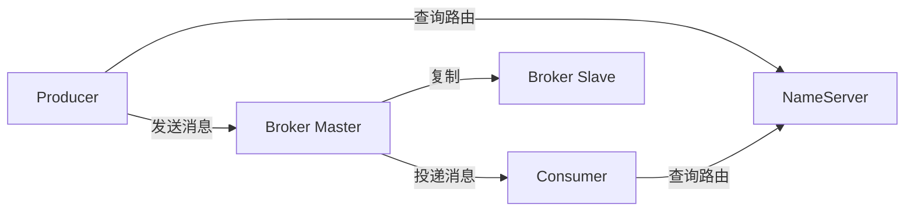
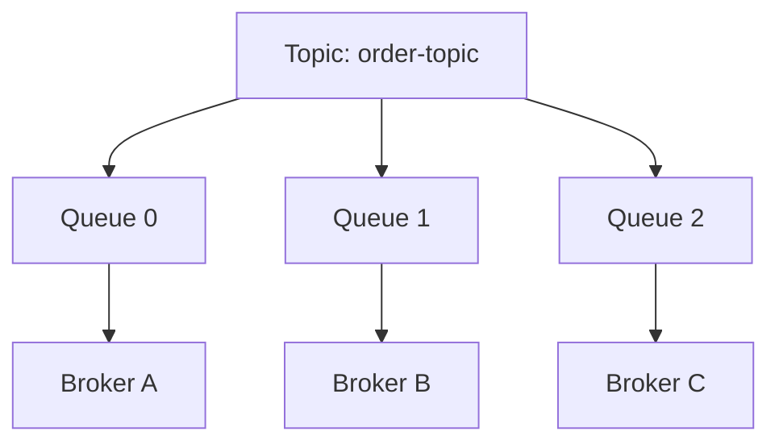
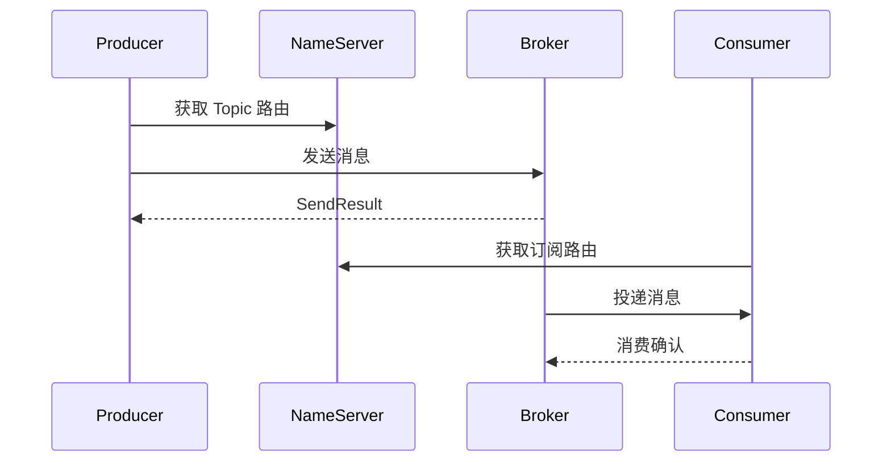
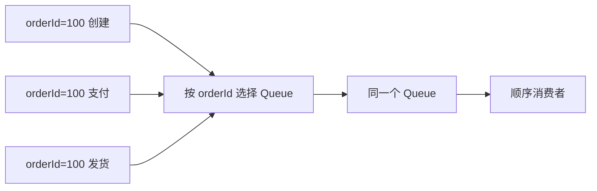
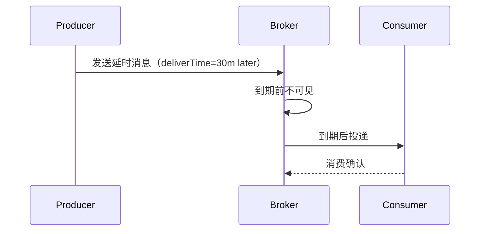
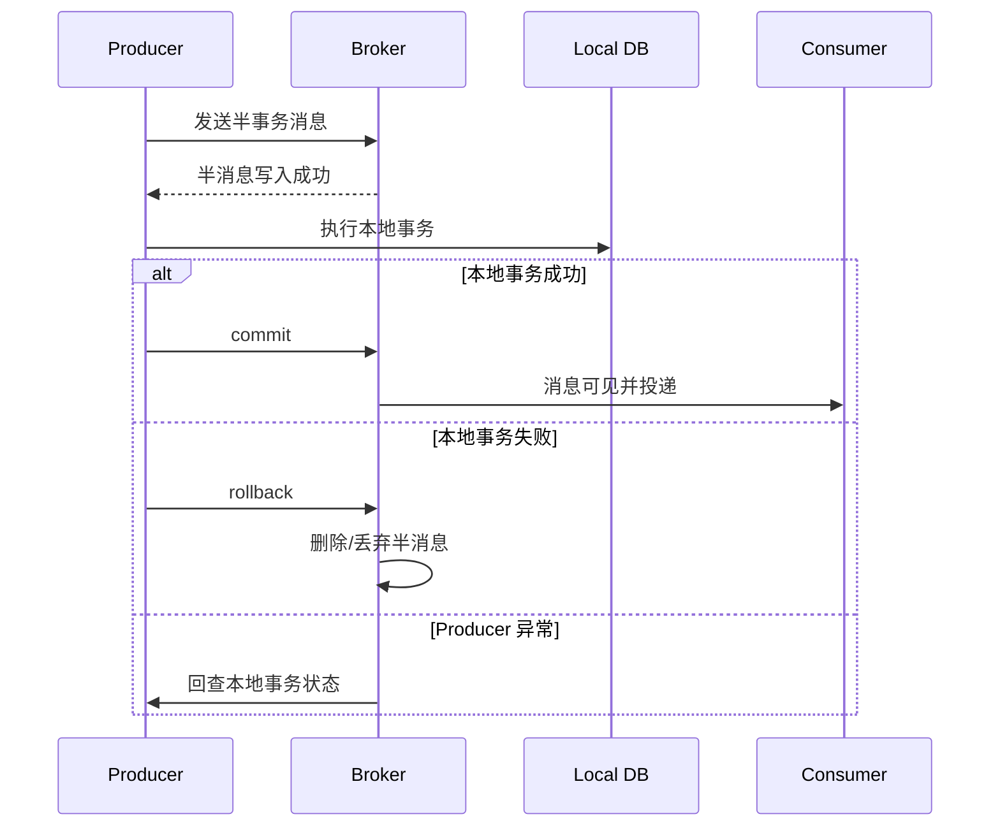
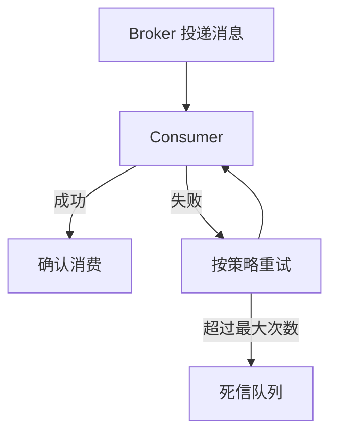
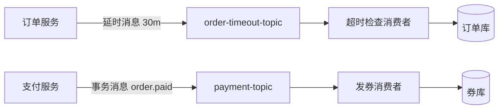

# RocketMQ：交易型消息中间件指南

RocketMQ 是 Apache 顶级项目，最早来自阿里巴巴大规模电商交易场景。  
相比“通用队列”，RocketMQ 更突出的是**业务消息语义**：普通消息、顺序消息、延时消息、事务消息、消费重试与死信。

## 一句话理解

RocketMQ 是一个面向业务系统的分布式消息中间件：`NameServer` 负责路由发现，`Broker` 负责消息存储和投递，`Producer/Consumer` 通过 Topic 和 Queue 完成发布订阅。

## 适合与不适合

适合：

- 订单、支付、库存等核心交易链路。
- 需要事务消息保证最终一致。
- 需要顺序消息处理状态流转。
- 需要延时消息处理超时取消、到期提醒。

不适合：

- 纯日志/埋点/数据湖事件流，Kafka 生态更成熟。
- 简单后台任务队列，RabbitMQ 更轻。
- 多租户平台化和存储计算分离诉求特别强，Pulsar 更合适。

## 核心组件

| 组件 | 作用 |
| --- | --- |
| NameServer | 路由注册中心，保存 Broker 与 Topic 路由 |
| Broker | 消息存储、投递、查询、复制 |
| Topic | 消息逻辑分类 |
| MessageQueue | Topic 的物理队列，并发和顺序的基本单位 |
| Producer | 消息生产者 |
| Consumer | 消息消费者 |
| Consumer Group | 消费者组，同组共同消费 |
| Proxy | 5.x 引入的重要接入层能力，便于协议与云原生接入 |

## Topic 与 Queue

一个 Topic 通常包含多个 Queue，Queue 分布在不同 Broker 上。

设计原则：

- Topic 按业务域划分，例如 `order-topic`、`payment-topic`。
- Queue 数量决定消费并发上限。
- 有顺序要求的消息要按同一业务 key 路由到同一 Queue。

## 四类核心消息

| 类型 | 能力 | 场景 |
| --- | --- | --- |
| Normal Message | 普通消息 | 异步通知、系统解耦 |
| FIFO Message | 顺序消息 | 订单状态流转、交易撮合 |
| Delay Message | 延时/定时投递 | 超时关闭订单、到期提醒 |
| Transaction Message | 事务消息 | 本地事务与消息发送最终一致 |

## 普通消息流程

## 顺序消息

RocketMQ 顺序消息的关键是：**同一业务序列进入同一个 MessageQueue，并由消费者顺序处理**。

适合：

- 订单状态：创建 -> 支付 -> 发货 -> 完成。
- 账户流水。
- 数据同步中的同一主键变更。

注意：

- 全局顺序通常不推荐，因为会牺牲并发。
- 分区顺序是更常见做法。

## 延时消息

延时消息是“现在发送，将来投递”。常见场景：

- 30 分钟未支付关闭订单。
- 会议开始前 10 分钟提醒。
- 优惠券到期提醒。

## 事务消息

事务消息用于解决“本地事务成功，但消息没发出去”或“消息发出去了，本地事务失败”的一致性问题。

关键点：

- 事务消息不是强一致分布式事务，而是最终一致方案。
- 本地事务状态回查必须可靠、可重入。
- Consumer 仍然需要幂等。

## 消费重试与死信

实践建议：

- 可重试错误：网络超时、临时下游不可用。
- 不可重试错误：消息格式错误、业务状态非法。
- 重试次数达到上限后进入死信队列，并触发告警。

## 统一案例：订单超时关闭 + 支付成功发券

### Topic 规划

| Topic | 消息类型 | 说明 |
| --- | --- | --- |
| `order-topic` | 普通/顺序 | 订单状态事件 |
| `order-timeout-topic` | 延时消息 | 超时检查 |
| `payment-topic` | 事务消息 | 支付成功事件 |
| `coupon-topic` | 普通消息 | 发券任务 |

### 流程图

### 关键设计

1. 下单成功后发送 30 分钟延时消息。
2. 延时消息到期后只做状态检查，不直接假设订单未支付。
3. 支付成功使用事务消息，保证支付本地事务和 `order.paid` 事件最终一致。
4. 发券消费者以 `orderId + couponTemplateId` 幂等。
5. 同一订单状态事件可按 `orderId` 做分区顺序。

## 高可用与部署

| 模式 | 说明 | 适用 |
| --- | --- | --- |
| 单 Master | 简单但有单点风险 | 本地/测试 |
| 多 Master | 性能高，Master 宕机期间部分消息不可消费 | 对可用性要求一般 |
| 多 Master 多 Slave 异步复制 | 性能与可用性平衡 | 常见生产场景 |
| 多 Master 多 Slave 同步双写 | 可靠性更高，延迟略高 | 核心交易链路 |

## 监控指标

| 指标 | 含义 |
| --- | --- |
| Topic 消息堆积 | 消费能力是否不足 |
| Consumer TPS | 消费吞吐 |
| Send TPS | 发送吞吐 |
| 消费失败率 | 下游或业务异常 |
| Broker 磁盘使用率 | 存储压力 |
| CommitLog 刷盘延迟 | 可靠性与性能风险 |
| DLQ 数量 | 是否存在毒丸消息 |

## 常见坑

1. 把事务消息当强一致事务用。
2. 顺序消息使用全局顺序导致吞吐极低。
3. 消费失败不分类，所有错误无限重试。
4. 事务回查依赖不可靠状态，导致消息悬挂。
5. 不设置消息 key，排查问题困难。
6. Consumer 不幂等，重复投递导致重复业务动作。

## 参考资料整理

- [RocketMQ Message](https://rocketmq.apache.org/docs/domainModel/04message/)：消息模型与消息类型。
- [Normal Message](https://rocketmq.apache.org/docs/featureBehavior/01normalmessage/)：普通消息。
- [Ordered/FIFO Message](https://rocketmq.apache.org/docs/featureBehavior/03fifomessage/)：顺序消息。
- [Delay Message](https://rocketmq.apache.org/docs/featureBehavior/02delaymessage/)：延时消息。
- [Transaction Message](https://rocketmq.apache.org/docs/featureBehavior/04transactionmessage/)：事务消息。
- [Consumer Group](https://rocketmq.apache.org/docs/domainModel/07consumergroup/)：消费组模型。
- [Consumption Retry](https://rocketmq.apache.org/docs/featureBehavior/10consumerretrypolicy/)：消费重试与死信。
